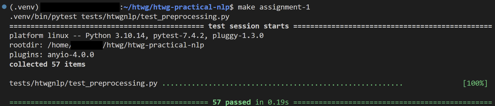

# Assignments

The course materials are accompanied by assignments to deepen your understanding of the topics.

The assignments are voluntary. But completing the assignment earns you [bonus points](#bonus-points-for-assignments) for the exam!

If you have basic programming skills, you should be able to complete the assignments.

## Structure

Throughout the course, we will work on a Python package called `htwgnlp`.
The package is located in the `src` directory and is a fully functional and installable Python package.
The core sturcture will be provided, and the assignments will be about implementing the missing functionality.

To work on an assignment, you will need to locate the `TODO ASSIGNMENT-*` items in the code.

!!! example

    For example, to work on the first assignment, use the search functionality of your IDE to find all relevant items:

    ```txt
    TODO ASSIGNMENT-1
    ```

!!! tip

    You should check the unit tests located in the `tests` directory to see the exact requirements that need to be implemented.

## Testing your Implementation

Once you implemented everything, you can run the tests to check if everything works as expected.

You can run the tests using the provided `make assignment-*` commands.
If all your tests pass, you successfully completed the assignment! 🚀

!!! example

    For example, to test your implementation for the first assignment, you can run:

    ```sh
    make assignment-1
    ```

!!! tip

    If your IDE provides the functionality, you can also run the tests directly from the IDE.

!!! note

    You can also use the native `pytest` commands, but then you need to know the exact path to the tests:

    ```sh
    # make sure to have the virtual environment activated
    pytest tests/htwgnlp/test_preprocessing.py
    ```

    Pytest is a very powerful testing framework and the de-facto standard for testing in Python.
    You will not need to know all the details, but if you want to learn more, check out the [official Pytest documentation](https://docs.pytest.org/en/latest/contents.html).

## Jupyter Notebooks

Some of the assignments are accompanied by Jupyter notebooks.

If you successfully complete an assignment, you can run the accompanying notebook and see your code in action.

See the [Getting Started](./getting_started.md) guide for instructions on how to start the Jupyter server.

## Submission

To submit an assignment, you will need to provide screenshots of a successful test run.



Please submit your screenshots via [email](mailto:pascal.keilbach@htwg-konstanz.de) to me.

When you submit your assignments, please provide a short description of your major learnings or challenges for each assignment.

!!! info

    Depending on your preference, you can submit all assignments at once, or submit them separately.

## Working on your Assignments

How you work on your assignments on your local machine is completely up to you.
But following a consistent branching strategy will probably make you life easier.

!!! info

    This is regardless of whether you use the recommended approach to fork the repository, or just clone it locally.

!!! note

    Feel free to skip this section if you have basic familiarity with git and branching workflows.

!!! tip

    If you are new to git or not very experienced, this is a great learing opportunity for you, as git is a very important tool in nowadays software development.
    You can work on the assignments without getting too much into git, but this is a great way to gain some experience with git.

### Using a single branch

Generally, it is recommended to work on your assignments in a separte branch:

```sh
git checkout -b my-assigments
```

Then, you can work on your assignments and commit your changes locally:

```sh
git add .
git commit -m "solution for assignment 1"
```

!!! tip

    If you work on a fork, you can also push your changes to your remote repository.
    This is not possible if you just clone the course repository.

### Using multiple branches

Similarly, you could create a new branch for each assignment. This can help you to keep your work separated.

```sh
git checkout -b my-assigments-1
git add .
git commit -m "solution for assignment 1"
```

### Using your local working tree

If you don't want to deal with git, you could also work purely locally without committing anything.

!!! warning

    This is not recommended, as this bears the risk of losing your progress, or dealing with lots of merge conflicts.
    When pulling updates, you probably need to [stash](https://git-scm.com/docs/git-stash) your changes.
    But be careful: if not done properly, you may lose your progress! 😱

## Fetching Updates

As described in the [getting started](./getting_started.md) guide, there will be updates from time to time.

It can happen that these updates affect the assignments - just in case you are wondering why your tests suddenly fail 😅).

So make sure to always [fetch the latest updates](./getting_started.md#fetching-updates) before working on your assignments.

## Bonus Points for Assignments

Each completed assignment earns you **one bonus points** for the exam. 🏅

Furthermore, you can earn an **extra two bonus points** if you manage to package and publish your code to [Test PyPI](https://test.pypi.org/).

!!! tip

    Note that the assignment code is organized as a **fully functional Python package** which you can **push** to a package index and **install** it via `pip`.

    Find more details on how to package and publish your code [here](https://packaging.python.org/en/latest/tutorials/packaging-projects/#a-simple-project).

!!! info "Acceptance Criteria"

    As soon as I can install your package with the following command, you are eligible for the two bonus points:

    ```sh
    pip install --index-url https://test.pypi.org/simple/ --no-deps htwgnlp_YOUR_GITHUB_USERNAME
    ```

    Please let me know via email when you are ready for me to test your package!
