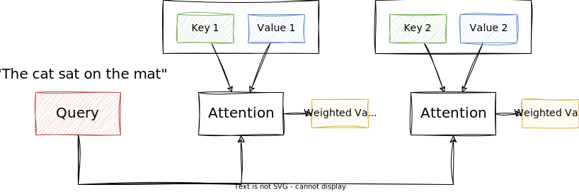
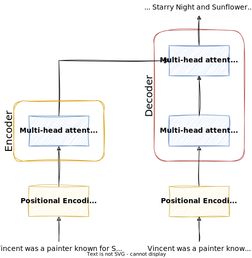

# Attention Models

This lecture will introduce an imprtant concept of state-of-the-art NLP models: **attention**. Specifically, we will look how the **transformer** architecture uses attention to process sequences of words.

## Attention

Attention is a mechanism that allows models to **focus on specific parts** of input sequences when making predictions or generating output sequences. It mimics the **human ability to selectively concentrate** on relevant information while processing input data. This allows the model to understand and generate more contextually relevant and accurate text.

!!! example

    Imagine you're reading a long article or a book, and there's a specific word or phrase that is **crucial for understanding the overall meaning**. Your attention naturally focuses on that important part to comprehend the context better. Attention models work somewhat similarly.

In NLP, when a computer is trying to understand or generate text, attention models help to decide **which parts of the input text are more important** at any given moment. Instead of treating all words equally, an attention model allows the model to focus **more on specific words** that are relevant to the task at hand.

<!-- TODO EXAM -->
The general attention mechanism makes use of three main components, namely **Query (Q), Key (K), and Value (V)**. They are used to capture the **relationships** between different words in a sequence, and thus, allow the model to focus on different parts of the input sequence when generating or understanding output.

- **Key (K):** The Key vector is like a unique identifier or key associated with each word in the input sequence. It captures information about the word that is relevant for determining its relationship with other words.

- **Query (Q):** The Query vectors represent the word for which we are trying to compute attention weights. The model uses the Query vectors to compare against the Key vectors of all other words in the sequence.

- **Value (V):** The Value vector is used to calculate the weighted sum, and it represents the content or meaning of the word. The attention weights determine how much importance should be given to each word's content when computing the final attention representation.

Attention is the mechanism that allows the model to find the **best matching keys for a given query**, and return the corresponding values.

The attention mechanism computes the attention scores by **measuring the similarity** between the query and keys: the _higher_ the attention score, the _more focus_ the model places on the corresponding values associated with those keys.

Here is a simplified visualization of the attention mechanism:



The input for the attention layer are the Query, Key, and Value vectors. The output is the attention vector, which is the weighted sum of the Value vectors.

<!--The attention scores are computed by measuring the similarity between the Query and Key vectors. The softmax function is used to normalize the scores, and the weighted sum of the Value vectors gives the final attention vector. -->

!!! example

    Imagine encoding the following sentence :

    > Vincent van Gogh is a painter, known for his stunning and emotionally expressive artworks.

    When encoding the _query_ `van Gogh`, the output may be `Vincent van Gogh` as the _key_, with `painter` as the associated _value_.

    The model stores keys and values in a table, which it can then use for future decoding:

    | Key | Value |
    | --- | --- |
    | Vincent van Gogh | painter |
    | William Shakespeare | playwright |
    | Charles Dickens | writer |

    Whenever a new sentence is presented, e.g.

    > Shakespeare's work has influenced many movies, mostly thanks to his work as a ...

    The model can complete the sentence by taking `Shakespeare` as the query and finding it in the table of keys and values:

    `Shakespeare` as _query_ is closest to `William Shakespeare` the _key_, and thus the associated _value_ `playwright` is presented as the output.

!!! tip "Analogy from Retrieval Systems"

    I found this analogy from retrieval systems quite helpful to understand the intuition behind the Query, Key, Value concept[^1]:

    > The Key/Query/Value concept can be seen analogous to retrieval systems. For example, when you search for videos on Youtube, the search engine will map your query  (text in the search bar) against a set of keys (video title, description, etc.) associated with candidate videos in their database, then present you the best matched videos (values).

    In attention models, the Query vector is used to retrieve the most relevant Key vectors, and the Value vectors are used to compute the final attention representation.

Suppose we have a sequence of words $X = \{x_1, x_2, ..., x_n\}$. Depending on the NLP task (e.g. translation or summarization), we might want to assign different weights to each word based on its relevance to the current task.

1.  **Key, Query, and Value:**

    - Each word in the sequence has associated Key $K$, Query $Q$, and Value $V$ vectors.
    - For each word $x_i$, we have corresponding $k_i$, $q_i$, and $v_i$ vectors.

2.  **Score Calculation:**

    - The attention score $e_{ij}$ between a query vector $q_i$ and a key vector $k_j$ is calculated using a function, most commonly the dot product:

    $$
    e_{ij} = q_i \cdot k_j
    $$

3.  **Softmax:**

    - The scores are passed through a softmax function to get normalized attention weights:

    $$
    a_{ij} = \frac{e^{e_{ij}}}{\sum_{k=1}^{n} e^{e_{ik}}}
    $$

    - These weights $a_{ij}$ represent the importance of each word $x_j$ with respect to the query word $x_i$.
    - In other words, the softmax function's output includes which keys are closest to the query.

    !!! info "Softmax"

        The softmax function is a generalization of the logistic function to multiple dimensions. It is used to normalize a vector of arbitrary real values to a probability distribution, that is, the sum of all values is 1.

        The softmax function is defined as follows:

        $$
        \text{softmax}(x_i) = \frac{e^{x_i}}{\sum_{j=1}^{n} e^{x_j}}
        $$

        The softmax function is often used in classification problems to convert a vector of real values to a probability distribution over predicted output classes.

4.  **Weighted Sum:**

    - The final attention vector $A_i$ for a word $x_i$ is the weighted sum of the Value vectors $v_j$ across all words, based on the attention weights:

    $$
    A_i = \sum_{j=1}^{n} a_{ij} \cdot v_j
    $$

When we write the equations above in matrix form, we get the following:

$$
Attention(Q, K, V) = \text{softmax}(QK^T)V
$$

Where:

- $Q$ is the matrix of Query vectors.
- $K$ is the matrix of Key vectors.
- $V$ is the matrix of Value vectors.
- $d_k$ is the dimensionality of the Key vectors.

In summary, attention allows the model to **dynamically focus** on different parts of the input sequence. It is a **layer of calculations** that let the model **focus on the most important parts** of the sequence for each step.

The attention scores are obtained by measuring the **similarity** between Query and Key vectors, and the **softmax** function ensures that the weights are normalized (i.e. sum to 1).

The weighted sum of the Value vectors, using these attention weights, gives the final **attention vector** for a specific word in the sequence.

**Combining all attention vectors** for all words in the sequence gives the final **attention matrix**.

This mechanism allows the model to **selectively attend to relevant information** during processing.

Attention models are used in many NLP tasks, such as machine translation, text summarization, and question answering.

!!! example "Machine Translation"

    The attention mechanism is particularly useful for machine translation as the most relevant words for the output often occur at similar positions in the input sequence.

    Here is a visualization of the attention matrix of a translation model[^2]:

    

    The x-axis represents the source sentence and the y-axis represents the target sentence.
    We can see which positions in the source sentence were considered more important when generating the target word.

    The model correctly translates a phrase `European Economic Area` into `zone economique européen`.
    It was able to correctly align `zone` with `Area`, jumping over the two words `European` and `Economic`,
    and then looked one word back at a time to complete the whole phrase `zone economique européen`.

!!! tip

    Here is a great interactive [visualization](https://distill.pub/2016/augmented-rnns/#attentional-interfaces) of the attention mechanism (make sure to scroll down a bit).

Here is the general attention mechanism implemented with SciPy and NumPy[^3]

```python
from numpy as np
from scipy.special import softmax

# encoder representations of four different words
word_1 = np.array([1, 0, 0])
word_2 = np.array([0, 1, 0])
word_3 = np.array([1, 1, 0])
word_4 = np.array([0, 0, 1])

# stacking the word embeddings into a single array
words = np.array([word_1, word_2, word_3, word_4])

# generating the weight matrices
np.random.seed(42)
W_Q = np.random.randint(3, size=(3, 3))
W_K = np.random.randint(3, size=(3, 3))
W_V = np.random.randint(3, size=(3, 3))

# generating the queries, keys and values
Q = words @ W_Q
K = words @ W_K
V = words @ W_V

# scoring the query vectors against all key vectors
scores = Q @ K.transpose()

# computing the weights by a softmax operation
weights = softmax(scores / K.shape[1] ** 0.5, axis=1)

# computing the attention by a weighted sum of the value vectors
attention = weights @ V

print(attention)
```

This would output the following:

```python
[[0.98522025 1.74174051 0.75652026]
 [0.90965265 1.40965265 0.5       ]
 [0.99851226 1.75849334 0.75998108]
 [0.99560386 1.90407309 0.90846923]]
```

## Transformers

Now the next step is to port the attention mechanism into a neural network architecture. This is where **transformers** come into play.

Transformers make use of the **attention mechanism** to process sequences of words.

> We could also say transformers is a type of neural network architecture that _implements_ the attention mechanism.

They are a type of neural network architecture that is used for a wide range of natural language processing tasks, such as machine translation, text summarization, and question answering.

<!-- TODO EXAM -->
The main **advantages** of Transformers over RNNs are:

- ❌ RNNs are slow to train because they process words sequentially and cannot be parallelized.
- ❌ RNNs cannot capture long-range dependencies effectively.
- ❌ RNNs are computationally expensive.
- ✅ Transformers can capture long-range dependencies more effectively using attention.
- ✅ Transformers are parallelizable
- ✅ Transformers are faster to train and require less computation.

Since the position of a word and the order of words in a sentence are important to understand the meaning of a text, while still being able to process text in parallel, Transformers use **positional encoding** to keep track of the sequence.

To be more specific, transformers use a variant of the attention mechanism, called **multi-head attention**, which allows them to capture more complex patterns and relationships between words in the sequence.

We will look at both of these concepts in more detail below.

!!! info "Attention Is All You Need"

    The transformer architecture was introduced in the paper ["Attention Is All You Need"](https://arxiv.org/abs/1706.03762) by Vaswani, et al. from 2017.

    It was a breakthrough in the field of natural language processing, as it outperformed previous state-of-the-art models on a wide range of tasks, including machine translation, text summarization, and question answering[^4]:

    This figure is taken from Google's [blog post](https://blog.research.google/2017/08/transformer-novel-neural-network.html), accompanying the original paper:

    {width=50%}

!!! info "BLUE Score"

    The BLEU score is a metric for evaluating the **quality of machine translation**. It is based on the precision of the translation, and it measures how many words in the machine translation match the reference translation. The **higher** the BLEU score, the **better** the translation.

!!! info "Large Language Models"

    Large language models (LLMs) are essentially a **type of transformer** model that are trained on large amounts of text data. The GPT models by [OpenAI](https://platform.openai.com/docs/models) are examples of large language models.

### Multi-Head Attention

Attention mechanisms enable models to focus on different parts of the input sequence when processing **each output token**, allowing them to capture long-range dependencies effectively.

Multi-head attention extends this concept by computing attention from multiple linearly projected "heads" in **parallel**, which are then concatenated and projected again to obtain the final output.

Multi-head attention involves the following steps:

1.  **Splitting**: Multi-head attention involves splitting the query (Q), key (K), and value (V) vectors into multiple smaller vectors, or "heads."

2.  **Independent Attention Calculation**: Attention scores are calculated independently for each head, allowing the model to focus on different parts of the input sequence simultaneously.

3.  **Weighted Summation**: Using the attention scores, a weighted sum of the value vectors is computed for each head.

4.  **Concatenation and Projection**: The results from all heads are concatenated and linearly projected again to obtain the final output of the multi-head attention layer.

{width=50%}

Not only is this more **computationally efficient**, but it also enables the model to **capture more complex patterns** and relationships between words in the sequence.
This is because  it enables the model to process and combine multiple aspects of the input data simultaneously, leading to richer and more nuanced representations.

!!! info "Self Attention"

    Traditional attention focuses on different parts of the **input sequence** (e.g., English sentence) to generate each word in the **output sequence** (e.g., translated French sentence).

    Self attention, on the other hand, captures dependencies and relationships **within the same sequence** (e.g., an English sentence) by allowing each element to attend to all other elements, including itself.

    It is computed on the fly, meaning that the query, key, and value vectors are all **derived from the same input sequence**.

    Multi-head attention can be seen as an **extension** of self attention, where the input is split into multiple heads, and attention is computed independently for each head.

    In the case where `it` refers to the animal, we can observe a different attention than when `it` refers to the street:

    

### Positional Encoding

Transformers **do not inherently understand the sequential order** of the input tokens.

This brings huge computational benefits, because if the order doesn't matter, we can process the text in **parallel**.

But the position of a word and the order of words in a sentence are important to understand the meaning of a text.

Therefore transformers must still keep track of the **order of words in a sentence**, and must somehow inject the positional information of the words in the sequence into the model, namely into the input embeddings.

This is done by adding **positional encoding** to the input embeddings.

!!! example

    In a simple version of positional encoding, we could encode the position of a word in a sentence by using a single number to represent its position in the sequence.

    Given the sentence:

    > The work of William Shakespeare inspired many movies.

    We could encode the position of each word in the sentence as follows:

    | Word | Index |
    | --- | --- |
    | The | 0 |
    | work | 1 |
    | of | 2 |
    | William | 3 |
    | Shakespeare | 4 |
    | inspired | 5 |
    | many | 6 |
    | movies | 7 |

Mathematically, positional encoding in transformers means **adding** the positional vectors to the input embeddings (they have the same shape). By doing so, the encoded text includes information about the **both the meaning and position** of a word in a sentence.

!!! info

    Word Embeddings + Positional Encoding = Input Embeddings

For Transformers, the encoding mechanism is a bit more complex than in the example above. It uses a **sine** and **cosine** function to encode the position of a word in a sentence. This allows the model to learn **relative positions** between words, which is important for understanding the meaning of a sentence.

### Encoder-Decoder Architecture

There are two main components in the transformer architecture:

1.  **Encoder**: The encoder takes the **input sequence** and generates a representation of it (i.e. a vector) that captures the meaning of the sequence. This representation is then passed to the decoder.

2.  **Decoder**: The decoder takes the representation generated by the encoder and uses it to generate the **output sequence**, one word at a time.

The encoder and decoder are both composed of **multiple layers**, each of which contains a multi-head attention layer and a feed-forward neural network. The encoder and decoder layers are stacked on top of each other, with each layer passing its output to the next layer in the stack.



The connection between the encoder and decoder is established through the **attention** mechanism, which allows the decoder to **selectively attend** to different parts of the input sequence based on their importance for generating the next token in the output sequence.

This enables the model to effectively capture dependencies between input and output sequences, making it well-suited for tasks such as machine translation, where the input and output sequences may have complex and non-linear relationships.

!!! tip

    The [original paper](https://arxiv.org/abs/1706.03762) shows the transformer architecture in more detail.

!!! info

    Neural networks for machine translation typically contain an encoder reading the input sentence and generating a representation of it. A decoder then generates the output sentence word by word while consulting the representation generated by the encoder.

    The animation below shows the encoder-decoder architecture of the transformer model in action. It is from the [transformer blog post](https://blog.research.google/2017/08/transformer-novel-neural-network.html) by Google:

    - The Transformer starts by generating **initial representations**, or embeddings, for each word. These are represented by the unfilled circles.
    - Then, using self-attention, it **aggregates information from all of the other words**, generating a **new representation** per word **informed by the entire context**, represented by the filled balls. This step is then repeated multiple times in parallel for all words, successively generating new representations.
    - The decoder operates similarly, but generates **one word at a time**, from left to right. It attends not only to the other previously generated words, but also to the final representations generated by the encoder.

    

## Key Takeaways

- Attention models address the limitations of sequence models like RNNs by enabling the model to **selectively weigh and focus** on specific parts of the input sequence when making predictions or generating output sequences.
- Attention **mimics the human ability** to selectively concentrate on relevant information while processing input data.
- Mathematically, attention is a weighted sum of the values, calculated from **Query (Q) and Key (K) and Value (V)** vectors.
- A model architecture that uses attention is called a **Transformer**. It is a type of neural network architecture that is used for a wide range of natural language processing tasks, such as machine translation, text summarization, and question answering.
- The transformer architecture was introduced in the paper ["Attention Is All You Need"](https://arxiv.org/abs/1706.03762) by Vaswani, et al. from 2017 and set new standards in natural language processing.
- Transformers can be **parallelized** because attention does not require sequential processing of words, making them much faster to train than RNNs. However, to process text in parallel, they still need to maintain the **order of words** in a sentence, which is achieved by incorporating **positional encoding** into the input embeddings.
- **Multi-head attention** is a variant of the attention mechanism that allows the model to capture more complex patterns and relationships between words in the sequence.
- The transformer model consists of an **encoder** and a **decoder** that are connected through the attention mechanism.

!!! note "Further Reading"

    The transformer is a sophisticated architecture and attention is a complex concept. If you want to dig deeper into those topics, here are some resources that may be interesting for you:

    - [Attention and Augmented Recurrent Neural Networks](https://distill.pub/2016/augmented-rnns/)
    - [The Illustrated Transformer](https://jalammar.github.io/illustrated-transformer/)
    - [The Illustrated GPT-2 (Visualizing Transformer Language Models)](https://jalammar.github.io/illustrated-gpt2/)
    - [https://jalammar.github.io/how-gpt3-works-visualizations-animations/](https://jalammar.github.io/how-gpt3-works-visualizations-animations/)
    - [The Annotated Transformer](https://nlp.seas.harvard.edu/2018/04/03/attention.html)
    - [Microsoft Learn: Understand the transformer architecture used for NLP](https://learn.microsoft.com/en-us/training/modules/explore-foundation-models-in-model-catalog/4-transformers)
    - [The Transformer Family](https://lilianweng.github.io/lil-log/2020/04/07/the-transformer-family.html)

<!-- footnotes -->

<!-- markdownlint-disable MD053 -->
[^1]: <https://stats.stackexchange.com/a/424127>
[^2]: [Neural Machine Translation by Jointly Learning to Align and Translate](https://arxiv.org/abs/1409.0473)
[^3]: <https://machinelearningmastery.com/the-attention-mechanism-from-scratch/>
[^4]: <https://blog.research.google/2017/08/transformer-novel-neural-network.html>
