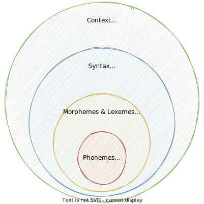
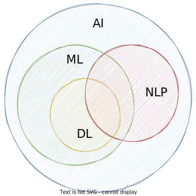

# Introduction to Natural Language Processing

The first lecture will give you a basic understanding of what NLP is about, the problems we deal with and the challenges that come with it.
The goal is to get a good intuition of what it means to work with language from a programmatic perspective.

## NLP in our everyday lives

In our daily digital lives, we interact with a lot of apps and tools that are based on NLP technologies.
The following figure gives an overview of real-world NLP applications along with popular examples[^1].


- **Voice-based assistants** like [Alexa](https://www.amazon.com/how-does-alexa-work/b?ie=UTF8&node=21166405011) or [Siri](https://machinelearning.apple.com/research/hey-siri) utilize a variety of NLP techniques to interact with its users, i.e. they need to understand user commands and questions, and reply accordingly using Text-to-Speech (TTS).
- Modern **search engines** like [Google](https://www.google.com/search/howsearchworks/) or [Bing](https://support.microsoft.com/en-us/topic/how-bing-delivers-search-results-d18fc815-ac37-4723-bc67-9229ce3eb6a3) make heavy use of NLP for a variety of subtasks, such as understanding the user query, autocompletion, or ranking and grouping the query results.
- **Social media platforms** make use of NLP, e.g. to analyse user comments, or make suggestions to their users.
  Also platforms like Youtube or conference tools are able to automatically create transcriptions on the fly using "Speech-to-text" (SST) technologies.
- In popular **email applications** like Gmail or Outlook, NLP is used for tasks like spam filtering, [calendar event extraction](https://patents.google.com/patent/US8832205B2/en) or [smart replies](https://blog.google/products/gmail/save-time-with-smart-reply-in-gmail/).
- **Text processing apps** offer auto-correction or auto-completion features to their users, i.e. spell-checking or grammar correction.
  [Grammarly](https://www.grammarly.com/blog/how-does-grammarly-work/) is a nice example here, as well as any smartphone keyboard.
- More and more companies offer **chatbots** (aka conversational agents) on their websites for their clients.
  With [ChatGPT](https://openai.com/blog/chatgpt/), **conversational agents** (and NLP in general) reached a new level just recently.

!!! question

    Based on your **working experience**, where have you already encountered, or can think of, potential **NLP applications**?

## A brief history about NLP

IMHO, every lecture should provide a little historical background in the beginning[^2]: 📜

- **1950s–1990s**
  Initial attempts are made to map hard rules around languages and follow logical steps to accomplish tasks like translating a sentence from one language to another.
  While this works sometimes, strictly defined rules only work for concrete, well-defined tasks that the system has knowledge about.

    !!! info "Noam Chomsky"

        Renowned linguist and cognitive scientist [Noam Chomsky](https://en.wikipedia.org/wiki/Noam_Chomsky) introduced the theory of generative grammar, which revolutionized the understanding of language structure and acquisition. His work laid the theoretical groundwork for studying language processing and understanding the innate structures that govern language use. Chomsky's theories on syntax and the nature of language have influenced computational linguistics and the development of algorithms for natural language processing, informing how machines understand and generate human language. His critiques of AI's ability to fully understand language have also sparked important discussions on the limitations of current language models.

- **1990s**
  Language models begin evolving into statistical models and language patterns start being analyzed, but larger-scale projects are limited by computing power.

- **2000s**
  Advancements in machine learning increase the complexity of language models, and the wide adoption of the internet sees an enormous increase in available training data.

    !!! info "Geoffrey Hinton"

        Often referred to as one of the "Godfathers of Deep Learning," [Geoffrey Hinton](https://en.wikipedia.org/wiki/Geoffrey_Hinton) has made significant contributions to the field of neural networks and deep learning, which are foundational to modern language models. His work on backpropagation, neural networks, and the development of the dropout technique has greatly influenced the training of deep learning models. Hinton's research laid the groundwork for the advancement of architectures like BERT and GPT, significantly impacting natural language processing (NLP) and machine learning as a whole.

        Together with [John Hopfield](https://en.wikipedia.org/wiki/John_Hopfield), he was awarded the 2024 Nobel Prize in Physics.

- **2012**
  Advancements in deep learning architectures and larger data sets lead to the development of GPT (Generative Pre-trained Transformer).

- **2018**
  Google introduces BERT (Bidirectional Encoder Representations from Transformers), which is a big leap in architecture and paves the way for future large language models.

- **2020**
  OpenAI releases GPT-3, which becomes the largest model at 175B parameters and sets a new performance benchmark for language-related tasks.

    !!! info "Ilya Sutskever"

        Co-founder and Chief Scientist at OpenAI, [Ilya Sutskever](https://en.wikipedia.org/wiki/Ilya_Sutskever) has played a pivotal role in the development of groundbreaking language models, including GPT-2 and GPT-3. His work in deep learning and reinforcement learning has advanced the understanding and capabilities of generative models. Sutskever's contributions to the architecture and training of these models have led to significant improvements in their performance on a wide range of language-related tasks. His leadership at OpenAI has also driven the broader adoption and awareness of large language models and their potential applications.

- **2022**
  ChatGPT is launched, which turns GPT-3 and similar models into a service that is widely accessible to users through a web interface and kicks off a huge increase in public awareness of LLMs and generative AI.

- **2023**
  Open source LLMs begin showing increasingly impressive results with releases such as Dolly 2.0, LLaMA, Alpaca, and Vicuna. GPT-4 is also released, setting a new benchmark for both parameter size and performance.

## Tasks that can be solved by NLP

NLP is used for a wide variety of language-related tasks, including answering questions, classifying text in a variety of ways, and conversing with users.

If you design an NLP system, you may make use of multiple tasks.

Here are some tasks that can be solved by NLP[^3]:

### Sentiment analysis

- **Sentiment analysis** is a **text classification** problem and it classifies the emotional intent of text.
- **Input** is a text, and the **output** is the probability of the sentiment being positive, negative, or neutral.
- **Features** used may include hand-generated features, word n-grams, TF-IDF, or deep learning models for capturing text dependencies.
- Common **applications** include classifying customer reviews and identifying signs of mental illness in online comments.

!!! example

    Here is a fictional example of customer reviews of a hotel booking service:

    - 😃 Great service for an affordable price. We will definitely be booking again!
    - 😐 Just booked two nights at this hotel.
    - 😡 Horrible service. The room was dirty and unpleasant. Not worth the money.

    Email spam detection is another typical example of a binary text classification problem in NLP.

!!! info "Toxicity classification"

    Toxicity classification, a branch of sentiment analysis, categorizes hostile content like threats, insults, obscenities, and hate speech. It's used to moderate online conversations by detecting and silencing offensive comments or scanning for defamation.

!!! info "Text classification with Naive Bayes"

    A very good starting algorithm for text classification tasks in [**Naive Bayes**](https://en.wikipedia.org/wiki/Naive_Bayes_classifier) algorithm.
    This is primarily because it is relatively simple to understand and implement, and very fast to train and run.
    We will cover the **Naive Bayes algorithm** later in the course, as well as in one of the assignments.

### Machine translation

- **Machine translation** automates the process of **translating** text between different languages.
- The **input** is text in a source language, and the **output** is text in a target language.
- Machine translation improves communication on platforms like Facebook and Skype.
- Effective models can distinguish between words with similar meanings.
- Some systems also identify the language of the input text.

!!! example

    - [DeepL](https://www.deepl.com) is a well-known example of this application.

### Named entity recognition

- **NER** extracts **entities** from text and classifies them into predefined categories (e.g., names, persons, organizations, locations, quantities, book title, etc.).
- The **input** is text, and the **output** includes the identified entities and their positions in the text.
- NER is valuable for **applications** like summarizing news articles and fighting disinformation.

!!! example

    The [spaCy library](https://spacy.io/) is an open-source Python library for advanced Natural Language Processing that provides efficient tools for tasks such as tokenization, POS tagging, NER, and dependency parsing.

    Here is an [example](https://spacy.io/usage/linguistic-features#named-entities) of NER with spaCy

    ```python
    import spacy

    nlp = spacy.load("en_core_web_sm")
    doc = nlp("Apple is looking at buying U.K. startup for $1 billion")

    for ent in doc.ents:
        print(ent.text, ent.start_char, ent.end_char, ent.label_)
    ```

    | Text        | Start | End | Label | Description                                      |
    |-------------|-------|-----|-------|--------------------------------------------------|
    | Apple       | 0     | 5   | ORG   | Companies, agencies, institutions.               |
    | U.K.       | 27    | 31  | GPE   | Geopolitical entity, i.e. countries, cities, states. |
    | $1 billion  | 44    | 54  | MONEY | Monetary values, including unit.                 |

    It can be visualized as follows:

    

### Part-of-speech (POS) tagging

- In NLP, the **anatomy** of a sentence is commonly described using **POS tags**, which involves assigning **grammatical categories** (e.g., noun, verb, adjective) to each word in the sentence.
- The **input** is a sequence of words, and the **output** is a tagged sequence indicating the POS for each word.
- POS tagging is essential for various NLP tasks, such as syntactic parsing, machine translation, and information retrieval.

!!! example "POS-tagging with the Python spaCy library"

    Here is an [example](https://spacy.io/usage/linguistic-features#pos-tagging) of POS-tagging with spaCy

    ```python
    import spacy
    from spacy import displacy

    nlp = spacy.load("en_core_web_sm")
    doc = nlp("This is a sentence.")
    displacy.serve(doc, style="dep")
    ```

    Output:

    

!!! info "POS-tagsets"

    A tagset is a predefined list of grammatical categories used in Natural Language Processing to classify words during tasks like POS tagging.

    A popular tagging convention is [Penn Treebank tagset](https://www.ling.upenn.edu/courses/Fall_2003/ling001/penn_treebank_pos.html) which is also used by default by the Python [Natural Language Toolkit library](https://www.nltk.org/api/nltk.tag.html).

    A simplified [universal tagset](https://github.com/slavpetrov/universal-pos-tags) by Google Research maps the Penn Treebank tagset to only 12 tags.

### Topic modelling

- **Topic modeling** is an **unsupervised text mining** task that identifies abstract topics in a collection of documents.
- The **input** is a corpus of documents, and the **output** is a list of topics, with each topic consisting of relevant words and proportions assigned to documents.
- Topic modeling has **commercial applications**, such as helping lawyers find evidence in legal documents.

!!! info "Latent Dirichlet Allocation"

    **[Latent Dirichlet Allocation](https://en.wikipedia.org/wiki/Latent_Dirichlet_allocation)** is a popular technique that views documents as mixtures of topics, and topics as mixtures of words.

### Text generation

- **Text generation** (aka natural language generation) produces text that mimics human-written content.
- Models can be **fine-tuned** to generate text in various formats, like **tweets, blogs,** and **computer code**.
- Common applications include **autocomplete** and **chatbots**.

!!! info "Autocomplete"

    **Autocomplete** predicts what word comes next, and autocomplete systems of varying complexity are used in chat applications like WhatsApp. Google uses autocomplete to predict search queries. One of the most famous models for autocomplete is GPT-2, which has been used to write articles, song lyrics, and much more.

!!! info "Grammatical error correction"

    Grammatical error correction models use grammatical rules to fix text. This is typically approached as a sequence-to-sequence task, where the model learns to transform an ungrammatical sentence into a correct one. Tools like [Grammarly](https://www.grammarly.com/) and Microsoft Word implement these models to enhance writing, while schools use them to grade student essays.

### Information Retrieval

- **Information retrieval** aims to find the most relevant documents for a given **query**.
- It is essential in **search** and **recommendation systems** and focuses on retrieving a relevant set of documents, not directly answering the query.
- These systems handle massive collections of documents (millions), retrieving the most relevant ones.
- Two main processes involved are **indexing** (typically done using vector space models and Two-Tower Networks) and **matching** (based on similarity or distance scores).
- Advanced systems, such as Google's, use **multimodal information retrieval**, working across **text, image, and video data**.

!!! info "Elasticsearch"

    A popular example for an information retrieval system is [Elasticsearch](https://www.elastic.co/guide/en/elasticsearch/reference/current/index.html). It is an open-source search and analytics engine built on top of [Apache Lucene](https://lucene.apache.org/). It is designed for fast, scalable search capabilities and is widely used for a variety of applications, including full-text search, structured data retrieval, and real-time analytics.

### Summarization

- **Summarization** aims to shorten text while emphasizing the most relevant information.
- Some summarizers are able to evaluate **factual consistency** for accurate **output**.
- **Extractive summarization**: Selects and combines the most important sentences from the **input** text.
- **Abstractive summarization**: Creates a summary by paraphrasing the **input** text, resulting in an **output** that may contain new words and sentences not present in the original. This is modeled as a sequence-to-sequence task.

### Question Answering

- **Question answering** involves providing answers to human-posed questions in **natural language**.
- Notable example: **Watson** won the game show **Jeopardy** against human champions in 2011.
- **Multiple choice**: A question is paired with a set of possible answers, and the task is to select the **correct answer**.
- **Open domain**: The model answers questions in **natural language** without provided options, often by querying a large number of **texts**.

!!! question

    In a modern **email application**, which of the above **NLP tasks** could be utilized to achieve a great user experience?

    ??? info "Answer"

        We can find many NLP tasks in a modern email client, such as:

        - information extraction: suggest calendar events
        - spam classification: spam or not spam
        - summarization: a potential plugin for long and annoying emails
        - information retrieval: email search capabilities
        - text generation: suggest answers or sophisticated autocompletion
        - ...

## Building Blocks of Language

While linguistics is the systematic study of language, NLP tries to make language processable by computer systems.

To study NLP, we don't need to be linguistic experts, but it is important to understand some core linguistic concepts. In this section, we will dissect language into its building blocks.

For the scope of this course, we think of human language as composed of four major building blocks: phonemes, morphemes and lexemes, syntax, and context.
In linguistics, each of the building blocks described in this section is a research area for itself.



### Phonemes

Description:

- Layer of **speech and sound**
- Smallest units of speech sound in a language
- Vary across languages, i.e. each language has its own set of phonemes.
- Standard English has [44 phonemes](https://en.wikipedia.org/wiki/Received_Pronunciation#Phonology) (i.e. 24 consonant phonemes, and 20 vowel phonemes)
  - German: 46 phonemes
  - Spanish: 24 phonemes
- Usually denoted in slashes using the symbols of the [International Phonetic Alphabeth (IPA)](https://en.wikipedia.org/wiki/International_Phonetic_Alphabet)
- May or may not have a meaning by themselves, but can induce meaning, e.g. `/s/` for plural or `/ɪ/` for adjective
- A nice list of examples can be found [here](https://englishphonetics.net/english-phonetics-academy/the-44-sounds-of-english-based-on-the-IPA.html)

Important for:

- Speech recognition
- Speech-to-text
- Text-to-speech

!!! example "Examples"

    Consonant phonemes:

    - `/b/` as in "bat" 🦇
    - `/dʒ/` as in "giraffe" 🦒

    Vowel phonemes:

    - `/iː/` as in "bee" 🐝
    - `/æ/` as in "cat" 🐈

### Morphemes and Lexemes

The layer of **words** consists of morphemes and lexemes.

Morphemes:

- Smallest unit of language that has a **meaning**
- Formed by a **combination of phonemes**
- All prefixes or suffixes are morphemes, e.g. `multi` as in `multimedia`
- When breaking down words into their morphemes, variations may occur

Lexemes:

- Consists of one or more morphemes
- Multiple words can go back to the same lexeme
- Not synonymous with the term "word", rather comparable to an **entry in a dictionary** or an encyclopedia
- Different verb forms go back to the same lexeme

Important for:

- Tokenization
- Stemming
- POS-tagging
- Word embeddings

!!! example "Examples"

    Breaking down a word into its morphemes:

    - no variation: $unbreakable$ 👉 $un + break + able$
    - with variation: $unreliability$ 👉 $un + rely + able + ity$

    Rooting back words on its lexemes:

    - $\{jump, jumps, jumping, ...\}$ 👉 $jump$
    - $\{buy, bought, buying, ...\}$ 👉 $buy$

    Differentiation of words, lexemes, and morphemes:

    - word $football$ (noun) 👉 lexeme: $football$ 👉 morphemes: $foot + ball$
    - word $cats$ (noun) 👉 lexeme: $cat$ 👉 morphemes: $cat + s$
    - word $tumbling$ (verb) 👉 lexeme: $tumble$ 👉 morphemes: $tumble + ing$
    - word $happening$ (verb) 👉 lexeme: $happen$ 👉 morphemes: $happen + ing$

!!! tip

    A **lexeme** is **not synonymous to a word**, but can be thought of as an **abstract word**: if we use lexemes, they become words

!!! warning

    There is some linguistic [debate](http://www.lilec.it/mmm/wp/wp-content/uploads/2012/09/195-208-Nemo-MMM4.pdf) on morphemes and lexemes, but we leave that to linguistics experts. For the scope of this course, the differentiation as given above is sufficient.

### Syntax

- Layer of **phrases and sentences**
- Set of rules to construct grammatically correct sentences out of words
- The syntactic structure can be described in many different ways, e.g. grammar
- In NLP, it is common to describe the anatomy of a sentence using POS tags

The following snippet shows POS-tagging in Python using the NLTK library and the [universal tagset](https://github.com/slavpetrov/universal-pos-tags):

```python
>>> from nltk import pos_tag, word_tokenize
>>> pos_tag(word_tokenize("The girl plays tennis."), tagset="universal")
[
    ('The', 'DET'),
    ('girl', 'NOUN'),
    ('plays', 'VERB'),
    ('tennis', 'NOUN'),
    ('.', '.')
]
```

!!! example

    Consider the following sentence:

    > *"The girl plays tennis."*

    Grammatical analysis 👉 *The girl (subject) plays (verb) tennis (object).*

    POS-tagging using the universal tagset: 👉 *The (DET) girl (NOUN) plays (VERB) tennis (NOUN) .(.)*

!!! question

    Imagine you need to analyze a set of tweets and the sentence above changes to:

    > *"The girl 👧 plays tennis 🎾."*

    Given the code above, how would you expect the POS-tagger to handle emojis?

    Find some [further information here](https://aclanthology.org/2021.acl-long.110v1.pdf).

    ??? info "Answer"

        It would depend on the use case, there are situations where the emoji is a crucial part of the sentence, to indicate emotions (e.g. social media posts).
        If it is just about the conveyed information, it is probably OK to remove them during pre-processing.

### Context

- Layer of **meaning**
- Describes how the various parts of language come together and **convey a particular meaning**
- Includes **world knowledge** and **common sense**
- Depending on the context, a word or sentence may **change its meaning**, as in the case of ambiguity
- Consists of semantics and pragmatics (external context)
  - **Semantics** refers to the direct meaning of words or sentences, without external context
  - **Pragmatics** add world knowledge and enables us to infer implied meaning

Important for:

- Text summarization
- Conversational agents
- Sentiment analysis

!!! example

    Consider the following sentence:

    > I'm so hungry, I could eat a horse!

    **Semantics** would assume that this person wants to eat a horse. 🐎

    **Pragmatics** applies **world knowledge** and infers that this person is very hungry. 🍴

!!! info

    Being a linguistic expert is not necessary to master NLP, but by understanding the basic building blocks of language, we can use the right NLP tools in real-world projects.

## Challenges in NLP

### Ambiguity

- Occurs when a word, phrase, or sentence has **more than one plausible interpretation**
- The intended meaning often depends on the **context or world knowledge**
- Related to **vagueness and uncertainty**
- Most **languages** are **inherently ambiguous**
- Humans use it sometimes **on purpose**

!!! example

    Consider the following sentence:

    > The boy ate the cookies on the couch 🍪🛋

    1. The boy ate the cookies that were lying on around on the couch
    2. The boy was sitting on the couch while eating cookies

!!! question

    Which *language* is supposed to be the least ambiguous of all languages?

    ??? info "Answer"

        The language of mathematics is unambiguous by design. A mathematical term is means the same everywhere.

        Also programming languages are designed to be unambiguous and deterministic.

### World Knowledge

- Set of all facts that most humans, or a targeted group of humans, are aware of
- Generally assumed that these facts are known, hence not explicitly mentioned
- Can change over time, e.g. [heliocentric model](https://en.wikipedia.org/wiki/Heliocentrism)

!!! example

    Consider the following 2 sentences:

    > 1. Man bit dog 👨🐶
    > 2. Dog bit man 🐶👨

    As humans, we know that only the second sentence is plausible since we assume that dogs are known to bite humans.
    Whereas for a machine, if not further specified, both sentences are equally plausible.

!!! info

    A nice collection of examples of how ambiguity and world knowledge play together are [Winograd schemas](https://cs.nyu.edu/~davise/papers/WinogradSchemas/WS.html).

    Here is an example:

    > The city councilmen refused the demonstrators a permit because they [feared/advocated] violence.

    1. If the word is *feared*, then *they* presumably refers to the city council.
    2. If it is *advocated*, then *they* presumably refers to the demonstrators.

    Examples like this one are easily disambiguated by the human reader (sometimes we don't even notice that there is ambiguity), mostly because of world knowledge, but they pose challenges to most NLP techniques.

    The official collection of 150 Winograd schemas can be found [here](https://cs.nyu.edu/~davise/papers/WinogradSchemas/WSCollection.html).

    In 2016, there was a [challenge](http://commonsensereasoning.org/winograd.html) announced, where the highest score achieved was 58%.

    Nowadays, NLP systems achieve more than [90% accuracy](https://arxiv.org/pdf/2201.02387.pdf).
    A review of approaches as of April 2020 can be found [here](https://arxiv.org/pdf/2004.13831.pdf).

### Creativity

- Language not only consists of rules, there are also a lot of creative aspects to it
- Language contains a lot of variety, e.g. styles, genres, dialects, aesthetics
- There is not "one correct way"
- Understanding creativity is a hard difficult problem, not just in NLP, but in AI in general (and probably also a philosophical problem)

!!! quote

    Writing beautiful novels probably requires a high degree of world knowledge and creativity:

    > *He stepped down, trying not to look long at her, as if she were the sun, yet he saw her, like the sun, even without looking.*

    Leo Tolstoy, Anna Karenina

### Diversity

- Many times, no direct mapping between the vocabularies of any two languages
- Makes adapting NLP solutions to other languages very hard
- Build a language-agnostic system, or build separate solutions for each language

!!! example

    The German word [*Heimat*](https://en.wikipedia.org/wiki/Heimat) has no exact English equivalent.

<!--
TODO: Anybody who used NLP solutions in another language than english probably has experienced lower performance.
-->

## NLP in the era of Artificial Intelligence

In this section, we will look at NLP and how it is related to articial intelligence (AI).

In general, NLP aims to give **computers** the ability to **understand text and spoken words** in much the same way human beings can.

It combines computational linguistics with programming, statistics, machine learning, and deep learning.
The field has greatly benefit from recent advancements in ML and DL and is one of the fast-growing research domains in AI.

However, in its simplest forms, NLP is **not necessarily based on AI**, and we can also solve some of the simpler tasks with rule-based apporaches.



!!! quote "Artificial Intelligence (AI), Oxford English Dictionary"

    The theory and development of computer systems able to perform tasks normally requiring human intelligence.

!!! info

    A good read on how AI, ML, and DL are related is [this article](https://www.ibm.com/topics/artificial-intelligence) by IBM. [This article](https://www.ibm.com/topics/natural-language-processing) gives more details about the role of NLP in that context.

### Rule-based NLP

- Defining **rules** for the task to be solved
- Utilize lexical resources
- Requires developers to have a certain degree of **domain expertise**

!!! info "Regular expressions (regex)"

    A very common rule-based tool for text analysis are **regular expressions**, where we define search patterns to find substrings in a text.
    Regexes operate deterministically, i.e. it is either a match or not.
    [Here](https://docs.python.org/3/library/re.html) is a guide using regular expressions with Python, which will be useful throughout the course (as well as your entire journey as a Python developer).

!!! example "WordNet"

    [WordNet](https://wordnet.princeton.edu/) is a database of words and their semantic relationship:

    - **Synonyms**: `car` and `automobile` 🚗 (interchangeable)
    - **Hyponyms**: both `baseball` ⚾ and `tennis` 🎾 are both `sports` (aka "super-subordinate" relation)
    - **Meronyms**: `arm` 💪 and `foot` 🦶 are `body` parts (aka "part-whole" relation)

!!! question

    What NLP tasks do you think could be solved using rule-based approaches? What are the advantages and limitations of such approaches?

    ??? info "Answer"

        Examples would be sentiment analysis based on word count, or a regex to map tracking numbers to shipping companies.

        - advantages: light-weight, quick & easy compared to DL models, are deterministic
        - limitations: hard to solve more complex NLP tasks

        We can use rule based approaches to bridge gaps between NLP systems, e.g. eliminate mistakes made by AI with rule-based approaches

### Machine Learning for NLP

- Branch of AI
- Algorithms that can learn to perform tasks based on a large number of **examples**
- No explicit instructions required, algorithm learns **patterns**
- Requires **numeric representation** (aka "features") of the training data
- ML can be applied to textual data similar to other forms of data
- A special focus needs to be put on **pre-processing** and **feature extraction**
- training a model is then "business as usual"

#### Supervised learning

- learn **mapping function** from input to output
- requires a large number of **labeled training data**, i.e. known input-output pairs

!!! example

    An **email spam filter** is a common example where supervised learning is used in NLP.

#### Unsupervised learning

- Aims to find hidden patterns in given input data
- Output is unknown, i.e. works with **unlabeled data**

!!! example

    An example where unsupervised learning is used in NLP is **topic modeling**, where we try to identify topics in a large collection of text data, e.g. news articles, without prior knowledge of these topics.
    A simple approach to topic modeling is a [tag cloud](https://en.wikipedia.org/wiki/Tag_cloud).

### Deep Learning for NLP

When we speak of using deep learning for NLP, this encompasses all algorithms based on **artifical neural networks**.
Deep learing approaches in NLP led to **significant advances** in the recent year in the field.

This section gives a brief overview of the terms that are used in this context.

#### Language Models

- System that is trained to **understand and generate** human-like text
- Designed to **predict** and generate sequences of words or characters based on the input it receives
- Learns **patterns, structures, and relationships** within a given language by being exposed to **large amounts of text data**
- They can be based on **various architectures**, including RNNs, LSTMs, CNNs, and more recently, transformers

!!! example

    GPT-3, based on the transformer architecture, is an example of a powerful language model.

#### Convolutional Neural Networks (CNNs)

- Adapted from computer vision tasks
- Require **word embeddings** to build sentences matrices, which can be treated analogously to images

#### Recurrent Neural Networks (RNNs)

- language is sequential by nature, e.g. text flows from one direction to another
- RNNs are a type of neural network designed for **sequential data**, making them suitable for tasks where the order of the input matters
- Can remember what they have processed so far, but cannot remember long contexts

#### Long Short-Term Memory (LSTM)

- LSTMs are a specific type of RNN designed to address the vanishing gradient problem, enabling better learning of long-range dependencies in sequential data.
- Let go of **irrelevant context**, and only remember the context that is required to solve the task at hand

#### Transformers

- **Type of architecture** that has gained prominence in NLP
- Use **attention mechanisms** to capture relationships between different parts of a sequence simultaneously, making them effective for processing sequential data, including language
- Look at surrounding words to derive context (e.g. bank as a river bank or financial institution)

#### Transfer Learning

- Transfer learning is a machine learning **paradigm** where a model trained on one task is **adapted or fine-tuned** for a different but related task
- Often used to leverage **pre-trained models** for specific applications
- The model is able to **transfer** the pre-trained knowledge for downstream tasks

#### Foundation Models

- The term **foundation model** refers to **large-scale** language models **based on the transformer** architecture
- They serve as a **starting point** for various NLP tasks
- It emphasizes the idea that a **pre-trained model** forms the **foundation** and can be adapted for various tasks

!!! info

    GPT-3 is known to be trained on 45 TB of text data and the model has about 175 billion parameters.

#### Attention

- The attention mechanism is a key component of the transformer model architecture and plays a crucial role in capturing **contextual information across sequences**.
- Attention mechanisms, particularly **self-attention** in the context of transformers, allow models to **focus on different parts of the input sequence** when making predictions.
- Especially beneficial for capturing long-range dependencies.
- In general, attention is the ability to **focus on important things and ignore irrelevant things**, as certain parts of a sentence are more important than others

### Limitations of AI in NLP

DL has brought NLP to the next level, and powerful transformer models have become SOTA in most NLP tasks.
However, DL is not the silver bullet for all NLP tasks, especially when it comes to industrial applications[^1]:

- **Overfitting on small datasets**:
  DL models need more training data to fit all their parameters, but many times, sufficient training data is not available.
  Hence, they overfit on small datasets and have poor generalization capabilities.
  Also, consider Occam's razor: given that all other conditions are equal, the simpler solution should be preferred.

- **Domain adaption**:
  Most DL models are trained on common domains (e.g. news articles).
  If we try to use them for a different domain (e.g. social media), we may observe poor performance.
  This is because language is domain-specific (think of all the emojis and all the slang words in social media posts).
  Therefore, a well-designed rule-based domain-specific that encodes all required knowledge may outperform a complex DL model.

- **Explainable models**:
  Most of the time, DL models work like a black box, but in many use cases, industries demand interpretable results that can be explained to end users.
  In such cases, traditional approaches might be more useful.
  For example, with Naive Bayes for sentiment analysis, the effect of positive vs. negative words can be easily explained.
  While for computer vision, many techniques exist to explain model predictions, this is not as common in NLP.

- **Common sense and world knowledge**
  As mentioned earlier, teaching NLP models common sense, and world knowledge remains a challenge.
  Also, logical reasoning falls into this category, and understanding events and understand their consequences are complex tasks for machines.

- **Cost**
  Many cost factors apply to complex NLP models, especially when DL-based.
  They require a lot of (labeled) data, and training not only takes a lot of time but also consumes a lot of hardware resources.
  In addition, such large models may have latency issues.

- **Deployment**
  In some use cases, some deployment constraints apply.
  For example, the NLP system needs to run on an embedded device with limited resources, or even offline, rather than in the cloud.

!!! example

    Consider the following sentence:

    > John walks out of the house into his garden.

    As humans, we immediately reason that John's current location is the garden, and his previous location was inside his house, but this kind of reasoning is hard to incorporate into machines.

!!! info "Is AI dumber than a cat?"

    Read in [this](https://www.wsj.com/tech/ai/yann-lecun-ai-meta-aa59e2f5) Wall Street Journal article why [Yann LeCun](https://www.linkedin.com/in/yann-lecun/), Meta's Chief AI Scientist, thinks that AI is dumber than a cat. 🐱

!!! note "Resource consumption of ChatGPT"

    An interesting [Twitter thread](https://twitter.com/tomgoldsteincs/status/1600196981955100694) from Professor Tom Goldstein gives some easily digestible figures about the resources consumed by ChatGPT.
    This is not what you can invest in your everyday NLP system!

!!! warning "AI is not always the best answer"

    DL has led to significant advances in NLP, but be aware that DL is not always the go-to solution for NLP projects.
    Most of the SOTA models are trained on common and very clean datasets, which does not apply to many industry use cases.

    Therefore it is even more important to understand the fundamentals of NLP and apply the right method for the right use case, as cutting-edge solutions may not always be the best choice.

    In many real-world scenarios, the focus is more on the data pipeline side.

!!! question

    In a hate speech detection project on tweets, a lesson learned was that a simple Naive Bayes prototype performed similarly, if not better, than a fine-tuned BERT model. Why do you think that is?

    ??? info "Answer"

        - Tweets are very short snippets of text and contain a lot of slang or informal words, as well as emojis.
        - Models like BERT are trained on rather "clean" corpora, like news articles.
        - We can adapt that, but for short text like tweets, BERT probably provides an overhead, and we found that a simple approach tailored to that exact use case leads to similar if not better results, with much less effort.

!!! tip "Start simple and improve iteratively"

    In many cases, it makes sense to start with a simple baseline model and adjust and improve model complexity iteratively.

    This is useful advice in many areas of software development. 😃

    

## Key Takeaways

- Our modern lives are full of NLP applications, and we encounter them every day.
- When building an NLP system or application, we need to **understand the problem** we are trying to solve and the **NLP tasks** that are required to solve it.
- To work on NLP problems, we need to have a basic understanding of **how we can approach language programmatically**.
- It is also important to understand if we are looking at a problem from a research or engineering **perspective**.
- The **basic building blocks of language** are phonemes, morphemes & lexemes, syntax, and context.
- Trying to map language to a computer system poses several **challenges**, as language is inherently ambiguous, requires world knowledge, and involves creativity and diversity.
- It is very common to make use of **AI to solve NLP problems**, but not every NLP problem requires AI. Depending on the use case, **rule-based approaches** may be sufficient.
- Recent advancement in NLP is mainly driven by **deep learning** and **transformer models** and their ability to learn from large amounts of data. This is the beginning of a new era in NLP.

<!-- footnotes -->
[^1]: Vajjala, Sowmya, S.V. Bharathi, Bodhisattwa Majumder, Anuj Gupta, and Harshit Surana. *Practical Natural Language Processing: A Comprehensive Guide to Building Real-world NLP Systems*. Sebastopol, CA: O'Reilly Media, 2020. <https://www.practicalnlp.ai/>.
[^2]: <https://www.databricks.com/sites/default/files/2023-06/compact-guide-to-large-language-models.pdf>
[^3]: <https://www.deeplearning.ai/resources/natural-language-processing/>
