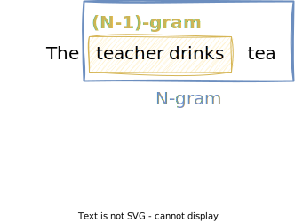

# Language Models

This lecture is about **language models**. A language model is able to calculate the probability of a sequence of words, such as a sentence. They can also estimate the probability of an upcoming word given a history of previous words.

A popular application of language models is **auto-complete**.


!!! example

    Given the sentence:

    > "I want to eat an ..."

    A language model can predict the next word:

    - apple 🍏
    - orange 🍊

## Applications of Language Models

N-gram Language Models can be used for almost any task that involves predicting the next word in a sentence:

- **Auto-complete**: predict the next word in a sentence
- **Summarization**: generate a summary of a long text
- **Spelling correction**: correct typos in a word
- **Speech recognition**: convert speech to text
- **Machine translation**: convert text in one language to another language

!!! example

    Speech recognition:

    - "I need to water 💦 a dozen red noses 👃 for my adversary." ❌
    - "I need to order 🛒 a dozen red roses 🌹 for my anniversary." ✅

    Spell correction:

    - "He entered the ship 🚢 and bought a bannaa 🍌." ❌
    - "He entered the shop 🛒 and bought a banana 🍌." ✅

## Text Corpus

A text corpus is a large and structured **set of texts**, such as:

- Wikipedia
- News articles
- Books
- Blog posts
- Tweets

A corpus can be **general**, such as Wikipedia or news articles, or it can be **domain specific**, such as medical texts or legal documents.

!!! note "Vocabulary size vs. corpus size"

    Note that the **vocabulary size** $|V|$ is the number of unique words in the corpus, whereas the **corpus size** $|C|$ is the total number of words in the corpus.


## Sequence of Words

When building language models, we make use of **sequence of words** in a text corpus.

Given a corpus $C$ and a sequence of words $w_1, w_2, \ldots, w_n$ with $w_i \in C$, we can denote the sequence as:

$$
w_1^n = w_1, w_2, \ldots, w_n
$$

!!! example

    Given a corpus $C$ of size $n$, we can denote the first three words as:

    $$
    w_1^3 = w_1, w_2, w_3
    $$

    The last three words are:

    $$
    w_{n-2}^n = w_{n-2}, w_{n-1}, w_n
    $$

## N-gram

In general, the term N-gram refers to a sequence of $N$ items.

In the context of NLP, an N-gram is a sequence of $N$ words:

- **Unigram (1 word)**: set of all unique single words in a text corpus
- **Bigram (2 words)**: set of all unique pairs of words in a text corpus
- **Trigram (3 words)**: set of all unique triplets of words in a text corpus
- **N-gram ($N$ words)**: set of all unique sequences of $N$ words in a text corpus



**Punctuation** is usually treated like words.

N-grams refer to **unique** sequences of words. So if a sentence contains the same N-gram multiple times, it appears only once in the **set of N-grams**.

!!! example

    The sentence "I want to eat an apple." 🍏 contains the following N-grams:

    - unigrams: $\{\text{I}, \text{want}, \text{to}, \text{eat}, \text{an}, \text{apple}, \text{.}\}$
    - bigrams: $\{\text{I want}, \text{want to}, \text{to eat}, \text{eat an}, \text{an apple}, \text{apple .}\}$
    - trigrams: $\{\text{I want to}, \text{want to eat}, \text{to eat an}, \text{eat an apple}, \text{an apple .}\}$

The **order** is important. Only words that appear next to each other in the text can form an N-gram.

!!! example

    Given the example above, the words "I" and "eat" do not form a bigram ❌

!!! info "Collocations"

    Words that appear next to each other frequently are called **collocations**.

    An N-gram language model can learn and leverage these collocations to improve its predictive accuracy and generate more coherent and contextually relevant language. They play a key role in understanding the nuances of a language.

    Here are some examples:

    - "ice cream" 🍦
    - "machine learning" 🤖
    - "New York" 🗽
    - "want to"

## N-gram Probabilities

Now we will learn how to calculate the probability of an N-gram. We will start with the unigram probability, which is simply the probability of a word appearing in the corpus, and then generalize to bigrams, trigrams, and N-grams.

### Unigram Probability

The unigram probability of a word $w$ is the probability of the word appearing in the corpus $C$:

$$
P(w) = \frac{\text{freq}(w)}{|C|}
$$

where

- $\text{freq}(w)$ is the number of times the word $w$ appears in the corpus $C$
- $|C|$ is the size of the corpus $C$, i.e. the total number of words in the corpus

!!! example "Unigram Probability"

    Given the corpus:

    > I am happy because I am learning

    The unigram probability of the word "I" is given by:

    $$
    P(\text{I}) = \frac{\text{freq}(\text{I})}{|C|} = \frac{2}{7}
    $$

    And the unigram probability of the word "happy" is given by:

    $$
    P(\text{happy}) = \frac{\text{freq}(\text{happy})}{|C|} = \frac{1}{7}
    $$

### Bigram Probability

The general formula for the bigram probability of a word $w_i$ given the previous word $w_{i-1}$ is given by:

$$
P(w_i | w_{i-1}) = \frac{\text{freq}(w_{i-1},w_i)}{\text{freq}(w_{i-1})}
$$

where

- $\text{freq}(w_{i-1}, w_i)$ is the number of times the bigram $w_{i-1}, w_i$ appears in the corpus $C$
- $\text{freq}(w_{i-1})$ is the number of times the word $w_{i-1}$ appears in the corpus $C$

!!! tip "Bigram vs. Conditional Probability"

    Note that the bigram probability is the same as the [conditional probability](./naive_bayes.md#conditional-probability) of the word $w_i$ given the previous word $w_{i-1}$.

!!! example "Bigram Probability"

    Given the corpus:

    > I am happy because I am learning

    The bigram probability of the "I am", i.e. the probability of the word "am" following the word "I", is given by:

    $$
    P(\text{am} | \text{I}) = \frac{\text{freq}(\text{I am})}{\text{freq}(\text{I})} = \frac{2}{2} = 1
    $$

    The probability of the bigram "I happy" is given by:

    $$
    P(\text{happy} | \text{I}) = \frac{\text{freq}(\text{I happy})}{\text{freq}(\text{I})} = \frac{0}{2} = 0
    $$

    The probability of the bigram "am learning" is given by:

    $$
    P(\text{learning} | \text{am}) = \frac{\text{freq}(\text{am learning})}{\text{freq}(\text{am})} = \frac{1}{2} = 0.5
    $$

### Trigram Probability

The general formula for the trigram probability of a word $w_i$ given the previous two words $w_{i-2}$ and $w_{i-1}$ is given by:

$$
P(w_i | w_{i-2}, w_{i-1}) = \frac{\text{freq}(w_{i-2},w_{i-1},w_i)}{\text{freq}(w_{i-2},w_{i-1})}
$$

where

- $\text{freq}(w_{i-2},w_{i-1},w_i)$ is the number of times the trigram $w_{i-2},w_{i-1},w_i$ appears in the corpus $C$
- $\text{freq}(w_{i-2},w_{i-1})$ is the number of times the bigram $w_{i-2},w_{i-1}$ appears in the corpus $C$

Note that we can think of a trigram as a bigram followed by a unigram. From the [sequence notation](#sequence-of-words) shown above, we can rewrite a trigram as:

$$
w_{i-2},w_{i-1},w_i = w_{i-2}^{i-1},w_i = w_{i-2}^i
$$

The trigram probability can then be rewritten as:

$$
P(w_i | w_{i-2}^{i-1}) = \frac{\text{freq}(w_{i-2}^{i-1},w_i)}{\text{freq}(w_{i-2}^{i-1})}
$$

The formula states that the conditional probability of the third word given the previous two words is the count of all three words appearing divided by the count of the previous two words appearing in the correct sequence.

!!! quote "Trigram Probability"

    The probability of the trigram $w_{i-2},w_{i-1},w_i$ is the probability of the word $w_i$ given the bigram $w_{i-2},w_{i-1}$ has already occurred.

    We can also say it is the _conditional probabity_ of the third word, given that the previous two words have already occurred.

!!! example

    Given the corpus:

    > I am happy because I am learning

    The trigram probability of the "I am happy", i.e. the probability of the word "happy" following the bigram "I am", is given by:

    $$
    P(\text{happy} | \text{I am}) = \frac{\text{freq}(\text{I am happy})}{\text{freq}(\text{I am})} = \frac{1}{2} = 0.5
    $$

### N-gram Probability

To generalize the formula to N-grams for any $N$, we can write the N-gram probability of a word $w_i$ given the previous $N-1$ words $w_{i-N+1}, \ldots, w_{i-1}$ as:

$$
P(w_i | w_{i-N+1}^{i-1}) = \frac{\text{freq}(w_{i-N+1}^{i-1},w_i)}{\text{freq}(w_{i-N+1}^{i-1})}
$$

where

- $\text{freq}(w_{i-N+1}^{i-1},w_i)$ is the number of times the N-gram $w_{i-N+1}^{i-1},w_i$ appears in the corpus $C$
- $\text{freq}(w_{i-N+1}^{i-1})$ is the number of times the (N-1)-gram $w_{i-N+1}^{i-1}$ appears in the corpus $C$

Note that we can think of an N-gram as an (N-1)-gram followed by a unigram:

$$
w_{i-N+1}^{i-1},w_i = w_{i-N+1}^i
$$

!!! quote "N-gram Probability"

    The probability of the N-gram $w_{i-N+1}^{i-1},w_i$ is the probability of the word $w_i$ given the (N-1)-gram $w_{i-N+1}^{i-1}$ has already occurred.

    We can also say it is the conditional probabity of the $i$-th word, given that the previous $N-1$ words have already occurred.

!!! example

    Given the corpus:

    > In every place of great resort the monster was the fashion. They sang of it in the cafes, ridiculed it in the papers, and represented it on the stage
    >
    > _Jules Verne, Twenty Thousand Leagues under the Sea_

    The probability of word "papers" following the phrase "it in the" is given by:

    $$
    P(\text{papers} | \text{it in the}) = \frac{\text{count}(\text{it in the papers})}{\text{count}(\text{it in the})} = \frac{1}{2}
    $$

## Sequence Probabilities

If we think of a sentence as a sequence of words, how can we calculate the probability of the sentence?

!!! example

    $$P(\text{The teacher drinks tea}) = ?$$

Recall the conditional probability of $A$ given $B$:

$$
P(A|B) = \frac{P(A \cap B)}{P(B)}
$$

From [Bayes rule](./naive_bayes.md#bayes-rule), we know that:

$$
P(A \cap B) = P(A) \cdot P(B | A)
$$

This means that the probability of $A$ and $B$ is the probability of $A$ times the probability of $B$ given $A$.

We can generalize this to a sequence of events $A, B, C, D$ as follows:

$$
P(A, B, C, D) = P(A) \cdot P(B | A) \cdot P(C | A, B) \cdot P(D | A, B, C)
$$

!!! example

    Let's take a look at a simple example, to get a better understanding of the formula.

    $$
    P(\text{The teacher drinks tea}) = P(\text{The}) \cdot P(\text{teacher} | \text{The}) \cdot P(\text{drinks} | \text{The teacher}) \cdot P(\text{tea} | \text{The teacher drinks})
    $$

    This means that the probability of the sentence "The teacher drinks tea" is

    - the probability of the word "The"
    - times the probability of the word "teacher" given the word "The"
    - times the probability of the word "drinks" given the words "The teacher"
    - times the probability of the word "tea" given the words "The teacher drinks".

From this example, we can see that the longer the sentence gets, the more unlikely it is to occur in the corpus.

We can also see this by looking at the probability of a sentence vs. the probability of a single word. From the [intersection of probabilities](./naive_bayes.md#intersection-of-two-events), we know that:

$$
P(A \cap B) \leq P(A)
$$

And thus, a sequence of events $A, B, C, D$ is less likely to occur than the first event $A$:

$$
P(A, B, C, D) < P(A)
$$

!!! example

    In a regular corpus, we can assume that the probability of the word "drinks" is higher than the probability of the sentence "The teacher drinks tea", because the word "drinks" will appear in other sentences as well.

    $$
    P(\text{The teacher drinks tea}) < P(\text{drinks})
    $$

Note that the probability of a sentence can be zero, because not every possible sentence will **appear in the corpus**.

In fact, a corpus almost never contains the exact sentence that we want to calculate the probability for.

The longer the sentence, the more unlikely it is to occur in the corpus.

!!! example

    Consider the following sentence:

    > The teacher drinks tea

    The probability of this sentence is given by:

    $$
    P(\text{The teacher drinks tea}) = P(\text{The}) \cdot P(\text{teacher} | \text{The}) \cdot P(\text{drinks} | \text{The teacher}) \cdot P(\text{tea} | \text{The teacher drinks})
    $$

    If we look at the probability of the word "tea" or the word "drinks", we can imagine that those words occur regularly in a regular corpus.

    However, if we look at the last part of the equation, which is the probability of the word "tea" given the words "The teacher drinks", we can imagine that they do not occur very often in a regular corpus, and thus, the probability of the sentence is very low.

    $$
    P(\text{tea} | \text{The teacher drinks}) = \frac{\text{freq}(\text{The teacher drinks tea})}{\text{freq}(\text{The teacher drinks})}
    $$

    We can easily construct sentences that are very unlikely to occur in a regular corpus.

    > The teacher drinks tea 🍵 and eats pizza 🍕 and afterwards the teacher builds a house 🏠

    In such cases, the nominator and the denominator of the formula will be zero.

## Markov Assumption

To overcome this problem, we can use the **Markov assumption**.

In general, the Markov assumption says that the probability of the next event only depends on the previous event. So we only look at the previous event, and ignore the rest.

$$
P(D | A, B, C) \approx P(D | C)
$$

Transferring this to sentences, i.e. sequences of words, the Markov assumption says that the probability of the next word only depends on the previous word.

$$
P(w_i | w_{i-1}, w_{i-2}, \ldots, w_1) \approx P(w_i | w_{i-1})
$$

That means, we can only look at the previous word, and ignore the rest.

Generalizing this to N-grams, we can write the Markov assumption for N-grams as:

$$
P(w_i | w_{i-1}, w_{i-2}, \ldots, w_1) \approx P(w_i | w_{i-N+1}^{i-1})
$$

!!! example

    $$
    P(\text{The teacher drinks tea}) \approx P(\text{The}) \cdot P(\text{teacher} | \text{The}) \cdot P(\text{drinks} | \text{teacher}) \cdot P(\text{tea} | \text{drinks})
    $$

!!! tip

    The Markov assumption is a **simplifying assumption** that allows us to estimate the probability of a word given the previous $N$ words, without having to consider the entire history of the sentence.

!!! info "Andrey Markov"

    The Markov assumption is named after the Russian mathematician [Andrey Markov](https://en.wikipedia.org/wiki/Andrey_Markov) (1856-1922).

    

    He was the first to study the theory of stochastic processes, and he discovered the [Markov chains](https://en.wikipedia.org/wiki/Markov_chain), which are a special case of the Markov assumption.

    Markov chains are used in many applications, such as:

    - [Google PageRank](https://en.wikipedia.org/wiki/PageRank)
    - [Hidden Markov Models](https://en.wikipedia.org/wiki/Hidden_Markov_model)
    - [Markov Decision Processes](https://en.wikipedia.org/wiki/Markov_decision_process)

Using the Markov assumption for bigrams, only the previous word is considered:

$$
P(w_i | w_{i-1}, w_{i-2}, \ldots, w_1) \approx P(w_i | w_{i-1})
$$

For N-grams, only the previous $N-1$ words are considered:

$$
P(w_i | w_{i-1}, w_{i-2}, \ldots, w_1) \approx P(w_i | w_{i-N+1}^{i-1})
$$

!!! note "Notation"

    Recall the notation for a sequence of words:

    $$
    P(w_i | w_{i-1}, w_{i-2}, \ldots, w_1) = P(w_i | w_{1}^{i-1})
    $$

Using the Markov assumption, we can rewrite the probability of a sequence of $n$ words as the product of conditional probabilities of the words and their immediate predecessors:

$$
\begin{align}
P(w_1^n) &= P(w_1) \cdot P(w_2 | w_1) \cdot P(w_3 | w_2) \cdot \ldots \cdot P(w_n | w_{n-1}) \\
&= \prod_{i=1}^n P(w_i | w_{i-1})
\end{align}
$$

For N-grams, the probability of a sequence of $n$ words is the product of conditional probabilities of the words and their $N-1$ immediate predecessors:

$$
\begin{align}
P(w_1^n) &= P(w_1) \cdot P(w_2 | w_1) \cdot P(w_3 | w_1^2) \cdot \ldots \cdot P(w_n | w_{n-N+1}^{n-1}) \\
&= \prod_{i=1}^n P(w_i | w_{i-N+1}^{i-1})
\end{align}
$$

!!! warning "Notation"

    Note that

    - $n$ is the number of words in the sequence, while
    - $N$ is the number of words in the N-gram.

!!! quote "Markov Assumption"

    Whenn applying the Markov assumption to N-grams, we can say that the probability of a word only depends on its $N-1$ immediate predecessors. That means, only the last $N$ words are relevant, and the rest can be ignored.

!!! info "Naive Bayes vs. Markov Assumption"

    As you may recall, this is in contrast with [Naive Bayes](./naive_bayes.md#likelihood) where we approximated sentence probability without considering any word history.

!!! example

    Given the folloing probabilities:

    | N-gram | Probability |
    | ---- | ----------- |
    | $P(\text{Mary})$ | 0.1 |
    | $P(\text{likes})$ | 0.2 |
    | $P(\text{cats})$ | 0.3 |
    | $P(\text{Mary} \vert \text{likes})$ | 0.2 |
    | $P(\text{likes} \vert \text{Mary})$ | 0.3 |
    | $P(\text{cats} \vert \text{likes})$ | 0.1 |
    | $P(\text{likes} \vert \text{cats})$ | 0.4 |

    We can calculate the approximated probability of the sentence

    > Mary likes cats

    using a bigram language model as follows:

    $$
    \begin{align}
    P(\text{Mary likes cats}) &= P(\text{Mary}) \cdot P(\text{likes} | \text{Mary}) \cdot P(\text{cats} | \text{likes}) \\
    &= 0.1 \cdot 0.3 \cdot 0.1 \\
    &= 0.003
    \end{align}
    $$

## Start and End of Sequences

When we calculate the probability of a sentence using N-grams, we need to take a closer look at the first and last word of the sentence.

At the beginning of a sentence, we do not have any **context**, so we cannot calculate the N-gram probability of the first word in a sentence.

To overcome this problem, we can add $N-1$ **start tokens** &lt;s&gt; at the beginning of the sentence.

!!! example

    Given the sentence:

    > The teacher drinks tea

    If we want to calculate the bigram probability of the sentence, we can add a start token &lt;s&gt; at the beginning of the sentence:

    > &lt;s&gt; The teacher drinks tea

    We can then calculate the bigram probability of the sentence as follows:

    $$
    P(\text{<s> The teacher drinks tea}) = P(\text{The} | \text{<s>}) \cdot P(\text{teacher} | \text{The}) \cdot P(\text{drinks} | \text{teacher}) \cdot P(\text{tea} | \text{drinks})
    $$

    If we want to calculate the trigram probability of the sentence, we can add two start tokens &lt;s&gt; at the beginning of the sentence:

    > &lt;s&gt; &lt;s&gt; The teacher drinks tea

    We can then calculate the trigram probability of the sentence as follows:

    $$
    P(\text{<s> <s> The teacher drinks tea}) = P(\text{The} | \text{<s> <s>}) \cdot P(\text{teacher} | \text{<s> The}) \cdot P(\text{drinks} | \text{The teacher}) \cdot P(\text{tea} | \text{teacher drinks})
    $$

Similarly we need to add an **end token** &lt;/s&gt; at the end of the sentence.

However, we only need to add a **single end token** &lt;/s&gt; at the end of the sentence, because we only need to calculate the probability of the **sentence ending** given its last $N-1$ words.

!!! example

    Given the sentence:

    > The teacher drinks tea

    If we want to calculate the bigram probability of the sentence, we can add one start token &lt;s&gt; at the beginning of the sentence, and one end token &lt;/s&gt; at the end of the sentence:

    > &lt;s&gt; The teacher drinks tea &lt;/s&gt;

    Since the last word in the sentence is "tea", we only need to calculate the probability of the word "tea" being the last word in the sentence, which is given by:

    $$
    P(\text{</s>} | \text{tea})
    $$

    So we can calculate the bigram probability of the sentence as follows:

    $$
    P(\text{<s> The teacher drinks tea </s>}) = P(\text{The} | \text{<s>}) \cdot P(\text{teacher} | \text{The}) \cdot P(\text{drinks} | \text{teacher}) \cdot P(\text{tea} | \text{drinks}) \cdot P(\text{</s>} | \text{tea})
    $$

!!! quote "Start and End Tokens"

    To calculate N-gram probabilities at the beginning and end of sequences, we need to add $N-1$ start tokens &lt;s&gt; at the beginning of the sentence, and a single end token &lt;/s&gt; at the end of the sentence.

## Count Matrix

The count matrix captures the counts of all N-grams in the corpus.

- the rows represent the unique (N-1)-grams in the corpus
- the columns represent the unique words in the corpus

!!! info

    Recap the formula for the [N-gram probability](#n-gram-probability), where the counts of an N-gram is repesented by the **numerator**:

    $$
    \text{freq}(w_{i-N+1}^{i-1},w_i)
    $$

!!! tip

    The count matrix tells us how often a word occurs after a certain (N-1)-gram. It is a variant of the [co-occurrence matrix](./vector_space_models.md#co-occurrence-matrix) we learned in the lecture about vector space models.

    You can also imagine _sliding a window_ of size $N$ over the whole corpus, and incrementing the counts in the matrix every time the window moves.

!!! example "Bigram Count Matrix"

    Given the corpus:

    > I study I learn

    If we look at the bigram "study I", we can see that it appears once in the corpus.

    That means, for the row "study", that is the (N-1)-gram, and for the column "I", that is the word that follows the (N-1)-gram, the count is one.

    The complete count matrix for bigrams looks as follows (note that we need to add the start and end tokens):

    |  | &lt;s&gt; | I | study | learn | &lt;/s&gt; |
    | ---- | ---- | ---- | ---- | ---- | ---- |
    | **&lt;s&gt;** | 0 | 1 | 0 | 0 | 0 |
    | **I** | 0 | 0 | 1 | 1 | 0 |
    | **study** | 0 | 1 | 0 | 0 | 0 |
    | **learn** | 0 | 0 | 0 | 0 | 1 |
    | **&lt;/s&gt;** | 0 | 0 | 0 | 0 | 0 |

!!! example "Trigram Count Matrix"

    Given the corpus:

    > I study I learn

    If we look at the trigram "study I learn", we can see that it appears once in the corpus.

    That means, for the row "study I", that is the (N-1)-gram, and for the column "learn", that is the word that follows the (N-1)-gram, the count is one.

    The complete count matrix for trigrams looks as follows (note that we need to add the start and end tokens):

    |  | &lt;s&gt; | I | study | learn | &lt;/s&gt; |
    | ---- | ---- | ---- | ---- | ---- | ---- |
    | **&lt;s&gt; &lt;s&gt;** | 0 | 1 | 0 | 0 | 0 |
    | **&lt;s&gt; I** | 0 | 0 | 1 | 0 | 0 |
    | **I study** | 0 | 1 | 0 | 0 | 0 |
    | **study I** | 0 | 0 | 0 | 1 | 0 |
    | **I learn** | 0 | 0 | 0 | 0 | 1 |
    | **learn &lt;/s&gt;** | 0 | 0 | 0 | 0 | 0 |

## Probability Matrix

To get the probabilities, we need to divide the counts by the total number of occurrences of the (N-1)-gram.

This is the same as dividing each row by the sum of the row.

!!! info

    Recall the formula for the [N-gram probability](#n-gram-probability), where the counts of an (N-1)-gram is represented by the **denominator**:

    $$
    \text{freq}(w_{i-N+1}^{i-1})
    $$

    Note that we want to know the probability of the word $w_i$ given the (N-1)-gram $w_{i-N+1}^{i-1}$ has already occurred.

!!! example

    Given the corpus:

    > I study I learn

    The count matrix for bigrams looks as follows:

    |  | &lt;s&gt; | I | study | learn | &lt;/s&gt; | $\sum$ |
    | ---- | ---- | ---- | ---- | ---- | ---- | ---- |
    | **&lt;s&gt;** | 0 | 1 | 0 | 0 | 0 | **1** |
    | **I** | 0 | 0 | 1 | 1 | 0 | **2** |
    | **study** | 0 | 1 | 0 | 0 | 0 | **1** |
    | **learn** | 0 | 0 | 0 | 0 | 1 | **1** |
    | **&lt;/s&gt;** | 0 | 0 | 0 | 0 | 0 | **0** |

    Note that last column, where we sum up the counts of each row.

    We can now calculate the probability matrix by dividing each cell by the sum of the row:

    |  | &lt;s&gt; | I | study | learn | &lt;/s&gt; |
    | ---- | ---- | ---- | ---- | ---- | ---- |
    | **&lt;s&gt;** | 0 | 1 | 0 | 0 | 0 |
    | **I** | 0 | 0 | 0.5 | 0.5 | 0 |
    | **study** | 0 | 1 | 0 | 0 | 0 |
    | **learn** | 0 | 0 | 0 | 0 | 1 |
    | **&lt;/s&gt;** | 0 | 0 | 0 | 0 | 0 |

## Language Model

A language model is a model that assigns a probability to a sequence of words. It can be used to predict the next word in a sentence, or to calculate the probability of a sentence.

!!! tip

    In a simple form, a language model can be as simple as a script that operates on the probability matrix.

### Predicting the Next Word

**Predicting the next word** of a sentence, as in auto-complete, works as follows:

- extract the last (N-1)-gram from the sentence
- find the word with the highest probability for the given the (N-1)-gram in the probability matrix

!!! question

    Given the bigram probability matrix from above, what is the most likely element to follow the word "study"?

!!! Example "Coding Example"

    Given a probability matrix as a pandas dataframe, where the index is the (N-1)-gram, and the columns are the words, in a trigram language model, we could predict the next word as follows:

    ```python
    def predict_next_word(sentence):
        # extract the last (N-1)-gram from the sentence
        last_n_gram = sentence.split()[-2:]
        # find the word with the highest probability for the given the (N-1)-gram in the probability matrix
        return probability_matrix.loc[last_n_gram].idxmax()
    ```

### Sentence Probability

To predict the **probility of a sentence**:

- split sentence into N-grams and extract the probability of each N-gram from the probability matrix
- multiply the probabilities of the N-grams to get the probability of the sentence

!!! example

    Let's assume we want to calculate the probability of the sentence "I learn" using the bigram probability matrix from above:

    $$
    \begin{align}
    P(\text{<s> I learn </s>}) &= P(\text{I} | \text{<s>}) \cdot P(\text{learn} | \text{I}) \cdot P(\text{</s>} | \text{learn}) \\
    &= 1 \cdot 0.5 \cdot 1 \\
    &= 0.5
    \end{align}
    $$

### Text Generation

Using the probability matrix, we can also generate text from scratch or by providing a small hint.

- Choose a sentence start (or provide a hint)
- Choose the next word based on the previous (N-1)-gram
- Repeat until the end of the sentence &lt;/s&gt; is reached

!!! example

    Given the following corpus:

    > &lt;s&gt; Lyn drinks chocolate &lt;/s&gt;
    > &lt;s&gt; John drinks tea &lt;/s&gt;
    > &lt;s&gt; Lyn eats chocolate &lt;/s&gt;

    A generated text could be:

    > Lyn drinks tea

    because:

    1. **(&lt;s&gt; Lyn)** or (&lt;s&gt; John)
    2. (Lyn eats) or **(Lyn drinks)**
    3. **(drinks tea)** or (drinks chocolate)
    4. **(tea &lt;/s&gt;)**

## Log Probability

When we calculate the probability of a sentence, we multiply the probabilities of the N-grams:

$$
P(w_1^n) = \prod_{i=1}^n P(w_i | w_{i-N+1}^{i-1})
$$

Since probability values are in the range $[0,1]$, the product of many probabilities can become very small, which can lead to [numerical underflow](naive_bayes.md#using-logarithms).

To avoid this problem, we can use the **log probability** instead:

$$
\log P(w_1^n) = \sum_{i=1}^n \log P(w_i | w_{i-N+1}^{i-1})
$$

!!! tip

    Recall the logarithmic property:

    $$
    \log(ab) = \log(a) + \log(b)
    $$

## Perplexity

In theory, we could evaluate our language model by calculating the probability of all words in the test set, i.e. the probability of the test set. In practice, a variation of this is used, called **perplexity**.

Perplexity is a commonly used metric to evaluate language models.

You can interpret perplexity as a measure of

- how complex a text is
- how well a language model predicts a text
- if a text looks like it was written by a human or by a computer.

A text with a low perplexity will sound more **natural** to a human than a text with a high perplexity.

The more information the N-gram gives us about the word sequence, the lower the perplexity score, as the following data based on an experiment by [Jurafsky & Martin](https://web.stanford.edu/~jurafsky/slp3/) shows:

| N-gram  | Perplexity |
| ------- | ---------- |
| Unigram | 962        |
| Bigram  | 170        |
| Trigram | 109        |

!!! example

    The following table shows three sentences randomly generated from three n-gram models computed from 40 million words of the Wall Street Journal.

    | N-gram | Generated Text |
    | ---- | ---- |
    | Unigram | Months the my and issue of year foreign new exchange’s september were recession exchange new endorsed a acquire to six executives |
    | Bigram | Last December through the way to preserve the Hudson corporation N. B. E. C. Taylor would seem to complete the major central planners one point five percent of U. S. E. has already old M. X. corporation of living on information such as more frequently fishing to keep her |
    | Trigram | They also point to ninety nine point six billion dollars from two hundred four oh six three percent of the rates of interest stores as Mexico and Brazil on market conditions |

    > Example from [Speech and Language Processing, 3rd ed. draft](https://web.stanford.edu/~jurafsky/slp3/), by Jurafsky & Martin, 2023.

The perplexity of a language model on a test set is the inverse probability of the test set, normalized by the number of words.

For a unigram model, the perplexity of a test set $W$ that consists of $m$ words, is defined as:

$$
\begin{align}
\text{perplexity}(W) &= P(w_1^m)^{-\frac{1}{m}} \\
&= \sqrt[m]{\frac{1}{P(w_1^m)}} \\
\end{align}
$$

Generalizing this to N-grams, the perplexity of a test set $W$ that consists of $m$ words, is defined as:

$$
\text{perplexity}(W) = \sqrt[m]{\prod_{i=1}^m \frac{1}{P(w_i | w_{i-N+1}^{i-1})}}
$$

Since the perplexity is the inverse probability of the set set, the lower the perplexity, the better the model.

!!! example

    Imagine a test set with 100 words, and a really good language model that assigns a probability of $P(W)=0.9$ to the test set.

    $$
    \text{perplexity}(W) = 0.9^{-\frac{1}{100}} \approx 1.001054
    $$

    Now, imagine a language model with a poor performance of only $P(W)=10^{-250}$. The perplexity of this model is:

    $$
    \text{perplexity}(W) = (10^{-250})^{-\frac{1}{100}} \approx 316.227766
    $$

!!! note

    Sometimes the log perplexity is used instead:

    $$
    \text{log perplexity} = \frac{1}{m} \sum_{i=1}^m \log P(w_i | w_{i-N+1}^{i-1})
    $$

!!! info

    The perplexity score of GPT-2 is reported to be 18.34 on the [WikiText-2](https://openai.com/research/better-language-models).
    There is no official perplexity score published by OpenAI for later versions of GPT, but according to [this](https://www.predictea.com/exploring-the-latest-advancements-in-gpt-4-a-comprehensive-overview/) source, GPT-3.5 achieves a perplexity score of 4.5 while GPT-4 achieves a perplexity score of 2.6.

## Out of Vocabulary (OOV) Words

In some cases we need to deal with words that we **haven't seen before**. Such words are called OOV words, and are usually replaced by a **special token `<unk>`**.

We need to think about how to make predictions for words that we have not seen in the training corpus. What would be the N-gram probability of a word that is not in the corpus?

!!! example

    Let's assume we have a trigram language model, and we want to predict the next word for the two given words `(I sip)`. Furthermore we assume that we have seen the bigram `(I drink)` but not the bigram `(I sip)`.

    Instead of predicting the next word for the bigram `(I sip)`, we would predict the next word for the bigram `(I <unk>)`.

Ultimately, the use of the `<unk>` token depends on the vocabulary size. If there are limitations regarding the vocabulary size, we could use the following strategies:

- **Minimum word frequency**: only add words to the vocabulary that occur at least $n$ times in the corpus
- **Maximum vocabulary size**: only add the $n$ most frequent words to the vocabulary

Any other words would be replaced by `<unk>`.

!!! info "Open vs. Closed Vocabulary"

    A **closed vocabulary** (aka _logical_ vocabulary) consists of a fixed set of words, whereas an **open vocabulary** (aka _non-logical_ vocabulary) means we may encounter words that we have not seen before.

!!! warning

    Using a lot of OOV words can influence the **perplexity** score. If there are a lot of OOV words in the test set, the model will predict them with a high probability, which will result in a low perplexity score.

    This means the model with generate sentences that contain a lot of `<unk>` tokens.

    For this reason, perplexities should only be compared across language models with the same vocabularies.

## Smoothing

In the previous section, we saw how to address missing words. However, there is another problem of missing information that we need to address: **missing N-grams**.

In other words, there can be N-grams that are made from words that occur in the corpus, but the N-gram itself _has not been seen_ in the corpus.

The probability of such N-grams would be zero, and thus, considered "impossible" by the language model.

!!! example

    Given the corpus:

    > &lt;s&gt; Lyn drinks chocolate &lt;/s&gt;
    > &lt;s&gt; John drinks tea &lt;/s&gt;
    > &lt;s&gt; Lyn eats chocolate &lt;/s&gt;

    The words "John" and "eats" occur in the corpus, but the bigram "John eats" has not been seen in the corpus.

    Thus, the frequency of the bigram "John eats" would be zero, and its probability would be zero as well.

### Laplacian Smoothing

We have already seen Laplacian smoothing [previously](./naive_bayes.md#laplacian-smoothing). If we apply it to N-grams, the formula looks as follows:

$$
P(w_i | w_{i-N+1}^{i-1}) = \frac{\text{freq}(w_{i-N+1}^{i-1},w_i) + 1}{\text{freq}(w_{i-N+1}^{i-1}) + V}
$$

!!! info

    Since there are $V$ words in the vocabulary and _each one was incremented_, we also need to adjust the denominator to take into account the extra $V$ observations.

Or in its generalized form:

$$
P(w_i | w_{i-N+1}^{i-1}) = \frac{\text{freq}(w_{i-N+1}^{i-1},w_i) + k}{\text{freq}(w_{i-N+1}^{i-1}) + k \cdot V}
$$

!!! info

    The Laplacian smoothing is also called **add-one smoothing**. In its general form, it is called **add-k smoothing**.

!!! note "Hyperparameter $k$"

    Since we are dealing with small values, adding $k=1$ can be too much and negatively affect the probability estimates.

    In practice, this means we need to find a good value for $k$. As a hyperparameter, it needs to be learned from the validation set.

!!! note "Other Smoothing Techniques"

    There are a couple of advanced smoothing techniques, such as [Good-Turing](https://en.wikipedia.org/wiki/Good%E2%80%93Turing_frequency_estimation) smoothing or [Kneser-Ney](https://en.wikipedia.org/wiki/Kneser%E2%80%93Ney_smoothing) smoothing.

### Backoff

Another smoothing approach to deal with N-grams that do not occur in the corpus is to use information about lower order N-grams. This is called **backoff**.

If the N-gram we need has zero counts, we can approximate it by backing off to the (N-1)-gram. If the (N-1)-gram has zero counts, we can approximate it by backing off to the (N-2)-gram, and so on.
We continue backing off until we reach something that has non-zero counts.

!!! info

    In other words, sometimes using _less context_ is a good thing, helping to generalize more for contexts that the model hasn’t learned much about.

Here is the general formula for backoff:

$$
P_{bo}(w_i | w_{i-N+1}^{i-1}) =
\begin{cases}
P(w_i | w_{i-N+1}^{i-1}) & \text{if } \text{freq}(w_{i-N+1}^{i}) > 0 \\
\alpha P(w_i | w_{i-N+2}^{i-1}) & \text{otherwise}
\end{cases}
$$

!!! warning "Discount"

    If we replace an unseen N-gram which has zero probability with a lower order N-gram, we would be _adding probability mass_, and the total **probability** assigned to all possible strings by the language model would be **greater than 1**!

    To account for this, we need to _discount_ the probability mass from the higher order N-gram and _redistribute_ it to the lower order N-grams.

    This is expressed by the parameter $\alpha$ in the formula above. There are different ways to set the value of $\alpha$.

!!! info "Katz Backoff"

    A popular smoothing technique is the [Katz backoff](https://www.cis.upenn.edu/~danroth/Teaching/CS598-05/Papers/Katz87.pdf) by Katz (1987). It involves a quite detailed computation for estimating the $\alpha$ parameter.

!!! info "Stupid Backoff"

    A simple yet efficient approach is the [Stupid Backoff](https://www.aclweb.org/anthology/D07-1090.pdf) by Brants et al. (2007), where the $\alpha$ parameter was heuristically set to 0.4.

    Originally, the authors thought that such simple approach cannot possibly be good, but it turned out to be very effective and inexpensive.

!!! example

    Given the corpus:

    > &lt;s&gt; Lyn drinks chocolate &lt;/s&gt;
    > &lt;s&gt; John drinks tea &lt;/s&gt;
    > &lt;s&gt; Lyn eats chocolate &lt;/s&gt;

    The probability of the sentence "John drinks chocolate" cannot be directly estimated:

    $$
    P(\text{chocholate} | \text{John drinks}) = ?
    $$

    However, we can use the bigram probability of $P(\text{chocholate} | \text{drinks})$ to estimate the probability of the sentence.

    Using **stupid backoff**, we can estimate the probability as follows:

    $$
    P(\text{chocholate} | \text{John drinks}) = 0.4 \cdot P(\text{chocholate} | \text{drinks})
    $$

### Interpolation

We can even make use of backoff in our model and _always_ mix the probability of the higher order N-gram with the lower order N-gram, even if the higher order N-gram has non-zero counts.

This is called **interpolation**.

!!! question

    What does this mean for building such a model?

<!-- ANSWER: We need to train a separate model for each N-gram. -->

Here is the general formula for _linear_ interpolation, where each N-gram is weighted by a parameter $\lambda$:

$$
P_{inter}(w_i | w_{i-N+1}^{i-1}) = \lambda_1 P(w_i | w_{i-N+1}^{i-1}) + \lambda_2 P(w_i | w_{i-N+2}^{i-1}) + \ldots + \lambda_n P(w_i)
$$

such that

$$
\sum_{i=1}^n \lambda_i = 1
$$

!!! note

    The $\lambda$ parameters are **hyperparameters** that need to be learned from the validation set.

!!! example

    Given the corpus:

    > &lt;s&gt; Lyn drinks chocolate &lt;/s&gt;
    > &lt;s&gt; John drinks tea &lt;/s&gt;
    > &lt;s&gt; Lyn eats chocolate &lt;/s&gt;

    Let's assume we have an interpolation model and trained the following $\lambda$ parameters:

    | N-gram | $\lambda$ |
    | ---- | ---- |
    | Unigram | 0.1 |
    | Bigram | 0.2 |
    | Trigram | 0.7 |

    Using an interpolation model, we would estimate the probability of the sentence "Lyn drinks chocolate" as follows:

    $$
    \begin{align}
    P(\text{Lyn drinks chocolate}) &= \lambda_1 P(\text{chocolate} | \text{Lyn drinks}) + \lambda_2 P(\text{chocolate} | \text{drinks}) + \lambda_3 P(\text{chocolate}) \\
    &= 0.7 \cdot P(\text{chocolate} | \text{Lyn drinks}) + 0.2 \cdot P(\text{chocolate} | \text{drinks}) + 0.1 \cdot \lambda_3 P(\text{chocolate}) \\
    \end{align}
    $$

## Key Takeaways

- **Language models** are able to assign a probability to a sequence of words, or to predict the next word in a sentence. This enables many intersting NLP applications, such as auto-complete, text generation, or machine translation.
- this lecture specifically looked at **N-gram language models**. An N-gram is a sequence of $N$ words, and instead of estimating the probability of a word given the entire history of the sentence, the N-gram language model only considers the last $N-1$ words.
- N-gram language models are based on the **Markov assumption**, which says that the probability of a word only depends on its $N-1$ immediate predecessors.
- Building the language model means **filling the probability matrix**, where the rows represent the unique (N-1)-grams in the corpus, and the columns represent the unique words in the corpus.
- When building the **probability matrix**, we need to add $N-1$ start tokens &lt;s&gt; at the beginning of the sentence, and a single end token &lt;/s&gt; at the end of the sentence.
- Having the probability matrix available, we can already predict the next word in a sentence, or calculate the probability of a sentence, simply by performing several **lookups** in the probability matrix.
- Also here, we usually make use of the **log probability** to avoid numerical underflow.
- To evaluate the **performance** of a language model, we can calculate the **perplexity** score. The lower the perplexity, the better the model.
- To deal with **missing information**, we introduce a special token for OOV words. For missing N-grams, we can make use of smoothing techniques, such as Laplacian smoothing, backoff, or interpolation.
