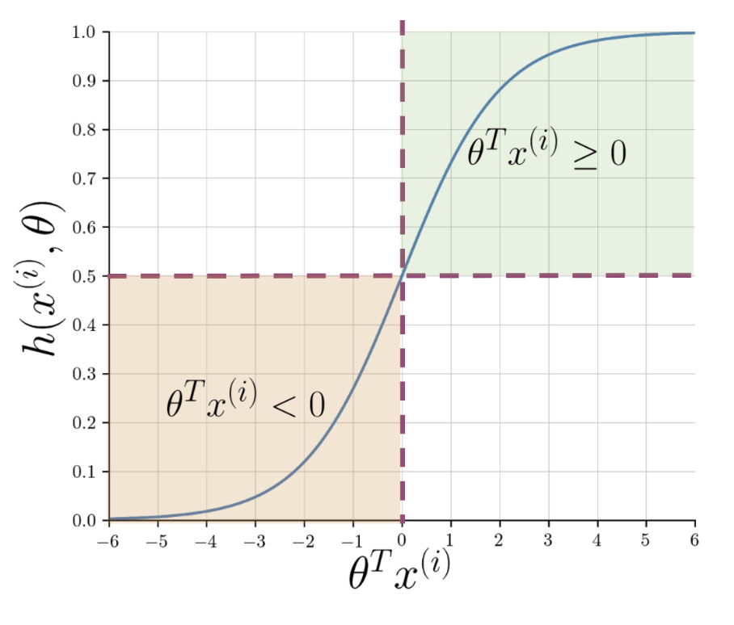
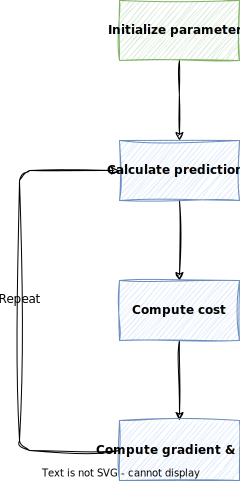
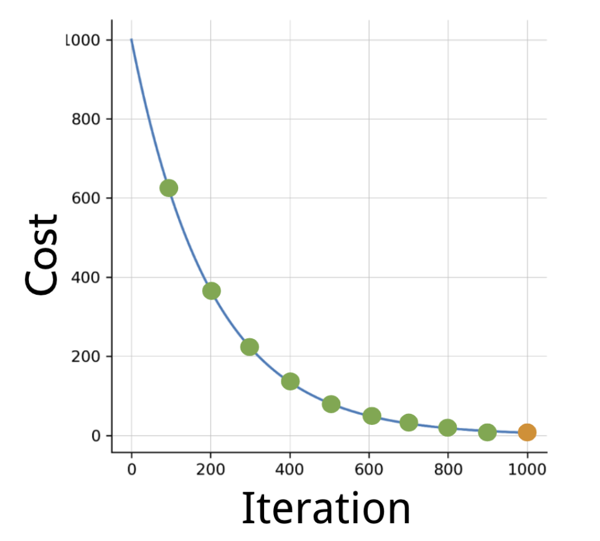

# Logistic Regression

Logistic regression is a **supervised learning** algorithm that can be used for **classification**.

In **classification**, the goal is to predict a discrete class label, such as "spam" or "not spam".

!!! info

    In the assignment, we will conduct a **sentiment analysis on tweets using logistic regression**, and try to predict whether a tweet has an overall **positive or negative meaning**.

## Supervised Learning

In **supervised learning**, the goal is to **learn a function**, i.e. the parameters of a function, that **maps an input to an output** based on example input-output pairs.

When working with **text data**, we need to make sure to apply the required **preprocessing** steps in order to extract the required features from the text data.



## The Sigmoid Function

The **prediction function** in logistic regression is a **sigmoid function** that transforms the linear combination of input features $z$ into a probability value between 0 and 1.

The **linear combination** $z$ of the input features of a given sample $x$ and their weights $\theta$ is given as

$$
z = \theta_0 + \theta_1 x_1 + \theta_2 x_2 + \cdots + \theta_n x_n,
$$

or in its **vectorized form**

$$
z = \theta^T x,
$$

where

- $\theta$ is the vector of weights, and
- $x$ is the vector of input features of a given sample.

When applying the **sigmoid function** to $z$, the output will be a probability value between 0 and 1.

$$
h(z) = \frac{1}{1 + e^{-z}}
$$

As $z$ approaches $-\infty$, the denominator of the sigmoid function gets larger and larger and as a result, $h(z)$ approaches 0.

On the other hand, as $z$ approaches $\infty$, the denominator of the sigmoid function gets closer to one and $h(z)$ approaches 1.



!!! note

    The term $z$ is also called the **log-odds** or **logit**.
    It represent the logarithm of the odds of the event occurring.

## Training

In logistic regression, the goal is typically **binary classification**, where the algorithm learns to classify input data into one of two classes.
During the **training phase**, the algorithm **adjusts its parameters** (weights and bias) based on the input data in order to **minimize the difference between its predictions and the actual labels** in the training dataset.

The process involves using an **optimization algorithm** (usually gradient descent) to find the optimal values for the parameters that **minimize a cost function**.
The cost function measures the **difference** between the predicted outputs and the true labels.
The training process continues iteratively until the algorithm converges to a set of parameters that yield satisfactory predictions on the training data.

### Gradient Descent

Training in logistic regression is based on the **gradient descent** algorithm. Here is a brief overview of the steps involved:



1.  **Initialize Parameters:** Set the initial values for the weights $\theta$, considering the **bias term**.
    This is the starting point for the optimization process.

    In numpy, this can be done with the following code:

    ```python
    theta = np.zeros((n_features + 1, 1))
    ```

2.  **Calculate Predictions:** Use the current parameter values to make predictions for each data point in the training set using the [sigmoid function](#the-sigmoid-function) $h(z)$.
    This step produces the predicted probabilities for each example.

3.  **Compute the Cost Function:** Calculate the [cost function](#cost-function) $J(\theta)$, which measures the difference between the predicted probabilities and the actual class labels.

4.  **Compute Gradients:** Calculate the partial derivatives of the cost function with respect to each parameter.
    These gradients indicate the direction and magnitude of the steepest increase in the cost function.

5.  **Update Weights:** Adjust the parameters in the direction opposite to the gradients to minimize the cost function.
    This involves multiplying the gradients by a learning rate $\alpha$ and subtracting the result from the current parameter values.

6.  **Repeat:** Iterate steps 2-5 until the convergence criteria are met, such as reaching a maximum number of iterations or achieving a sufficiently small change in the cost function.

These steps represent the core of the gradient descent algorithm in the context of logistic regression.

The goal is to **iteratively update the parameters** in the direction that minimizes the cost function, eventually reaching a set of **parameters that optimally fit the training data**.

!!! info "Bias Term"

    The **bias term** (also known as the intercept or offset) in logistic regression serves to shift the decision boundary away from the origin (0,0) in the feature space.

    Without the bias term, the decision boundary would always pass through the origin, but this is barely the case in real-world data.

    While the weights associated with the features determine the slope of the decision boundary, the bias term influences where the decision boundary is positioned on the y-axis.

!!! info "Learning Rate"

    The **learning rate $\alpha$** is a hyperparameter that controls the **step size at each iteration** while moving toward a minimum of the cost function.
    It is a crucial parameter in optimization algorithms that are used to train machine learning models.

    If the learning rate is too small, the algorithm may take a long time to converge or may get stuck in a local minimum.
    On the other hand, if the learning rate is too large, the algorithm may overshoot the minimum and fail to converge

!!! info

    The terms **"cost function"** and **"loss function"** are often used **interchangeably**. In most contexts, they refer to the same concept.

### Cost Function

The cost function measures the **difference** between the **predicted labels** and the **actual class labels** (aka cost).

The cost function $J(\theta)$ in logistic regression is given as

$$
J(\theta) = - \frac{1}{m}(\mathbf{y}^T \log(\mathbf{h}) + (1 - \mathbf{y})^T \log(1 - \mathbf{h}))
$$

where

- $m$ is the number of training samples,
- $\mathbf{y}$ is the vector of training labels, and
- $\mathbf{h}$ is the vector of outputs of the sigmoid function for all samples.

A low cost means good predictions, so the goal is to **minimize the cost function** $J(\theta)$.

When performing gradient descent, the cost should **decrease with every iteration**.



!!! info

    For our purposes, we do not bother the derivation of the cost function.
    However, if you are interested, you can read more about it [here](https://ml-explained.com/blog/logistic-regression-explained).

### Compute Gradient and Update Weights

Computing the gradient and updating the weights can happen in one step.

We want to find the direction of the steepest increase of the cost function $J(\theta)$, this is why we need to calculate the gradient of the cost function $J(\theta)$.

To do that, we need the partial derivative of the cost function $J(\theta)$ with respect to the weights $\theta$.

A vectorized form of the gradient of the cost function $J(\theta)$ and the weight updates is given as

$$
\theta = \theta - \frac{\alpha}{m} \mathbf{X}^T (\mathbf{h - y})
$$

where

- $m$ is the number of training samples,
- $\alpha$ is the learning rate,
- $\mathbf{X}$ is the matrix of input features of all samples, and
- $\mathbf{h}$ is the vector of outputs of the sigmoid function for all samples.
- $\mathbf{y}$ is the vector of training labels.

So the term $\mathbf{h - y}$ is essentially the **vector of errors**, representing the difference between the predicted values and the actual values.
For the equation to work, we need to transpose the matrix of input features $\mathbf{X}$.

## Testing

When we reached testing phase, we have already trained the logistic regression model and have the weights $\theta$ available.

To test a sample, we need to **extract the features** $x$ from the sample, and then pass it to the **prediction function** of the logistic regression model.

To test the logistic regression model, for all samples in the test set, the following steps are performed:

1.  Calculate the **linear combination** $z$ of the input features $x$ and the weights $\theta$.

    $$
    z = \theta^T x
    $$

2.  Calculate the **sigmoid function** $h(z)$.
3.  Determine the **predicted label** $\hat{y}$ based on the value of the sigmoid function $h(z)$.

    $$
    \hat{y} =
    \begin{cases}
    1 & \text{if } h(z) \geq 0.5 \\
    0 & \text{if } h(z) < 0.5
    \end{cases}
    $$

4.  **Compare** the predicted labels with the test labels $y$.

    $$
    \hat{y} == y
    $$

5.  Calculate **performance metrics**, e.g. accuracy.

The figure in the [supervised learning](#supervised-learning) section also indicates the steps involved in testing process.

!!! warning

    Before extracting features from a test sample, we need to apply the **same preprocessing steps** as we did during training.

## Key Takeaways

- Logistic regression is a **supervised learning** algorithm that can be used for classification.
- The **prediction function** in logistic regression is a **sigmoid function** that outputs a probability value between 0 and 1.
- The **cost function** measures the difference between the predicted labels and the actual class labels.
- The goal is to **minimize** the cost function.
- Training in logistic regression is based on the **gradient descent** algorithm.
