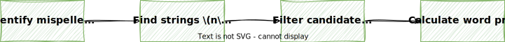
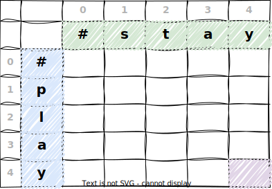
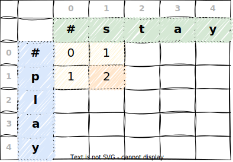
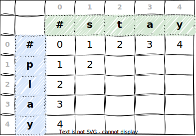
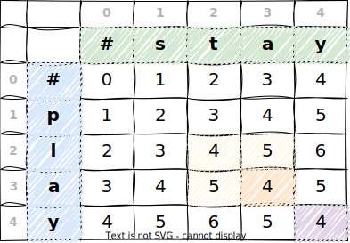

# Minimum Edit Distance

Minimum edit distance is another similarity measure that can be used to find strings that are close to a given string.

A popular use in NLP is in **autocorrection** systems, where it is used to suggest corrections for misspelled words. Autocorrect is a feature that is built into many devices and applications, such as smartphones, email clients, and text processors.

It does not always work as intended, and sometimes it can even be quite funny. You have probably seen examples like the following:

<div style="display: flex; justify-content: space-around; align-items: center; margin: ">
  
  
</div>

!!! tip

    Find more funny autocorrect examples [here](https://www.buzzfeed.com/andrewziegler/autocorrect-fails-of-the-decade) and [here](https://cheezburger.com/15340293/25-outrageous-autocorrect-fails-to-make-you-lol-cheezburger).

## Edit Distance

Edit distance, also known as Levenshtein distance, is a **measure of the similarity** between two strings by calculating the **minimum number of single-character edits** required to change one string into the other. It provides a quantitative measure of how _different_ or _similar_ two strings are.

The operations that can be performed are:

- Insertion
- Deletion
- Replacement

For the **minimum edit distance**, we want to find the **minimum number of operations** that are needed to transform one string into another string.

!!! quote "Minimum Edit Distance"

    Given a string, the **minimum edit distance** is the minimum number of single-character edits (insertions, deletions, or substitutions) required to change one string into the other.

!!! info

    The term is named after the Soviet mathematician **Vladimir Levenshtein**, who first introduced the concept in 1965.

    

    Note that there are other algorithms for calculating the edit distance, including the [Wagner-Fischer algorithm](https://en.wikipedia.org/wiki/Wagner%E2%80%93Fischer_algorithm), the [Needleman-Wunsch algorithm](https://en.wikipedia.org/wiki/Needleman%E2%80%93Wunsch_algorithm), or the [Jaro-Winkler algorithm](https://en.wikipedia.org/wiki/Jaro%E2%80%93Winkler_distance).

    Also see NLTK's [edit distance](https://www.nltk.org/api/nltk.metrics.distance.html) module for more information.

!!! example

    Consider the words `kitten` 🐈 and `sitting` 🧘. The edit distance between them is 3 because the following three operations can transform one into the other:

    - Replace `k` with `s`
    - Replace `e` with `i`
    - Insert `g` at the end

    For this intuitive example, we do not consider the cost of each operation. We will look at that later.

## Applications

The edit distance is used in various NLP applications, including:

- **Autocorrection / Spell checking:** Minimum Edit Distance is often used in spell-checking algorithms to **suggest corrections for misspelled words**. By calculating the minimum edit distance between a misspelled word and candidate words in a dictionary, a spell checker can identify potential corrections.

- **Information Retrieval:** Minimum Edit Distance can be used in information retrieval systems to **find similar words or phrases** in a database. This is particularly useful in **search engines** when dealing with queries that may contain **typos** or slight variations.

- **Plagiarism Detection:** Minimum Edit Distance can be applied to compare and analyze text documents for plagiarism detection. By measuring the similarity between documents in terms of edit operations, it becomes possible to **identify instances of copied or closely paraphrased** content.

- **OCR (Optical Character Recognition):** OCR systems may use Minimum Edit Distance to recognize and correct errors in the recognized text. It helps improve the accuracy of **converting scanned or photographed documents** into machine-readable text.

But also in other fields, such as:

- **DNA Sequencing:** In bioinformatics, Minimum Edit Distance is applied to **compare DNA or RNA sequences**. It helps identify the evolutionary relationships between different genetic sequences by quantifying the number of mutations needed to transform one sequence into another.

- **Genealogy and Historical Linguistics:** Minimum Edit Distance is used to study language evolution and historical relationships between languages by **comparing words and phrases across different time periods**.


For this lecture, we will specifally look at how the Minimum Edit Distance can be used in **autocorrection** systems.

!!! info

    The notebook associated with this lecture is the `minimum_edit_distance.ipynb` notebook in the `notebooks` folder.

## Autocorrect Process

The autocorrect process can be broken down into four steps:

1. Identify an incorrect word
2. Find strings $n$ edit distance away
3. Filter candidate words
4. Calculate the word probabilities



!!! example

    Consider the following sentence:

    > "my *deah* friend" ❌

    1.  We can easily see that the word `deah` is incorrect. The intended word is probably `dear`.

        - my *dear* friend ✅

    2.  We can find words that are **1 edit distance** away from `deah`:

        Note that we do not care if the words are valid words or not. We just want to find words that are 1 edit distance away from `deah`.

        - Replacements, e.g. `dear`, `dead`, `deas`, `yeah`
        - Insertions, e.g. `deahs`, `deaht`, `deahh`
        - Deletions, e.g. `dea`, `deh`, `eah`

    3.  We can filter out words that are not in the vocabulary.

        - `dear` ✅
        - `dead` ✅
        - `deal` ✅
        - `deas` ❌
        - ...

    4.  We can calculate the word probabilities to find the most likely word.

        In our case, we can intuitively assume that `dear` is more likely than `dead`.

        - My *dear* friend ✅
        - My *dead* friend 😱🧟

## Identifying Incorrect Words

For humans, it is usually quite easy to identify incorrect words. But for a computer, we need to find a way to identify incorrect words.

The simplified assumption we can in the lecture is that if a word is not in the vocabulary, then it is probably a typo.

```python hl_lines="4"
def identify_incorrect_words(words, vocab):
    incorrect_words = []
    for word in words:
        if word not in vocab:
            incorrect_words.append(word)
    return incorrect_words
```

Note that the vocabulary is a **set of words**, i.e. it does not contain duplicates.

```python
>>> words = ["happy", "sad", "excited", "happy", "sad", "happy", "cool", "funny"]
>>> vocab = set(words)
>>> vocab
{'happy', 'sad', 'excited', 'funny', 'cool'}
```

!!! info

    There are much more sophisticated techniques for identifying words that are probably incorrect by looking at the context of the word.
    However, in this lecture, we will only look at spelling errors, not grammatical or contextual errors.

!!! example

    Consider the following sentence:

    - Happy birthday to you, my *dear* friend ✅
    - Happy birthday to you, my *deah* friend ❌

    This is as expected, since `deah` is not in the vocabulary. But since we can expect the word `deer` to be in the vocabulary, we would not identify the following sentence as incorrect:

    - Happy birthday to you, my *deer* friend ✅🦌

## Finding Strings within Edit Distance

Next, we want to find strings that are within a certain edit distance $n$ from a given string.

An edit is a type of operation that we can perform on a string to change it into another string, and ss we've already learned, there are three types of edits:

- Insertion
- Deletion
- Replacement

So the edit distance $n$ tells us, how many operations one string is away from another string. We can combine these operations in any order.

By combining these edits, we can find a list of all possible strings that are $n$ edit distances away from a given string, regardless of wheter those strings are **valid words or not**.

!!! info

    For autocorrect, we want to find strings that are close to the incorrect word. For autocorrect, a good guess would be to find strings that are not more than 3 edit distances away from the incorrect word.

To implement the following operations, Python [index slicing](https://realpython.com/lessons/indexing-and-slicing/) comes in handy. It allows you to access a subset of a sequence by specifying a range of indices.

```python
>>> word = "play"
>>> word[:2]
'pl'
>>> word[2:]
'ay'
```

### Insertion

An insertion is when we insert a character into a string. It does not matter where we insert the character.

```python
def insert_char(word, i, char):
    return word[:i] + char + word[i:]
```

!!! example

    For the word `to`

    - if we do an insertion of the character `p`, we get the word `top`.
    - if we do an insertion of the character `o`, we get the word `too`.
    - if we do an insertion of the character `w`, we get the word `two`.

### Deletion

A deletion is when we remove a character from a string. It does not matter which character we delete.

```python
def delete_char(word, i):
    return word[:i] + word[i+1:]
```

!!! example

    For the word `hat`

    - if we remove the character `h`, we get the word `at`.
    - if we remove the character `a`, we get the word `ht`.
    - if we remove the character `t`, we get the word `ha`.

### Replacement

A replacement is when we replace a character in a string with another character. It does not matter which character we replace.

```python
def replace_char(word, i, char):
    return word[:i] + char + word[i+1:]
```

!!! example

    For the word `jaw`

    - if we replace the character `j` with `s`, we get the word `saw`.
    - if we replace the character `w` with `r`, we get the word `jar`.
    - if we replace the character `j` with `p`, we get the word `paw`.

## Filtering Candidate Words

Many words returned by the edit distance algorithm are not valid words. We need to filter these words out.

To do this, we can also check if the word is in the vocabulary. If it is, then we can keep it.

```python hl_lines="4"
def filter_candidates(words, vocab):
    valid_words = []
    for word in words:
        if word in vocab:
            valid_words.append(word)
    return valid_words
```

## Calculating Word Probabilities

If we have the candidate words available, the next step is to find the word that is most likely to be the correct word (or the $n$ most likely words).

!!! example

    Consider the following sentence:

    > "I like apples 🍎🍏 *ans* bananas" 🍌🍌

    The word `ans` is supposedly a typo of the word `and`.

    If we look at two candidate words, `and` and `ant`, we can observe that both are 1 edit distance away from `ans`. So how can we tell that `and` is more likely to be the correct word than `ant`? 🐜

    Usually, we can assume that the word `and` is more frequent than the word `ant` 🐜 in any given text, so based on word frequencies, the model should suggest the word `and` as the correct word. 💡

To do this, we can use the word probabilities. The word probabilities tell us how likely it is for a word to appear in a given text.

The word probabilities can be calculated by counting the number of times a word appears in a text, and dividing it by the total number of words in the text.

$$
P(w) = \frac{N(w)}{N}
$$

Where

- $P(w)$ is the probability of the word $w$ appearing in a text
- $N(w)$ is the frequency of the word $w$ in the text
- $N$ is the total count of all words in the text

!!! info

    This is quite similar as from the lecture on [feature extraction](./feature_extraction.md#positive-and-negative-frequencies), where we calculated the word frequencies per class. The difference here is that we are now calculating the word frequencies for the entire text, not per class. This gives us the probability of a **word appearing in a text**.

!!! example

    Consider the following corpus:

    ```python
    corpus = [
        "I like apples and bananas",
        "I like apples and oranges"
    ]
    ```

    By counting the number of times each word appears in the corpus, we get the word frequencies. Since the total number of words $N$ in the corpus is 10, we can calculate the word probabilities, and end up with the following table:

    If we build the word frequency table for this corpus, we get the following:

    | Word     | Frequency | Probability |
    | -------- | --------- | ----------- |
    | I        | 2         | 0.2         |
    | like     | 2         | 0.2         |
    | apples   | 2         | 0.2         |
    | and      | 2         | 0.2         |
    | bananas  | 1         | 0.1         |
    | oranges  | 1         | 0.1         |
    | **total**    | **10**        | **1.0**        |

Note that in Python, we can utilize the `Counter` class from the `collections` module to count the number of times each word appears in the corpus.

```python
>>> from collections import Counter
>>> freqs = Counter()
>>> for text in corpus:
>>>     freqs.update(text.split())
>>> freqs
Counter({'I': 2, 'like': 2, 'apples': 2, 'and': 2, 'bananas': 1, 'oranges': 1})
```

From there, we can calculate the word probabilities as follows:

```python
>>> total_words = sum(freqs.values())
>>> {word: freq / total_words for word, freq in freqs.items()}
{'I': 0.2, 'like': 0.2, 'apples': 0.2, 'and': 0.2, 'bananas': 0.1, 'oranges': 0.1}
```

!!! info

    The code snippet above shows a Python [dict comprehension](https://docs.python.org/3/tutorial/datastructures.html#dictionaries).

    They can be used to create dictionaries from arbitrary key and value expressions, like so:

    ```python
    >>> {x: x**2 for x in (2, 4, 6)}
    {2: 4, 4: 16, 6: 36}
    ```

    This is equivalent to the following code:

    ```python
    data = {}
    for x in (2, 4, 6):
        data[x] = x**2
    ```

## The Levenshtein Distance Algorithm

Now we take a look at a specific algorithm for calculating the minimum edit distance between two strings.

In NLP, one of the most common algorithms for calculating the minimum edit distance is the **Levenshtein distance algorithm**.

The Levenshtein distance algorithm is a **dynamic programming** algorithm that calculates the minimum edit distance between two strings.

!!! info "Dynamic Programming"

    Dynamic programming is a method for solving complex problems by breaking them down into simpler subproblems. It is often used when the subproblems are overlapping, i.e. when subproblems share subproblems.

    The Levenshtein distance algorithm is a dynamic programming algorithm because it breaks down the problem of calculating the minimum edit distance into smaller subproblems, and it uses the results of those subproblems to solve the larger problem of calculating the minimum edit distance.

    We can often solve dynamic programming problems by using **recursion**.

    Here is a nice blog post that explains dynamic programming in more detail: [The complete beginners guide to dynamic programming](https://stackoverflow.blog/2022/01/31/the-complete-beginners-guide-to-dynamic-programming/)

When computing the minimum edit distance, you would start with a source word and transform it into the target word. The algorithm would then return the minimum cost of transforming the source word into the target word.

We can do that by created a **distance matrix $D$** where the source word is shown on the vertical axis, and the target word is shown on the horizontal axis.

!!! example

    To explain the algorithm in the following sections, we will use the following example words:

    - Source: `play`
    - Target: `stay`

### Edit Cost

In the Minimum Edit Distance algorithm, each edit operation has a cost associated with it.

For the Levenshtein distance algorithm, the cost of each edit operation is as follows:

| Operation | Cost |
| --------- | ---- |
| Insertion | 1    |
| Deletion  | 1    |
| Replace   | 2    |

!!! info

    Since a **replacement** can be seen as a deletion followed by an insertion, it makes sense that the cost of a replacement is given as 2.

If we transform one string into another string, we can calculate the **total edit cost** by adding up the costs of all edit operations. This is referred to as the **total edit cost**, and this is what we are trying to minimize.

We can think of the cost as the **distance** between two words. The lower the cost, the closer the words are, and the more similar they are.

!!! example

    Consider our two example words:

    - Source: `play`
    - Target: `stay`

    To go from `play` to `stay`, we need to do the following operations:

    - *Replace* `p` with `s`
    - *Replace* `l` with `t`

    Since a replacement has a cost of 2, the total cost of changing `play` into `stay` is calculated by:

    $$
    2 + 2 = 4
    $$

    So the edit distance between `play` and `stay` is 4.

### Edit Paths

Sometimes there are multiple ways to transform the source word into the target word. Each possible sequence of edit operations is called an **edit path**.

!!! example

    If we want to transform the letter `p` into the letter `s`, we can do this via the following edit paths:

    - Insert `s` and delete `p`: `p` -> `ps` -> `s` (cost: 1 + 1 = 2)
    - Delete `p` and insert `s`: `p` -> `#` -> `s` (cost: 1 + 1 = 2)
    - Replace `p` with `s`: `p` -> `s` (cost: 2)

### Creating the Distance Matrix

We start by creating the distance matrix $D$ where the **source** word `play` is shown on the **vertical** axis, and the **target** word `stay` is shown on the **horizontal** axis.



Note that each letter is assigned an **index**.

Also note that we also add an **empty character** `#` to the top and left of the table. This is because we need to be able to transform the source word into an empty string, and the empty string into the target word.

Our goal is to fill each cell `D[i,j]` with the correct edit distance values, where:

$$
D[i,j] = source[:i] \rightarrow target[:j]
$$

We can find the edit distance between the source word `play` and the target word `stay` in the **bottom right corner** of the table, which represents the transformation `play -> stay`.

!!! example

    The element `D[2,3]` represents the transformation `pl -> sta`.

    ```python
    >>> source = "play"
    >>> target = "stay"
    >>> source[:2]
    'pl'
    >>> target[:3]
    'sta'
    ```

### Initializing the Matrix

Let's start in the top left corner of the table, which represents the transformation `# -> #`, that is, transforming an empty string into an empty string. This is a special case, since we do not need to do any edits to transform an empty string into an empty string. So the cost of this transformation is zero.

- The cell `D[1,0]` represents the path `p -> #`, that is, deleting `p` so that we have an empty string, which has a cost of 1.
- The cell `D[0,1]` represents the path `# -> s`, that is, inserting `s` into an empty string, which has a cost of 1.
- The cell `D[0,0]` represents the path `# -> #`, that is, transforming an empty string into an empty string, which has a cost of 0.



Now, consider the cell `D[1,1]`, which represents the transformation `p -> s`. As we've seen [before](#edit-paths), there are three paths to do that:

| Path           | Operations                | Cost      |
| -------------- | ------------------------- | --------- |
| `p -> ps -> s` | Insert `s` and delete `p` | 1 + 1 = 2 |
| `p -> # -> s`  | Delete `p` and insert `s` | 1 + 1 = 2 |
| `p -> s`       | Replace `p` with `s`      | 2         |

1.  **First insert `s`, then delete `p`**

    In cell `D[0,1]`, we already calculated the cost of inserting `s`, so we can reuse that cost, and add another deletion cost for `p`:

    $$
    D[i-1,j] + \text{delete cost}
    $$

2.  **First delete `p`, then insert `s`**

    In cell `D[1,0]`, we already calculated the cost of deleting `p`, so we can reuse that cost, and add another insertion cost for `s`:

    $$
    D[i,j-1] + \text{insert cost}
    $$

3.  **Replace `p` with `s`**

    Going directly from `p -> s` is considered a replacement and has a cost of 2. In our case `p` and `s` are different. If they were the same, we would not need to replace them, and thus, the cost would be zero. So we need to differentiate those two cases here:

    $$
    D[i-1,j-1] + \begin{cases}
        0 & \text{if } source[i] = target[j] \\
        2 & \text{otherwise}
    \end{cases}
    $$

    !!! tip

        You can think of a replace operation as moving diagonal in the table.

In this example, all edit paths lead to a **cost of 2**. But remeber that we always want to find the **minimum cost** for the given transformation. So if one of those costs would be smaller than the other ones, this would be the cost to enter in `D[1,1]`.

### Deriving the Algorithm

Considering all of the above cases, we can formalize the algorithm as follows:

$$
D[i,j] = \text{min} \begin{cases}
        D[i-1,j] + \text{delete cost} \\
        D[i,j-1] + \text{insert cost} \\
        D[i-1,j-1] + \begin{cases}
            0 & \text{if } source[i] = target[j] \\
            2 & \text{otherwise}
        \end{cases}
    \end{cases}
$$

### Completing the first rows

Now let's try to complete the first row horizontally and vertically.

Let's start with the **first row vertically**. This means, we want to transform the source word `play` into an empty string `#`:

| Path        | Operations                    | Cost              |
| ----------- | ----------------------------- | ----------------- |
| `p -> #`    | Delete `p`                    | 1                 |
| `pl -> #`   | Delete `p` and `l`            | 1 + 1 = 2         |
| `pla -> #`  | Delete `p`, `l`, and `a`      | 1 + 1 + 1 = 3     |
| `play -> #` | Delete `p`, `l`, `a`, and `y` | 1 + 1 + 1 + 1 = 4 |

Intuitively, we can just delete each of the four letters one by one, which gives us a cost of 4. That means, the **minimum edit distance** between `play` and `#` is 4.

!!! tip

    We can also think of this as adding one additional deletion for each letter to the already known cost of deleting the previous letters.

    This is exactly what is reflected in the algorithm:

    $$
    D[i-1,j] + \text{delete cost}
    $$

<!-- 1. To transform the letter `p` into `#`, we need to delete `p`, which has a cost of 1.
2. To transform the letter `pl` into `#`, we need to delete the letters `p` and `l`, which have a cost of 1 each. We can also think of this as adding one additional deletion for the letter `l` to the already known cost of deleting `p`.
3. To transform the letter `pla` into `#`, we need to delete the letters `p`, `l`, and `a`, which have a cost of 1 each. We can also think of this as adding one additional deletion for the letter `a` to the already known cost of deleting `pl`.
4. To transform the letter `play` into `#`, we need to delete the letters `p`, `l`, `a`, and `y`, which have a cost of 1 each. We can also think of this as adding one additional deletion for the letter `y` to the already known cost of deleting `pla`. -->

The same applies to the **first row horizontally**. This means, we want to transform the empty string `#` into the target word `stay`. This time, instead of deleting characters, we need to insert characters:

| Path        | Operations                    | Cost              |
| ----------- | ----------------------------- | ----------------- |
| `# -> s`    | Insert `s`                    | 1                 |
| `# -> st`   | Insert `s` and `t`            | 1 + 1 = 2         |
| `# -> sta`  | Insert `s`, `t`, and `a`      | 1 + 1 + 1 = 3     |
| `# -> stay` | Insert `s`, `t`, `a`, and `y` | 1 + 1 + 1 + 1 = 4 |

Intuitively, we can just insert each of the four letters one by one, which gives us a cost of 4. That means, the **minimum edit distance** between `#` and `stay` is 4.

!!! tip

    We can also think of this as adding one additional insertion for each letter to the already known cost of inserting the previous letters.

    This is exactly what is reflected in the algorithm:

    $$
    D[i,j-1] + \text{insert cost}
    $$

<!-- 1. To transform the empty string `#` into the letter `s`, we need to insert `s`, which has a cost of 1.
2. To transform the empty string `#` into the letter `st`, we need to insert the letters `s` and `t`, which have a cost of 1 each. We can also think of this as adding one additional insertion for the letter `t` to the already known cost of inserting `s`.
3. To transform the empty string `#` into the letter `sta`, we need to insert the letters `s`, `t`, and `a`, which have a cost of 1 each. We can also think of this as adding one additional insertion for the letter `a` to the already known cost of inserting `st`.
4. To transform the empty string `#` into the letter `stay`, we need to insert the letters `s`, `t`, `a`, and `y`, which have a cost of 1 each. We can also think of this as adding one additional insertion for the letter `y` to the already known cost of inserting `sta`. -->

So far, our distance matrix looks like this:



### Completing the remaining cells

Applying the algorithm to the **remaining cells**, we get the following table:



!!! example

    Lets take a look at cell `D[3,3]` which represents the transformation `pla -> sta`.

    1.  Coming from the cell above:

        $$
        D[i-1,j] + \text{delete cost} = D[2,3] + 1 = 5 + 1 = 6
        $$

    2.  Coming from the cell on the left:

        $$
        D[i,j-1] + \text{insert cost} = D[3,2] + 1 = 5 + 1 = 6
        $$

    3.  Coming from the cell diagonally:

        Remember that

        $$
        D[i-1,j-1] + \begin{cases}
            0 & \text{if } source[i] = target[j] \\
            2 & \text{otherwise}
        \end{cases}
        $$

        In our case, since `a` and `a` are the same, we can add a cost of 0:

        $$
        D[i-1,j-1] + 0 = D[2,2] + 0 = 4 + 0 = 4
        $$

    So the minimum cost of transforming `pla` into `sta` is 4, and hence:

    $$
    D[3,3] = 4
    $$

Finally, we can find the minimum edit distance between `play` and `stay` in the **bottom right corner** of the table, which is 4.

!!! note

    Since there are no more edits needed from `pl` to `st`, the value of 4 is propagated to the bottom right corner.

!!! info "Backtrace"

    Now that we have the distance matrix, we can find the **edit path** that leads to the minimum edit distance.

    We can do this by starting in the bottom right corner, and then backtracing to the top left corner.

    The backtrace represents the optimal sequence of edit operations that transform the source word into the target word.

    This sequence provides insights into how two words are related to each other, and can be used to improve the autocorrect process and suggest better corrections.

## Limitations

While the Levenshtein distance algorithm is a very popular algorithm for calculating the minimum edit distance, it has some limitations.
Specfically, it does not take into account the following:

- **Context**: It only looks at the words themselves, not the words around them.
- **Part of speech:** It treats all words equally, regardless of their POS.
- **Word order:** The position in the sentence is not considered
- **Frequency**: Generally, the algorithm does not take frequency into account. To do that, we would need to calculate the word frequencies, as indicated [above](#calculating-word-probabilities).
- **Long strings**: It does not work well with long strings, since the number of possible edit paths increases exponentially with the length of the strings.

## Key Takeaways

- The **minimum edit distance** is the minimum number of single-character edits (insertions, deletions, or substitutions) required to change one string into the other.
- In NLP, a common use case for the minimum edit distance is in **autocorrection** systems, where it is used to suggest corrections for misspelled words.
- The **Levenshtein distance algorithm** is a common algorithm for calculating the minimum edit distance between two strings. Each edit operation has a cost associated with it.
- We want to find the **minimum cost** of transforming one string into another string. To do this we can create a **distance matrix** $D$ where the source word is shown on the vertical axis, and the target word is shown on the horizontal axis.
- After we have filled the distance matrix, we can find the minimum edit distance in the **bottom right corner** of the table.
