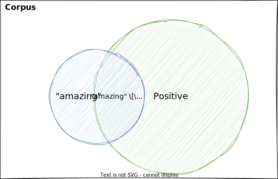
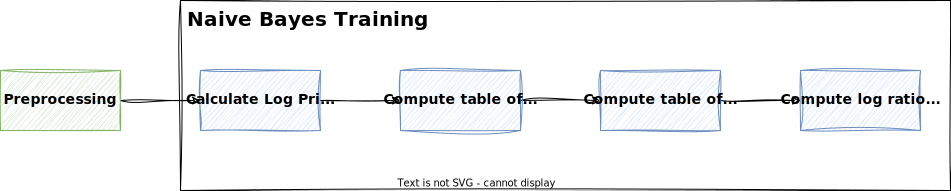
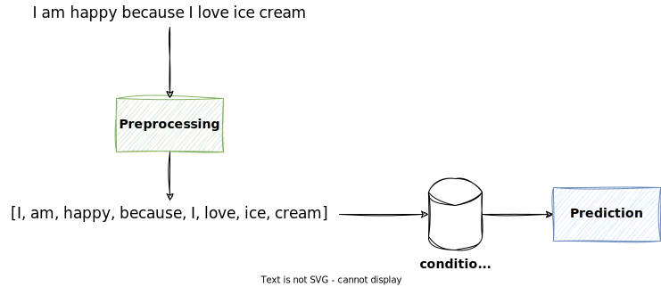

# Naive Bayes

In this lecture, we will learn about the Naive Bayes classifier for binary classification.

Naive Bayes is a **simple but powerful** classifier that doesn't require to find any hyperparameters.

It is very fast to train and predict, and can perform surprisingly well.

## TL;DR

When using Naive Bayes for binary classification, we need to calculate the **likelihood** of a tweet being positive or negative.

To do this, we need to build the **log ratio of probabilities** for each word in the vocabulary.

For example, if the word "happy" appears 20 times in positive tweets and 5 times in negative tweets, then the ratio of probabilities is $20/5=4$. This means that the word "happy" is more likely to appear in a positive tweet. If the ratio would be less than 1, then the word is more likely to appear in a negative tweet.

Taking the **logarithm** is a mathematical trick to avoid **numerical underflow** and simplify the calculations.

Using the **log ratio of probabilities**, we can calculate the log likelihood of a tweet being positive or negative by summing up the log ratio of probabilities for each word in the tweet, and thus, **predict** the class of the tweet.

## Probability Recap

Let

- $A$ be the event that a tweet being labeled positive
- $N_{pos}$ be the number of positive tweets
- $N$ be the total number of tweets

Then the probability $P(A)$ of a tweet being positive is the **number of positive tweets** divided by the **total number of tweets**:

$$
P(A) = \frac{N_{pos}}{N}
$$

!!! note

    For **binary classification**, if there a tweet can only be either positive or negative, then the probability of a tweet being negative is $1-P(A)$.

!!! example

    If there are 35 positive tweets and 100 tweets in total, then the probability $P(A)$ of a **tweet being positive** is calculated as

    $$
    P(A)=35/100=0.35.
    $$

    The probability of the **tweet being negative** is then calculated as $1-P(A) = 0.65$.

Let $B$ be the event that a tweet contains the word "amazing". Then the probability $P(B)$ of a **tweet containing the word "amazing"** is the number of tweets containing the word divided by the total number of tweets:

$$
P(B) = \frac{N_{amazing}}{N}
$$

!!! example

    If there are 5 tweets containing the word "amazing" and 100 tweets in total, then the probability $P(B)$ of a tweet containing the word "amazing" is calculated as

    $$
    P(B) = 5/100 = 0.05
    $$

## Intersection of Two Events

Let $A \cap B$ be the event that a **tweet is positive and contains the word "amazing"**.

Then the probability $P(A \cap B)$ is calculated as the number of tweets that are positive and contain the word "amazing" divided by the total number of tweets:

$$
P(A \cap B) = \frac{N_{pos \cap amazing}}{N}
$$

The following Venn diagram illustrates this:

!!! example

    Let's assume a corpus of 100 tweets:

    - 35 tweets are positive
    - 65 tweets are negative
    - 5 tweets contain the word "amazing", but one of them is negative (e.g. "I thought this movie was amazing, but it was actually terrible!")

    Then the probability $P(A \cap B)$ of a tweet being positive and containing the word "amazing" is calculated as

    $$
    P(A \cap B) = \frac{4}{100} = 0.04
    $$

## Conditional Probability

Continuing the example from above, let's assume we want to calculate the probability of a tweet being positive, but knowing that the tweet contains the word "amazing".

Looking at the diagram from above, this means we only consider the **blue circle**.

In our example, this is the **probability of the intersection** of the tweets being positive and containing the word "amazing" divided by the probability of all tweets containing the word "amazing".

This is called the **conditional probability** of a tweet being positive, _given that_ it contains the word "amazing".

!!! quote "Conditional Probability"

    Generally speaking, the **conditional probability** $P(A|B)$ is the probability of event $A$ _given that_ event $B$ has already occurred.

    It is calculated as the probability of **both events occuring** divided by the probability of the event that **has already occurred**:

    $$
    P(A|B) = \frac{P(A \cap B)}{P(B)}
    $$

!!! example

    Let's continue the example from above, where we have 5 tweets containing the word "amazing" and 4 of them are positive.

    Then the probability $P(positive|amazing)$ of a tweet being positive, given that it contains the word "amazing" is calculated as

    $$
    P(positive|amazing) = \frac{P(positive \cap amazing)}{P(amazing)} = \frac{4/100}{5/100} = \frac{4}{5} = 0.8
    $$

    Now let's turn it around and calculate the probability of a tweet containing the word "amazing", given that it is positive.

    This is calculated as follows:

    $$
    P(amazing|positive) = \frac{P(positive \cap amazing)}{P(positive)} = \frac{4/100}{35/100} = \frac{4}{35} = 0.1143
    $$

## Bayes Rule

Now we can derive Bayes Rule, which is based on conditional probabilities.

We know that the conditional probability $P(A|B)$ is calculated as follows:

$$
P(A|B) = \frac{P(A \cap B)}{P(B)}
$$

and we also know that the conditional probability $P(B|A)$ is calculated as follows:

$$
P(B|A) = \frac{P(B \cap A)}{P(A)}
$$

We can rewrite this as:

$$
P(B \cap A) = P(B|A)P(A)
$$

Given that

$$
P(A \cap B) = P(B \cap A)
$$

we can plug in the previous equation and get:

$$
P(A|B) = \frac{P(B|A)P(A)}{P(B)}
$$

With that, we have **derived Bayes Rule**.

!!! quote "Bayes Rule"

    Bayes Rule is a way to calculate the conditional probability $P(A|B)$, given that we know $P(B|A)$.

    It is calculated as follows:

    $$
    P(A|B) = \frac{P(B|A)P(A)}{P(B)}
    $$

    In other words: _Out of all the times $B$ happens, what fraction are due to $A$?_

!!! example

    Suppose that in your dataset, 25% of the positive tweets contain the word "amazing".
    You also know that a total of 13% of the tweets in your dataset contain the word "amazing", and that 40% of the total number of tweets are positive.
    Given the tweet "amazing to be here". What is the probability that this tweet is positive?

    Let $A$ be the event that a tweet is positive and $B$ be the event that a tweet contains the word "amazing".

    $$
    \begin{align}
    P(A) &= 0.4 \\
    P(B) &= 0.13 \\
    P(B|A) &= 0.25 \\
    P(A|B) &= \frac{P(B|A)P(A)}{P(B)} = \frac{0.25 \times 0.4}{0.13} = 0.7692
    \end{align}
    $$

    The probability that the tweet "amazing to be here" is positive is 0.7692.

!!! info "Thomas Bayes"

    

    [Thomas Bayes](https://en.wikipedia.org/wiki/Thomas_Bayes) (1701 - 1761) was an English statistician, philosopher and Presbyterian minister.
    Bayes never published what would become his most famous accomplishment; his notes were edited and published posthumously by Richard Price.

    In NLP, Bayes' Theorem can be used for:

    - **classification**: given a document, what is the probability that it belongs to a certain class? (e.g. spam or not spam or sentiment analysis)
    - **information retrieval**: given a query, what is the probability that a document is relevant?
    - **word sense disambiguation**: given a word, what is the probability that it has a certain meaning?

    Besides machine learning and NLP, Bayes' Theorem is also used in many other fields, such as:

    - **medicine**: given a symptom, what is the probability that a patient has a certain disease?
    - **biology**: given a genetic profile, what is the probability that a person will develop a certain disease?
    - **economics**: given a set of economic conditions, what is the probability that the economy will be in a recession next year?
    - **finance**: given a set of financial conditions, what is the probability that a stock will increase in value next year?

## Laplacian Smoothing

Using Bayes Rule, we can calculate the probability of a word given a class $P(w|c)$ as follows:

$$
P(w|c) = \frac{P(c|w)P(w)}{P(c)} = \frac{freq(w,c)}{N_c}
$$

However, for OOV words, if a word has not been seen in the training data, then $freq(w,c) = 0$ and thus, $P(w|c) = 0$.

To account for this, we can use Laplacian Smoothing (aka Additive Smoothing).

This is done by adding the **smoothing constant** $\alpha$ to the numerator and $\alpha|V|$ to the denominator:

$$
P(w|c) = \frac{freq(w,c) + \alpha}{N_c + \alpha|V|}
$$

!!! info

    If we add a constant $\alpha$ to the numerator, and since there are $|V|$ words in the vocabulary to normalize, we have to add $\alpha|V|$ to the denominator.
    This way, the probabilities will sum up to 1.

    Note that $\alpha$ is usually set to 1.

## Word Probabilities

Let's assume we have the following table of word frequencies (as from the [feature extraction lecture](./feature_extraction.md#positive-and-negative-frequencies)):

| $V$        | $n_{pos}$ | $n_{neg}$ |
| ---------- | --------- | --------- |
| I          | 3         | 3         |
| am         | 2         | 2         |
| happy      | 2         | 0         |
| sad        | 0         | 2         |
| because    | 1         | 1         |
| love       | 1         | 0         |
| hate       | 0         | 1         |
| the        | 1         | 1         |
| weather    | 1         | 1         |
| **$\sum$** | **11**    | **11**    |

Note that we added the last row to calculate the total number of words per class.
This allows us to calculate the probabilities $P(w|pos)$ and $P(w|neg)$ for each word $w$ in a class.

Using the formula for Laplacian Smoothing with $\alpha=1$

$$
P(w|c) = \frac{freq(w,c) + 1}{N_c + |V|}
$$

We end up with the following table:

| $V$        | $P(w \vert pos)$ | $P(w \vert neg)$ |
| ---------- | ---------------- | ---------------- |
| I          | 0.2              | 0.2              |
| am         | 0.15             | 0.15             |
| happy      | 0.15             | 0.05             |
| sad        | 0.05             | 0.15             |
| because    | 0.1              | 0.1              |
| love       | 0.1              | 0.05             |
| hate       | 0.05             | 0.1              |
| the        | 0.1              | 0.1              |
| weather    | 0.1              | 0.1              |
| **$\sum$** | **$1$**          | **$1$**          |

!!! example

    Let's calculate the probability $P(\text{happy}|\text{pos})$ of the word "happy" given that the tweet is **positive**.

    $$
    \begin{align}
    P(\text{happy}|\text{pos}) &= \frac{freq(\text{happy},\text{pos}) + 1}{N_{pos} + |V|} \\
    &= \frac{2 + 1}{11 + 9} \\
    &= \frac{3}{20} \\
    &= 0.15
    \end{align}
    $$

    Let's calculate the probability $P(\text{happy}|\text{neg})$ of the word "happy" given that the tweet is **negative**.

    $$
    \begin{align}
    P(\text{happy}|\text{neg}) &= \frac{freq(\text{happy},\text{neg}) + 1}{N_{neg} + |V|} \\
    &= \frac{0 + 1}{11 + 9} \\
    &= \frac{1}{20} \\
    &= 0.05
    \end{align}
    $$

## Ratio of Probabilities

Now that we have the probabilities $P(w|pos)$ and $P(w|neg)$ for each word $w$ in a class, we can calculate the ratio of probabilities for each word $w$ in the vocabulary:

$$
\frac{P(w \vert pos)}{P(w \vert neg)}
$$

Based on the ratio, we can make the following observations:

- If the ratio is **greater than 1**, then the word is more likely to appear in a **positive** tweet.
- If the ratio is **less than 1**, then the word is more likely to appear in a **negative** tweet.
- If the ratio is **equal to 1**, then the word is considered **neutral** and equally likely to appear in a positive or negative tweet.

| $V$     | $P(w \vert pos)$ | $P(w \vert neg)$ | $\frac{P(w \vert pos)}{P(w \vert neg)}$ |
| ------- | ---------------- | ---------------- | --------------------------------------- |
| I       | 0.2              | 0.2              | 1.0                                     |
| am      | 0.15             | 0.15             | 1.0                                     |
| happy   | 0.15             | 0.05             | 3.0                                     |
| sad     | 0.05             | 0.15             | 0.3333                                  |
| because | 0.1              | 0.1              | 1.0                                     |
| love    | 0.1              | 0.05             | 2.0                                     |
| hate    | 0.05             | 0.1              | 0.5                                     |
| the     | 0.1              | 0.1              | 1.0                                     |
| weather | 0.1              | 0.1              | 1.0                                     |

!!! note

    Words that are neutral don't provide any information for classification.

## Likelihood

Now that we have the ratio of probabilities for each word $w$ in the vocabulary, we can calculate the probability of a tweet being positive or negative.

To **classify a whole tweet**, we need to **multiply the ratios of probabilities** for each word in the tweet.

This is called the **likelihood** $P(tweet|pos)$ of a tweet being positive and is calculated as follows:

$$
P(\text{pos}|\text{tweet}) = \prod_{i=1}^{m} \frac{P(w_i|pos)}{P(w_i|neg)}
$$

where

- $m$ is the number of words in the tweet and
- $w_i$ is the $i$-th word in the tweet.

!!! note

    - If the likelihood is greater than 1, then the tweet is more likely to be positive.
    - If the likelihood is less than 1, then the tweet is more likely to be negative.
    - If the likelihood is equal to 1, then the tweet is equally likely to be positive or negative and thus, neutral.

!!! example

    Given the table above, let's see if the following tweet is positive or negative:

    > I am happy because I love ice cream

    We have the following ratios of probabilities:

    $$
    \begin{align}
    \frac{P(\text{I}|\text{pos})}{P(\text{I}|\text{neg})} &= \frac{0.2}{0.2} = 1.0 \\
    \frac{P(\text{am}|\text{pos})}{P(\text{am}|\text{neg})} &= \frac{0.15}{0.15} = 1.0 \\
    \frac{P(\text{happy}|\text{pos})}{P(\text{happy}|\text{neg})} &= \frac{0.15}{0.05} = 3.0 \\
    \frac{P(\text{because}|\text{pos})}{P(\text{because}|\text{neg})} &= \frac{0.1}{0.1} = 1.0 \\
    \frac{P(\text{I}|\text{pos})}{P(\text{I}|\text{neg})} &= \frac{0.2}{0.2} = 1.0 \\
    \frac{P(\text{love}|\text{pos})}{P(\text{love}|\text{neg})} &= \frac{0.1}{0.05} = 2.0 \\
    \end{align}
    $$

    Note that the words "ice" and "cream" are not in the vocabulary, so we ignore them.

    Given these ratios, we can calculate the likelihood of the tweet being positive as follows:

    $$
    \begin{align}
    P(\text{pos}|\text{tweet}) &= \prod_{i=1}^{m} \frac{P(w_i|pos)}{P(w_i|neg)} \\
    &= 1.0 \times 1.0 \times 3.0 \times 1.0 \times 1.0 \times 2.0 \\
    &= 6.0
    \end{align}
    $$

## Prior

The prior $P(pos)$ is the probability of a tweet being positive, **regardless** of the words in the tweet.

The prior probability represents the probability of a particular class **before considering any features**.

The prior is especially important when the dataset is **unbalanced**.

In a binary classification problem, the prior for a class is calculated as follows:

$$
prior = \frac{N_c}{N}
$$

where

- $N_c$ is the number of tweets in the class and
- $N$ is the total number of tweets.

!!! example

    Let's assume we have the following corpus of 100 tweets:

    - 35 tweets are positive
    - 65 tweets are negative

    Then the prior probability of a tweet being positive is calculated as

    $$
    prior = \frac{N_c}{N} = \frac{35}{100} = 0.35
    $$

    and the prior probability of a tweet being negative is calculated as

    $$
    prior = \frac{N_c}{N} = \frac{65}{100} = 0.65
    $$

## Prior Ratio

The prior ratio is the ratio of the prior probabilities of the two classes.

In a binary classification problem, the prior ratio is calculated as follows:

$$
\text{prior ratio} = \frac{P(pos)}{P(neg)}
$$

!!! example

    Let's assume we have the following corpus of 100 tweets:

    - 35 tweets are positive
    - 65 tweets are negative

    Then the prior ratio is calculated as

    $$
    \frac{P(pos)}{P(neg)} = \frac{0.35}{0.65} = 0.5385
    $$

If we apply the prior to the likelihood, we get the following formula:

$$
P(\text{pos}|\text{tweet}) = \frac{P(pos)}{P(neg)} \times \prod_{i=1}^{m} \frac{P(w_i|pos)}{P(w_i|neg)}
$$

## Using Logarithms

The likelihood is the product of many probabilities, i.e. values between 0 and 1.

This can have several consequences, and numbers can become so **small** that computers have trouble representing them.

This is called **numerical underflow**.

To avoid this, we can use the logarithm instead.

!!! warning "Numerical Underflow"

    Numerical underflow occurs when the result of a calculation is too small to be represented by the computer.

    This can happen when multiplying many small numbers, because the result gets smaller and smaller with each multiplication.

    The computer can only represent numbers up to a certain precision, so at some point the result will be rounded to zero.

    This is a problem and can lead to errors, as we lose information about the probabilities.

!!! tip

    Because they avoid the risk of numerical underflow and they are way more convenient to work with, **logarithms** appear throughout deep-learning and NLP.

### Log Likelihood

Applying the logarithm to the likelihood formula from above, we get the following formula:

$$
\log P(\text{pos}|\text{tweet}) = \log \frac{P(pos)}{P(neg)} + \sum_{i=1}^{m} \log \frac{P(w_i|pos)}{P(w_i|neg)}
$$

!!! note "Logarithm"

    Besides avoiding numerical underflow, another advantage of logarithms is that they allow us to use simpler operations, such as addition instead of multiplication.

    This is because of the following property of logarithms:

    $$
    \log (ab) = \log a + \log b
    $$

    Thus, the product changes to a sum in the formula above.

### Log Prior Ratio

When using the logarithm, we speak of the prior as the **log prior**, and of the prior ratio as the **log prior ratio**.

$$
\log \frac{P(pos)}{P(neg)}
$$

### Log Ratio of Probabilities

Now, if we calculate the ratio of probabilities using the logarithm, the table above looks as follows:

| $V$     | $P(w \vert pos)$ | $P(w \vert neg)$ | $\log \frac{P(w \vert pos)}{P(w \vert neg)}$ |
| ------- | ---------------- | ---------------- | -------------------------------------------- |
| I       | 0.2              | 0.2              | 0.0                                          |
| am      | 0.15             | 0.15             | 0.0                                          |
| happy   | 0.15             | 0.05             | 1.0986                                       |
| sad     | 0.05             | 0.15             | -1.0986                                      |
| because | 0.1              | 0.1              | 0.0                                          |
| love    | 0.1              | 0.05             | 0.6931                                       |
| hate    | 0.05             | 0.1              | -0.6931                                      |
| the     | 0.1              | 0.1              | 0.0                                          |
| weather | 0.1              | 0.1              | 0.0                                          |

!!! example

    Let's look at a single example, e.g. the word "happy". The ratio of probabilities is calculated as follows:

    $$
    \log \frac{P(\text{happy}|\text{pos})}{P(\text{happy}|\text{neg})} = \log \frac{0.15}{0.05} = \log 3.0 = 1.0986
    $$

## Training

For training of the Naive Bayes classifier for binary classification, we need to do the following:

1. Calculate the [log prior ratio](#log-prior-ratio)
2. Compute the table of [word frequencies](./feature_extraction.md#positive-and-negative-frequencies) for each class
3. Compute the table of [conditional probabilities](#word-probabilities) of a word given a class using Laplacian Smoothing
4. Compute the [log ratio](#log-ratio-of-probabilities) of the conditional probabilities

Of course, we need to apply the desired preprocessing steps before the training.

## Prediction

To predict a tweet using the Naive Bayes classifier for binary classification, we need to apply the likelihood formula to the tweet, and check if the log likelihood is greater than 0.

$$
\log \frac{P(pos)}{P(neg)} + \sum_{i=1}^{m} \log \frac{P(w_i|pos)}{P(w_i|neg)} > 0
$$

So for every word in the tweet, we look up the log ratio of probabilities in our likelihood table and sum them up. Then we add the log prior ratio to the sum.

OOV Words are **ignored**. They are considered neutral and do not contribute to the log likelihood, as the model can only give a score for words that it has seen in the training data.

!!! example

    Let's assume we have a **balanced corpus**:

    $$
    \log \frac{P(pos)}{P(neg)} = \log \frac{0.5}{0.5} = \log 1.0 = 0.0
    $$

    Given the table above, let's see if the following tweet is positive or negative:

    > I am happy because I love ice cream

    We have the following **ratios of probabilities**:

    $$
    \begin{align}
    \log \frac{P(\text{I}|\text{pos})}{P(\text{I}|\text{neg})} &= \log \frac{0.2}{0.2} = \log 1.0 = 0.0 \\
    \log \frac{P(\text{am}|\text{pos})}{P(\text{am}|\text{neg})} &= \log \frac{0.15}{0.15} = \log 1.0 = 0.0 \\
    \log \frac{P(\text{happy}|\text{pos})}{P(\text{happy}|\text{neg})} &= \log \frac{0.15}{0.05} = \log 3.0 = 1.0986 \\
    \log \frac{P(\text{because}|\text{pos})}{P(\text{because}|\text{neg})} &= \log \frac{0.1}{0.1} = \log 1.0 = 0.0 \\
    \log \frac{P(\text{I}|\text{pos})}{P(\text{I}|\text{neg})} &= \log \frac{0.2}{0.2} = \log 1.0 = 0.0 \\
    \log \frac{P(\text{love}|\text{pos})}{P(\text{love}|\text{neg})} &= \log \frac{0.1}{0.05} = \log 2.0 = 0.6931 \\
    \end{align}
    $$

    Note that the words "ice" and "cream" are not in the vocabulary, so we ignore them.

    Given these ratios, and considering the **log prior**, we can calculate the **log likelihood** of the tweet being positive as follows:

    $$
    \begin{align}
    \log \frac{P(pos)}{P(neg)} + \sum_{i=1}^{m} \log \frac{P(w_i|pos)}{P(w_i|neg)} &= 0.0 + 0.0 + 0.0 + 1.0986 + 0.0 + 0.0 + 0.6931\\
    &= 1.0986 + 0.6931 \\
    &= 1.7917
    \end{align}
    $$

    Since $1.7917 > 0$, the tweet is classified as **positive**.

    Note how only the words "happy" and "love" contribute to the log likelihood, since the other words are neutral.

## Limitations

Naive Bayes is a very simple but powerful classifier and doesn't require to find any hyperparameters.

However, it has some limitations, with the most important one being the **independence assumption**.

The independence assumption in Naive Bayes refers to the assumption that the presence or absence of a particular feature is independent of the presence or absence of any other feature, given the class label.

In other words, Naive Bayes assumes that the features are independent of each other, which typically isn't the case in NLP.

Some words are more likely to appear together than others, and are thus not independent. Also words can be related to the thing they describe.

!!! example

    > It is sunny and hot in the Sahara desert.

    - the word "sunny" is more likely to appear with the word "hot" than with the word "cold"
    - the word "Sahara" is more likely to appear with the word "desert" than with the word "ocean"
    - the words "sunny" and "hot" are related to the word "desert"

!!! example

    Which word to fill in the blank?

    > It is always cold and snowy in ...

    For Naive Bayes, the words "spring", "summer", "autumn" and "winter" are all equally likely, but from the context, we know that "winter" is the most obvious candidate.

## Key Takeaways

- Naive Bayes is a **simple but powerful** classifier that doesn't require to find any hyperparameters.
- Naive Bayes is based on Bayes Rule, which is a way to calculate the **conditional probability** $P(A|B)$, given that we know $P(B|A)$.
- By using **Logarithms**, we can avoid numerical underflow and simplify the calculations.
- For **training** a Naive Bayes classifier, we need to obtain the [log ratio of probabilities](#log-ratio-of-probabilities) for each word in the vocabulary.
- For **prediction**, we need to use those ratios to calculate the [log likelihood](#log-likelihood) of a tweet being positive or negative.
- The main limitation of Naive Bayes is the **independence assumption**, which assumes that the features are independent of each other, which typically isn't the case in NLP.
- However, because of its simplicity, Naive Bayes is often used as a **baseline** for text classification tasks and can perform surprisingly well.
