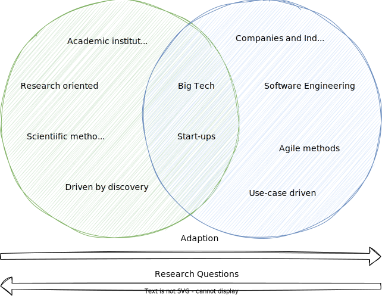
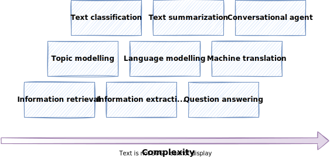

# Introduction to NLP

Welcome to the world of natural language processing (NLP).
The first lecture will give you a basic understanding of what NLP is about, the problems we deal with and the challenges that come with it.
We will take a look at some real-world NLP applications and learn about the most important NLP tasks.
Also we will dissect language into its building blocks and learn about the relation between NLP and AI.
The goal is to get a good intuition of what it means to work with language from a programmatic perspective.

## Real-world NLP Applications

In our daily digital lives, we interact with a lot of apps and tools that are based on NLP technologies.
The following figure gives an overview of real-world NLP applications along with popular examples.


- **Voice-based assistants** like [Alexa](https://www.amazon.com/how-does-alexa-work/b?ie=UTF8&node=21166405011) or [Siri](https://machinelearning.apple.com/research/hey-siri) utilize a variety of NLP techniques to interact with its users, i.e. they need to understand user commands and questions, and reply accordingly using Text-to-Speech (TTS).
- Modern **search engines** like [Google](https://www.google.com/search/howsearchworks/) or [Bing](https://support.microsoft.com/en-us/topic/how-bing-delivers-search-results-d18fc815-ac37-4723-bc67-9229ce3eb6a3) make heavy use of NLP for a variety of subtasks, such as understanding the user query, autocompletion, or ranking and grouping the query results.
- **Social media platforms** make use of NLP, e.g. to analyse user comments, or make suggestions to their users.
  Also platforms like Youtube or conference tools are able to automatically create transcriptions on the fly using "Speech-to-text" (SST) technologies.
- In popular **email applications** like Gmail or Outlook, NLP is used for tasks like spam filtering, [calendar event extraction](https://patents.google.com/patent/US8832205B2/en) or [smart replies](https://blog.google/products/gmail/save-time-with-smart-reply-in-gmail/).
- **Text processing apps** offer auto-correction or auto-completion features to their users, i.e. spell-checking or grammar correction.
  [Grammarly](https://www.grammarly.com/blog/how-does-grammarly-work/) is a nice example here, as well as any smartphone keyboard.
- More and more companies offer **chatbots** (aka conversational agents) on their websites for their clients.
  With [ChatGPT](https://openai.com/blog/chatgpt/), **conversational agents** (and NLP in general) reached a new level just recently.

!!! question

    Based on your **working experience**, where have you already encountered, or can think of, potential **NLP applications**?

<!--
Answer: ask students in the course
-->

## A brief history about NLP

IMHO, every lecture should provide a little historical background in the beginning[^1]: 📜

- **1950s–1990s**
  Initial attempts are made to map hard rules around languages and follow logical steps to accomplish tasks like translating a sentence from one language to another.
  While this works sometimes, strictly defined rules only work for concrete, well-defined tasks that the system has knowledge about.

    !!! info "Noam Chomsky"

        Renowned linguist and cognitive scientist [Noam Chomsky](https://en.wikipedia.org/wiki/Noam_Chomsky) introduced the theory of generative grammar, which revolutionized the understanding of language structure and acquisition. His work laid the theoretical groundwork for studying language processing and understanding the innate structures that govern language use. Chomsky's theories on syntax and the nature of language have influenced computational linguistics and the development of algorithms for natural language processing, informing how machines understand and generate human language. His critiques of AI's ability to fully understand language have also sparked important discussions on the limitations of current language models.

- **1990s**
  Language models begin evolving into statistical models and language patterns start being analyzed, but larger-scale projects are limited by computing power.

- **2000s**
  Advancements in machine learning increase the complexity of language models, and the wide adoption of the internet sees an enormous increase in available training data.

    !!! info "Geoffrey Hinton"

        Often referred to as one of the "Godfathers of Deep Learning," [Geoffrey Hinton](https://en.wikipedia.org/wiki/Geoffrey_Hinton) has made significant contributions to the field of neural networks and deep learning, which are foundational to modern language models. His work on backpropagation, neural networks, and the development of the dropout technique has greatly influenced the training of deep learning models. Hinton's research laid the groundwork for the advancement of architectures like BERT and GPT, significantly impacting natural language processing (NLP) and machine learning as a whole.

        Together with [John Hopfield](https://en.wikipedia.org/wiki/John_Hopfield), he was awarded the 2024 Nobel Prize in Physics.


- **2012**
  Advancements in deep learning architectures and larger data sets lead to the development of GPT (Generative Pre-trained Transformer).

- **2018**
  Google introduces BERT (Bidirectional Encoder Representations from Transformers), which is a big leap in architecture and paves the way for future large language models.

- **2020**
  OpenAI releases GPT-3, which becomes the largest model at 175B parameters and sets a new performance benchmark for language-related tasks.

    !!! info "Ilya Sutskever"

        Co-founder and Chief Scientist at OpenAI, [Ilya Sutskever](https://en.wikipedia.org/wiki/Ilya_Sutskever) has played a pivotal role in the development of groundbreaking language models, including GPT-2 and GPT-3. His work in deep learning and reinforcement learning has advanced the understanding and capabilities of generative models. Sutskever's contributions to the architecture and training of these models have led to significant improvements in their performance on a wide range of language-related tasks. His leadership at OpenAI has also driven the broader adoption and awareness of large language models and their potential applications.

- **2022**
  ChatGPT is launched, which turns GPT-3 and similar models into a service that is widely accessible to users through a web interface and kicks off a huge increase in public awareness of LLMs and generative AI.

- **2023**
  Open source LLMs begin showing increasingly impressive results with releases such as Dolly 2.0, LLaMA, Alpaca, and Vicuna. GPT-4 is also released, setting a new benchmark for both parameter size and performance.

## NLP Research vs. NLP Engineering

Natural Language Processing (NLP) is a broad field that encompasses a wide range of topics, including linguistics, computer science, and artificial intelligence.
When working on NLP problems, it is important to know which perspective we are having on the problem.

There is an academic perspective on NLP, which is focused on advancing the field through research and innovation.
And there is a practical perspective on NLP, which is focused on applying NLP techniques to solve real-world problems.
It is important to understand the difference between these two views, as they require different skills and lead to different career paths.

Depending on the perspective, the goals and metrics, the data and methodology, as well as the challenges that are faced, can be very different.
For example, as a software engineer in the industry, aspects like scalability, cost or robustness of your NLP system are more important than if you are a researcher in academia.
On the other hand, as a researcher, your primary goal is to find answers to your research questions rather than bothering with latest frameworks and tools.

However, as a software engineer working on NLP problems, it is important to get the gist of the theoretical foundations of NLP, in order to properly adapt it on your business problem.
At the same time, many research projects are driven by practical needs and are often inspired by real-world problems.
The following figure illustrates the relation between the research and engineering side of NLP.



The following table summarizes the main differences between NLP research and NLP engineering.

| Aspect                           | NLP Research                                                                                                | NLP Engineering                                                                                                                                                  |
| -------------------------------- | ----------------------------------------------------------------------------------------------------------- | ---------------------------------------------------------------------------------------------------------------------------------------------------------------- |
| Nature of Work                   | Advancing NLP through innovative methods, models, and theories with creativity and scientific rigor         | Applying NLP techniques to real-world problems and creating efficient systems                                                                                    |
| Focus                            | Developing new methods, models, algorithms, and theories                                                    | Building scalable, reliable, and efficient systems for handling large datasets and producing high-quality outputs                                                |
| Workplace                        | Academic institutions, research labs, or R&D-focused companies                                              | Product teams, software companies, or organizations with NLP needs                                                                                               |
| Knowledge and Skills Required    | Strong foundation in mathematics, statistics, computer science, linguistics, deep NLP knowledge             | Software engineering principles, practical experience with NLP tools, familiarity with NLP architectures and models, strong data processing skills               |
| Programming Languages/Frameworks | Proficiency in languages like Python, PyTorch, TensorFlow                                                   | Use of Python, NLP libraries (spaCy, NLTK, Gensim), and other relevant tools                                                                                     |
| Responsibilities                 | Conducting literature reviews, designing experiments, analyzing results, writing research papers            | Designing and building efficient NLP systems as well as integration with other systems such as web services, databases, and cloud services                       |
| Goal Definition                  | Abstract and ambitious goals driven by curiosity, exploration, and discovery                                | Concrete and specific goals driven by customer needs, business requirements, and user feedback                                                                   |
| Performance Metrics              | Academic metrics like accuracy, recall, F1-score, perplexity, etc.                                          | Product metrics such as speed, scalability, robustness, usability, etc.                                                                                          |
| Methodology                      | Based on scientific methods and experiments                                                                 | Tend to use software engineering methodology and best practices (SCRUM, DevOps, etc.)                                                                            |
| Datasets                         | Use open source or benchmark datasets                                                                       | Use real-world data that is often less structured and unlabelled                                                                                                 |
| Core Challenges                  | Finding novel research questions, managing research uncertainty, balancing publication quality and quantity | Adapting solutions to different domains, ensuring reliability and security, managing real-world data diversity and noise, balancing product performance and cost |

In this course, we will focus on the engineering perspective of NLP.
While we will cover all important theoretical foundations, the main objective is to provide you with the skills that are required to successfully design and implement NLP systems in the industry.
We will learn some of the most important NLP tools, libraries and frameworks that are used in real-world NLP projects.

## NLP Tasks

Some fundamental tasks appear across many NLP projects.
For example, if you want to find out if some tweets have a positive or negative meaning (as in sentiment analysis), or if an email is spam or not, both would be a text classification task.
The following table gives an overview of frequently used NLP tasks.

| NLP Task                   | Description                                                                                    | Examples                                                                                                                    |
| -------------------------- | ---------------------------------------------------------------------------------------------- | --------------------------------------------------------------------------------------------------------------------------- |
| **Language modeling**      | Predict the next word in a sentence based on the previous word or context                      | auto-correction or auto-completion                                                                                          |
| **Text classification**    | Classify text in different categories, depending on the use-case                               | Email spam filter or sentiment analysis                                                                                     |
| **Information extraction** | Extract relevant information from text                                                         | Extract calendar events from emails or names in social media posts                                                          |
| **Information retrieval**  | Find documents that are relevant to a specific user query                                      | Search engines like [Google](https://www.google.com/)                                                                       |
| **Conversational agent**   | A dialogue system that can converse in human language                                          | Voice assistants like Alexa or Siri, ChatGPT                                                                                |
| **Text summarization**     | Create short summaries of longer text while preserving the key message and meaning of the text | [Reddit autotldr](https://www.reddit.com/r/autotldr/comments/31b9fm/faq_autotldr_bot/) to summarize long Reddit submissions |
| **Question answering**     | A system that can answer questions posed in natural language                                   | Search engines or voice assistants                                                                                          |
| **Machine translation**    | Convert a piece of text from one language into another                                         | Translator apps like [DeepL](https://www.deepl.com/translator) or automatic transcription of calls or videos                |
| **Topic modeling**         | Uncover the topical structure of a (large) set of documents                                    | Group blog posts by their main topic                                                                                        |

The figure shows the NLP tasks from the table organized by their complexity, where complexity means a best guess of the relative difficulty to develop a comprehensive solution.



!!! warning

    Note that the **complexity** here is a rather loosely defined term and the mapping can be seen as a "best guess". What is complex or not is not only subjective, but also depends on factors, like use-case, client requirements, or preconditions of the NLP project.

!!! question

    In a modern **email application**, which of the above **NLP tasks** could be utilized to achieve a great user experience?

<!--
Answer:
- information extraction: suggest calendar events
- text classification: spam or not spam
- text summarization: a potential plugin for long and annoying emails
- information retrieval: email search capabilities
-->

!!! info

    An **NLP application** is usually use-case driven, i.e. it has a specific goal in mind or provides added value to its users. It makes use of one or more **NLP tasks** to achieve that goal.

<!--

Resources on the categorization of NLP tasks:

- https://www.avenga.com/magazine/natural-language-processing-application-areas/
- https://medium.com/@miranthaj/25-nlp-tasks-at-a-glance-52e3fdff32e2
- https://en.wikipedia.org/wiki/Natural_language_processing
- https://towardsdatascience.com/natural-language-processing-tasks-3278907702f3
- https://www.analyticsvidhya.com/blog/2021/06/part-8-step-by-step-guide-to-master-nlp-useful-natural-language-processing-tasks/

-->

## Building Blocks of Language

While linguistics is the systematic study of language, NLP tries to make language processable by computer systems.

To study NLP, we don't need to be linguistic experts, but it is important to understand some core linguistic concepts. In this section, we will dissect language into its building blocks.

For the scope of this course, we think of human language as composed of four major building blocks: phonemes, morphemes and lexemes, syntax, and context.
In linguistics, each of the building blocks described in this section is a research area for itself.


### Phonemes

Description:

- Layer of **speech and sound**
- Smallest units of speech sound in a language
- Vary across languages, i.e. each language has its own set of phonemes.
- Standard English has [44 phonemes](https://en.wikipedia.org/wiki/Received_Pronunciation#Phonology) (i.e. 24 consonant phonemes, and 20 vowel phonemes)
  - German: 46 phonemes
  - Spanish: 24 phonemes
- Usually denoted in slashes using the symbols of the [International Phonetic Alphabeth (IPA)](https://en.wikipedia.org/wiki/International_Phonetic_Alphabet)
- May or may not have a meaning by themselves, but can induce meaning, e.g. `/s/` for plural or `/ɪ/` for adjective
- A nice list of examples can be found [here](https://englishphonetics.net/english-phonetics-academy/the-44-sounds-of-english-based-on-the-IPA.html)

!!! example "Examples"

    Consonant phonemes:

    - `/b/` as in "bat" 🦇
    - `/dʒ/` as in "giraffe" 🦒

    Vowel phonemes:

    - `/iː/` as in "bee" 🐝
    - `/æ/` as in "cat" 🐈

Important for:

- Speech recognition
- Speech-to-text
- Text-to-speech

### Morphemes and Lexemes

The layer of **words** consists of morphemes and lexemes.

Morphemes:

- Smallest unit of language that has a meaning
- Formed by a combination of phonemes
- All prefixes or suffixes are morphemes, e.g. `multi` as in `multimedia`
- When breaking down words into their morphemes, variations may occur

Lexemes:

- Consists of one or more morphemes
- Multiple words can go back to the same lexeme
- Not synonymous with the term "word", rather comparable to an entry in a dictionary or an encyclopedia
- Different verb forms go back to the same lexeme

!!! example "Examples"

    Breaking down a word into its morphemes:

    - no variation: $unbreakable$ 👉 $un + break + able$
    - with variation: $unreliability$ 👉 $un + rely + able + ity$

    Rooting back words on its lexemes:

    - $\{jump, jumps, jumping, ...\}$ 👉 $jump$
    - $\{buy, bought, buying, ...\}$ 👉 $buy$

    Differentiation of words, lexemes, and morphemes:

    - word $football$ (noun) 👉 lexeme: $football$ 👉 morphemes: $foot + ball$
    - word $cats$ (noun) 👉 lexeme: $cat$ 👉 morphemes: $cat + s$
    - word $tumbling$ (verb) 👉 lexeme: $tumble$ 👉 morphemes: $tumble + ing$
    - word $happening$ (verb) 👉 lexeme: $happen$ 👉 morphemes: $happen + ing$

Important for:

- Tokenization
- Stemming
- POS-tagging
- Word embeddings

!!! tip

    A **lexeme** is **not synonymous to a word**, but can be thought of as an **abstract word**: if we use lexemes, they become words

!!! warning

    There is some linguistic [debate](http://www.lilec.it/mmm/wp/wp-content/uploads/2012/09/195-208-Nemo-MMM4.pdf) on morphemes and lexemes, but we leave that to linguistics experts. For the scope of this course, the differentiation as given above is sufficient.

### Syntax

- Layer of **phrases and sentences**
- Set of rules to construct grammatically correct sentences out of words
- The syntactic structure can be described in many different ways, e.g. grammar
- In NLP, it is common to describe the anatomy of a sentence using part-of-speech (POS) tags
- A popular tagging convention is [Penn Treebank tagset](https://www.ling.upenn.edu/courses/Fall_2003/ling001/penn_treebank_pos.html) which is also used by default by the Python [Natural Language Toolkit library](https://www.nltk.org/api/nltk.tag.html)
- A simplified [universal tagset](https://github.com/slavpetrov/universal-pos-tags) by Google Research maps the Penn Treebank tagset to only 12 tags

!!! example

    Consider the following sentence:

    > *"The girl plays tennis."*

    Grammatical analysis 👉 *The girl (subject) plays (verb) tennis (object).*

    POS-tagging using the universal tagset: 👉 *The (DET) girl (NOUN) plays (VERB) tennis (NOUN) .(.)*

The following snippet shows POS-tagging in Python using the NLTK library and the universal tagset:

```python
>>> from nltk import pos_tag, word_tokenize
>>> pos_tag(word_tokenize("The girl plays tennis."), tagset="universal")
[
    ('The', 'DET'),
    ('girl', 'NOUN'),
    ('plays', 'VERB'),
    ('tennis', 'NOUN'),
    ('.', '.')
]
```

!!! question

    Imagine you need to analyze a set of tweets and the sentence above changes to:

    > *"The girl 👧 plays tennis 🎾."*

    Given the code above, how would you expect the POS-tagger to handle emojis?

    Find some [further information here](https://aclanthology.org/2021.acl-long.110v1.pdf).

<!--
Answer:

It would depend on the use case, there are situations where the emoji is a crucial part of the sentence, to indicate emotions (e.g. social media posts).
If it is just about the conveyed information, it is probably OK to remove them during pre-processing.
-->

### Context

- Layer of **meaning**
- Describes how the various parts of language come together and **convey a particular meaning**
- Includes **world knowledge** and **common sense**
- Depending on the context, a word or sentence may **change its meaning**, as in the case of ambiguity
- Consists of semantics and pragmatics (external context)
  - **Semantics** refers to the direct meaning of words or sentences, without external context
  - **Pragmatics** add world knowledge and enables us to infer implied meaning

!!! example

    Consider the following sentence:

    > I'm so hungry, I could eat a horse!

    **Semantics** would assume that this person wants to eat a horse. 🐎

    **Pragmatics** applies **world knowledge** and infers that this person is very hungry. 🍴

<!--
    The [sad story](https://en.wikipedia.org/wiki/For_sale:_baby_shoes,_never_worn) of how Hemingway supposedly won a 10$ bet shows the difference between semantics and pragmatics.
-->

Important for:

- Text summarization
- Conversational agents
- Sentiment analysis

!!! info

    Being a linguistic expert is not necessary to master NLP, but by understanding the basic building blocks of language, we can use the right NLP tools in real-world projects.

## Challenges in NLP

### Ambiguity

- Occurs when a word, phrase, or sentence has **more than one plausible interpretation**
- The intended meaning often depends on the **context or world knowledge**
- Related to **vagueness and uncertainty**
- Most **languages** are **inherently ambiguous**
- Humans use it sometimes **on purpose**

!!! example

    Consider the following sentence:

    > The boy ate the cookies on the couch 🍪🛋

    1. The boy ate the cookies that were lying on around on the couch
    2. The boy was sitting on the couch while eating cookies

!!! question

    Which *language* is supposed to be the least ambiguous of all languages?

<!--
Answer:
The language of mathematics is designed to be unambiguous.
-->

### World Knowledge

- Set of all facts that most humans, or a targeted group of humans, are aware of
- Generally assumed that these facts are known, hence not explicitly mentioned
- Can change over time, e.g. [heliocentric model](https://en.wikipedia.org/wiki/Heliocentrism)

!!! example

    Consider the following 2 sentences:

    > 1. Man bit dog 👨🐶
    > 2. Dog bit man 🐶👨

    As humans, we know that only the second sentence is plausible since we assume that dogs are known to bite humans.
    Whereas for a machine, if not further specified, both sentences are equally plausible.

!!! info

    A nice collection of examples of how ambiguity and world knowledge play together are [Winograd schemas](https://cs.nyu.edu/~davise/papers/WinogradSchemas/WS.html).

    Here is an example:

    > The city councilmen refused the demonstrators a permit because they [feared/advocated] violence.

    1. If the word is *feared*, then *they* presumably refers to the city council.
    2. If it is *advocated*, then *they* presumably refers to the demonstrators.

    Examples like this one are easily disambiguated by the human reader (sometimes we don't even notice that there is ambiguity), mostly because of world knowledge, but they pose challenges to most NLP techniques.

    The official collection of 150 Winograd schemas can be found [here](https://cs.nyu.edu/~davise/papers/WinogradSchemas/WSCollection.html).

    In 2016, there was a [challenge](http://commonsensereasoning.org/winograd.html) announced, where the highest score achieved was 58%.

    Nowadays, NLP systems achieve more than [90% accuracy](https://arxiv.org/pdf/2201.02387.pdf).
    A review of approaches as of April 2020 can be found [here](https://arxiv.org/pdf/2004.13831.pdf).

### Creativity

- Language not only consists of rules, there are also a lot of creative aspects to it
- Language contains a lot of variety, e.g. styles, genres, dialects, aesthetics
- There is not "one correct way"
- Understanding creativity is a hard difficult problem, not just in NLP, but in AI in general (and probably also a philosophical problem)

!!! quote

    *He stepped down, trying not to look long at her, as if she were the sun, yet he saw her, like the sun, even without looking.*

    Leo Tolstoy, Anna Karenina

!!! question

    Is [GenAI](https://en.wikipedia.org/wiki/Generative_artificial_intelligence) creative?

### Diversity

- Many times, no direct mapping between the vocabularies of any two languages
- Makes adapting NLP solutions to other languages very hard
- Build a language-agnostic system, or build separate solutions for each language

!!! example

    The German word [*Heimat*](https://en.wikipedia.org/wiki/Heimat) has no exact English equivalent.

<!--
Comment:
Anybody who used NLP solutions in another language than english probably has experienced lower performance.
-->

## NLP meets Artificial Intelligence


!!! quote "Artificial Intelligence (AI), Oxford English Dictionary"

    The theory and development of computer systems able to perform tasks normally requiring human intelligence.

Machine Learning (ML):

- Branch of AI
- Algorithms that can learn to perform tasks based on a large number of **examples**
- No explicit instructions required, algorithm learns **patterns**
- Requires **numeric representation** (aka "features") of the training data

Deep Learning (DL):

- Algorithms based on artificial **neural networks**
- Inspired by the neurons of the human brain and how they interact
- Significant **advances** in the past years

Natural Language Processing (NLP):

- Aims to give **computers** the ability to **understand text and spoken words** in much the same way human beings can
- Combines computational linguistics with statistical, machine learning, and deep learning models
- Leverage advances in ML and DL
- Not **necessarily based on AI**, early work is also based on rules and heuristics

!!! info

    A good read on how AI, ML, and DL are related is [this article](https://www.ibm.com/topics/artificial-intelligence) by IBM. [This article](https://www.ibm.com/topics/natural-language-processing) gives more details about the role of NLP in that context.

### Heuristic-Based NLP

- Defining **rules** for the task to be solved
- Utilize lexical resources
- Requires developers to have a certain degree of **domain expertise**

!!! info "Regular expressions (regex)"

    A powerful rule-based tool for text analysis are **regular expressions**, where we define search patterns to find substrings in a text.
    Regexes operate deterministically, i.e. it is either a match or not.
    [Here](https://docs.python.org/3/library/re.html) is a guide using regular expressions with Python, which will be useful throughout the course (as well as your entire journey as a Python developer).

!!! example "WordNet"

    [WordNet](https://wordnet.princeton.edu/) is a database of words and their semantic relationship:

    - **Synonyms**: `car` and `automobile` 🚗 (interchangeable)
    - **Hyponyms**: both `baseball` ⚾ and `tennis` 🎾 are both `sports` (aka "super-subordinate" relation)
    - **Meronyms**: `arm` 💪 and `foot` 🦶 are `body` parts (aka "part-whole" relation)

!!! question

    What NLP tasks do you think could be solved using rule-based approaches? What are the advantages and limitations of such approaches?

<!--
Answer:

example: sentiment analysis based on word count, or a regex to map tracking numbers to shipping companies
advantages: light-weight, quick & easy compared to DL models, are deterministic, i.e. AI will make mistakes, rule-based not, therefore can bridge gaps between NLP systems (eliminate AI mistakes with a rule-based approach)
limitations: hard to solve complex NLP tasks
-->

### Machine Learning for NLP

- ML can be applied to textual data similar to other forms of data
- A special focus needs to be put on **pre-processing** and **feature extraction**
- training a model is then "business as usual"

#### Supervised learning

- learn **mapping function** from input to output
- requires a large number of **labeled training data**, i.e. known input-output pairs

!!! example

    An **email spam filter** is a common example where supervised learning is used in NLP.

#### Unsupervised learning

- Aims to find hidden patterns in given input data
- Output is unknown, i.e. works with **unlabeled data**

!!! example

    An example where unsupervised learning is used in NLP is **topic modeling**, where we try to identify topics in a large collection of text data, e.g. news articles, without prior knowledge of these topics.
    A simple approach to topic modeling is a [tag cloud](https://en.wikipedia.org/wiki/Tag_cloud).

#### Semi-supervised learning

- Small labeled dataset and a large unlabeled data set
- Make use of additional unlabeled data to better capture the shape of the underlying data distribution and generalize better to new samples
- Important when labeling is challenging or expensive

#### Reinforcement learning

- Does not need a lot of training data, and can be created during training
- Learns tasks by being rewarded for desired behaviors and punished for bad ones ("trial and error")

!!! info

    A very good starting algorithm for text classification tasks in [**Naive Bayes**](https://en.wikipedia.org/wiki/Naive_Bayes_classifier) algorithm.
    This is primarily because it is relatively simple to understand and implement, and very fast to train and run.
    We will cover the **Naive Bayes algorithm** later in the course, as well as in one of the labs.

### Deep Learning for NLP

In this section we will introduce some important concepts of deep learning for NLP.
We will only scratch the surface as we will meet some of those concepts later in the course.

#### Language Models

- System that is trained to **understand and generate** human-like text
- Designed to **predict** and generate sequences of words or characters based on the input it receives
- Learns **patterns, structures, and relationships** within a given language by being exposed to **large amounts of text data**
- They can be based on **various architectures**, including RNNs, LSTMs, CNNs, and more recently, transformers

!!! example

    GPT-3, based on the transformer architecture, is an example of a powerful language model.

#### Convolutional Neural Networks (CNNs)

- Adapted from computer vision tasks
- Require **word embeddings** to build sentences matrices, which can be treated analogously to images

#### Recurrent Neural Networks (RNNs)

- language is sequential by nature, e.g. text flows from one direction to another
- RNNs are a type of neural network designed for **sequential data**, making them suitable for tasks where the order of the input matters
- Can remember what they have processed so far, but cannot remember long contexts

#### Long Short-Term Memory (LSTM)

- LSTMs are a specific type of RNN designed to address the vanishing gradient problem, enabling better learning of long-range dependencies in sequential data.
- Let go of **irrelevant context**, and only remember the context that is required to solve the task at hand

#### Transformers

- **Type of architecture** that has gained prominence in NLP
- Use **attention mechanisms** to capture relationships between different parts of a sequence simultaneously, making them effective for processing sequential data, including language
- Look at surrounding words to derive context (e.g. bank as a river bank or financial institution)

#### Transfer Learning

- Transfer learning is a machine learning **paradigm** where a model trained on one task is **adapted or fine-tuned** for a different but related task
- Often used to leverage **pre-trained models** for specific applications
- The model is able to **transfer** the pre-trained knowledge for downstream tasks

#### Foundation Models

- The term **foundation model** refers to **large-scale** language models **based on the transformer** architecture
- They serve as a **starting point** for various NLP tasks
- It emphasizes the idea that a **pre-trained model** forms the **foundation** and can be adapted for various tasks

!!! info

    GPT-3 is known to be trained on 45 TB of text data and the model has about 175 billion parameters.

#### Attention

- The attention mechanism is a key component of the transformer model architecture and plays a crucial role in capturing **contextual information across sequences**.
- Attention mechanisms, particularly **self-attention** in the context of transformers, allow models to **focus on different parts of the input sequence** when making predictions.
- Especially beneficial for capturing long-range dependencies.
- In general, attention is the ability to **focus on important things and ignore irrelevant things**, as certain parts of a sentence are more important than others

#### Limitations

DL has brought NLP to the next level, and powerful transformer models have become SOTA in most NLP tasks.
However, DL is not the silver bullet for all NLP tasks, especially when it comes to industrial applications:

- **Overfitting on small datasets**:
  DL models need more training data to fit all their parameters, but many times, sufficient training data is not available.
  Hence, they overfit on small datasets and have poor generalization capabilities.
  Also, consider Occam's razor: given that all other conditions are equal, the simpler solution should be preferred.

- **Domain adaption**:
  Most DL models are trained on common domains (e.g. news articles).
  If we try to use them for a different domain (e.g. social media), we may observe poor performance.
  This is because language is domain-specific (think of all the emojis and all the slang words in social media posts).
  Therefore, a well-designed rule-based domain-specific that encodes all required knowledge may outperform a complex DL model.

- **Explainable models**:
  Most of the time, DL models work like a black box, but in many use cases, industries demand interpretable results that can be explained to end users.
  In such cases, traditional approaches might be more useful.
  For example, with Naive Bayes for sentiment analysis, the effect of positive vs. negative words can be easily explained.
  While for computer vision, many techniques exist to explain model predictions, this is not as common in NLP.

- **Common sense and world knowledge**
  As mentioned earlier, teaching NLP models common sense, and world knowledge remains a challenge.
  Also, logical reasoning falls into this category, and understanding events and understand their consequences are complex tasks for machines.

- **Cost**
  Many cost factors apply to complex NLP models, especially when DL-based.
  They require a lot of (labeled) data, and training not only takes a lot of time but also consumes a lot of hardware resources.
  In addition, such large models may have latency issues.

- **Deployment**
  In some use cases, some deployment constraints apply.
  For example, the NLP system needs to run on an embedded device with limited resources, or even offline, rather than in the cloud.


!!! example

    Consider the following sentence:

    > John walks out of the house into his garden.

    As humans, we immediately reason that John's current location is the garden, and his previous location was inside his house, but this kind of reasoning is hard to incorporate into machines.

!!! note

    An interesting [Twitter thread](https://twitter.com/tomgoldsteincs/status/1600196981955100694) from Professor Tom Goldstein gives some easily digestible figures about the resources consumed by ChatGPT.
    This is not what you can invest in your everyday NLP system!

!!! warning

    DL has led to significant advances in NLP, but be aware that DL is not always the go-to solution for NLP projects.
    Most of the SOTA models are trained on common and very clean datasets, which does not apply to many industry use cases.
    Therefore it is even more important to understand the fundamentals of NLP and apply the right method for the right use case, as cutting-edge solutions may not always be the best choice.
    In many real-world scenarios, the focus is more on the data pipeline side.

!!! tip

    In many cases, it makes sense to start with a simple baseline model and adjust and improve model complexity iteratively.

!!! question

    In a hate speech detection project on tweets, a lesson learned was that a simple Naive Bayes prototype performed similarly, if not better, than a fine-tuned BERT model.
    Why do you think that is?

<!--
Answer:

Tweets are very short snippets of text and contain a lot of slang or informal words, as well as emojis.
Models like BERT are trained on rather "clean" corpora, like news articles.
We can adapt that, but for short text like tweets, BERT probably provides an overhead, and we found that a simple approach tailored to that exact use case leads to similar if not better results, with much less effort.
-->

## Key Takeaways

- Our modern lives are full of NLP applications, and we encounter them every day.
- When building an NLP system or application, we need to **understand the problem** we are trying to solve and the **NLP tasks** that are required to solve it.
- To work on NLP problems, we need to have a basic understanding of **how we can approach language programmatically**.
- It is also important to understand if we are looking at a problem from a research or engineering **perspective**.
- The **basic building blocks of language** are phonemes, morphemes & lexemes, syntax, and context.
- Trying to map language to a computer system poses several **challenges**, as language is inherently ambiguous, requires world knowledge, and involves creativity and diversity.
- It is very common to make use of **AI to solve NLP problems**, but not every NLP problem requires AI. Depending on the use case, **rule-based approaches** may be sufficient.
- Recent advancement in NLP is mainly driven by **deep learning** and **transformer models** and their ability to learn from large amounts of data. This is the beginning of a new era in NLP.

## References

- <https://medium.com/bitgrit-data-science-publication/nlp-in-academia-vs-the-real-world-9dee491bea38>
- <https://www.linkedin.com/advice/3/what-main-differences-between-nlp-research>
- <https://scikit-learn.org/stable/modules/semi_supervised.html>
- <https://machinelearningmastery.com/what-is-semi-supervised-learning/>
- <https://databasecamp.de/en/ml/reinforcement-learnings>
