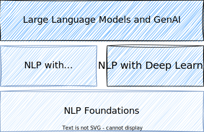
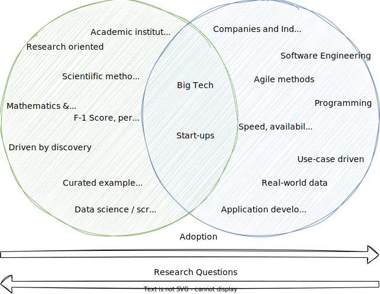

# Preface

Before we start with the course, let's briefly align our expectations and how we approach the fascinating topic of NLP.

## What to expect

**This course is ...**

- a practical introduction NLP
- hands-on: we will learn some important NLP libraries and frameworks
- collaborative: you are encouraged to contribute to the course content through GitHub
- driven by real-world use cases
- a course that will teach you the foundations of NLP and equip you with the knowledge and skills to apply NLP in your domain
- designed for software engineers and we will focus on the engineering perspective of NLP

## What is not included

**This course is not ...**

- a theoretical deep dive into NLP algorithms and models: we rather want to know how we can apply NLP in practice
- primarily about ChatGPT and GenAI: we will cover these topics, but we rather focus on the foundations of NLP
- a survey of the latest NLP research: the field is moving fast, and we will rather build a good foundation that will allow you to keep up with the latest developments
- a course that will teach you how to build NLP models from scratch: we will rather focus on how to apply existing models and frameworks

## Structure of the course

The following diagram shows the structure we follow in the course.
After doing some groundwork and covering NLP foundations, we will take a look at probabilistic NLP approaches.
After that, we dive into deep learning and how we can use it for NLP tasks.
Finally, we will take a look at large language models, generative artificial intelligence, and the current advances in this field.

## Academic research vs. practical applications

NLP is a broad field that encompasses a wide range of topics, including linguistics, computer science, and artificial intelligence.
When working on NLP problems, it is important to know which perspective we are having on the problem.

There is an **academic perspective** on NLP, which is focused on advancing the field through research and innovation.
And there is a **practical perspective** on NLP, which is focused on applying NLP techniques to solve real-world problems.
It is important to understand the difference between these two views, as they require **different skills** and lead to different **career paths**.

Depending on the perspective, the goals and metrics, the data and methodology, as well as the challenges that are faced, can be very different:

- As a **software engineer** in the industry, aspects like scalability, cost or robustness of your NLP system are more important than if you are a researcher in academia. But still, if you work on an NLP problem, it is important to understand basic NLP concepts.
- As a **researcher**, your primary goal is to find answers to your research questions rather than dealing with devops topics or the latest frameworks and tools. At the same time, many research projects are driven by practical needs and are often inspired by real-world problems.

The following figure illustrates those differences:

In this course, we will lean bit more towards the apllication side of NLP.
While we will cover all important theoretical foundations, the main objective is to provide you with the skills that are required to successfully design and implement NLP systems in the industry.
