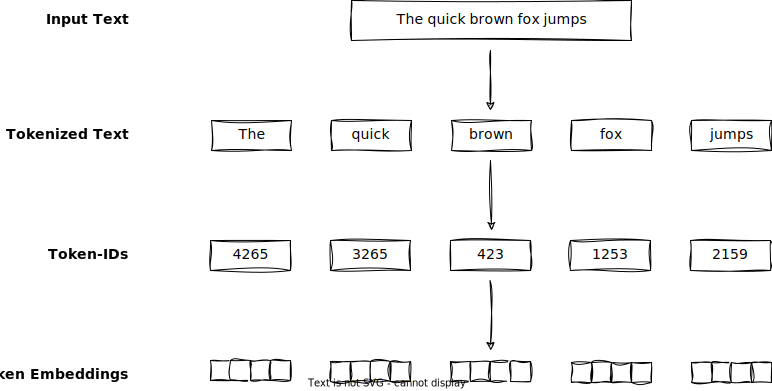
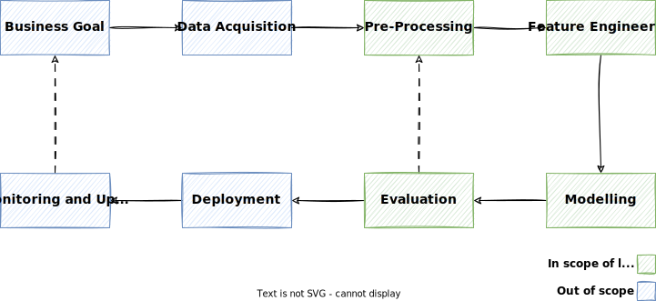

# Preprocessing

Natural language data is inherently **unstructured** and often contains noise, irregularities, and inconsistencies.

Machine learning models **cannot process raw text directly**.
Since text is categorical, it isn’t compatible with the mathematical operations used to implement and train neural networks. Therefore, we need a way to represent words as continuous-valued vectors (aka [embeddings](http://127.0.0.1:8000/lectures/word_embeddings/)).[^1]

!!! info "Embeddings"

    As we will learn [later](http://127.0.0.1:8000/lectures/word_embeddings/), embeddings are a numerical representation of a token.

The **goal** of preprocessing is to transform raw text data into such embeddings so that we can use them for training machine learning models.

In this lecture, we will look at some **common preprocessing** steps that are essential for preparing text data for NLP tasks.

## Overview

The image shows the typical preprocessing steps of text data:[^1]



- When we have the raw input text available, we need to [**tokenize**](#tokenization) it.
- Afterwards, the each individual token is **mapped to an ID**.
- Then, we convert the token IDs into **embedding vectors**.

!!! info "Embeddings"

    As we will learn later, embeddings are a numerical representation of a token.
    In the beginning, we initialize them **randomly**.
    Later, during training, they are optimized to represent the token in a way that is useful for the task at hand.

## The pipeline concept in NLP

Like with many other complex problems, in NLP, it makes sense to break the problem that needs to be solved down into several sub-problems.
This step-by-step processing is also referred to as a _pipeline_.
Using a pipeline and breaking down an NLP problem into different steps offers several advantages that contribute to the overall efficiency and effectiveness of the NLP process:

1.  **Modularization and Reusability:**
    Breaking down the NLP process into distinct steps allows for modularization.
    Each step can be designed as a separate module with well-defined inputs and outputs.
    This modularity promotes code reusability and makes swapping out or updating individual components easier without affecting the entire system.

2.  **Complexity Management:**
    NLP tasks can be intricate, involving numerous subtasks and techniques.
    By dividing the problem into manageable steps, it becomes easier to focus on each aspect separately.
    This simplifies the development, debugging, and maintenance of the NLP solution.

3.  **Parallelization and Efficiency:**
    Different steps of the pipeline can often be executed in parallel, speeding up the overall process.
    For instance, while one part of the pipeline preprocesses data, another can perform feature engineering, enhancing computational efficiency.

4.  **Experimentation and Iteration:**
    A structured pipeline allows researchers and practitioners to experiment with various techniques and algorithms at different stages.
    This iterative approach facilitates the testing of different configurations and helps identify the best-performing components for each step.

5.  **Collaboration:**
    When working in teams, a well-defined pipeline allows team members to focus on specific stages of the NLP process, enhancing collaboration and specialization.
    Team members can work on their respective areas of expertise while contributing to the overall project.

6.  **Debugging and Troubleshooting:**
    If a problem arises in a specific stage of the pipeline, it's easier to identify the source and address the issue when the process is divided into distinct steps.
    This targeted approach simplifies debugging and reduces the scope of potential errors.

7.  **Scalability:**
    As NLP projects grow in complexity, a modular pipeline can accommodate the addition of new components or steps as needed.
    This scalability is especially important when dealing with evolving data sources and changing requirements.

8.  **Adaptation to Different Tasks:**
    The pipeline structure can be adapted and reused for various NLP tasks.
    By modifying or replacing specific steps, the same pipeline can be applied to tasks like sentiment analysis, text summarization, machine translation, and more.

9.  **Documentation and Transparency:**
    A well-defined pipeline provides a clear outline of the entire NLP process.
    This documentation is valuable for sharing insights, collaborating, and ensuring transparency in the development and deployment process.

In essence, the concept of a pipeline in NLP enhances organization, flexibility, collaboration, and maintainability throughout the development lifecycle.
It facilitates the transformation of raw text data into valuable insights by systematically addressing the challenges specific to natural language processing tasks.

!!! info

    Pipeline processing can be found in many areas of machine learning and computer science in general, e.g., data engineering or DevOps.
    An NLP pipeline can be seen as an adapted machine learning pipeline, as many of its steps apply to machine learning in general.

The following figure shows a generic NLP pipeline, followed by a high-level description of each step.
The color indicates whether the pipeline step is relevant for the course.[^2][^3]



1.  **Business Goal**
    An organization considering ML should have a clear idea of the problem and the business value to be gained by solving that problem.
    You must be able to measure business value against specific business objectives and success criteria.

2.  **Data Acquisition:**
    In this initial step, you gather the raw text data that you will use for your NLP task.
    This could involve scraping websites, accessing databases, or any other method to collect relevant text documents.

3.  **Pre-Processing:**
    Pre-processing includes a series of tasks like tokenization (breaking text into words or subword units), lowercasing, and stemming/lemmatization (reducing words to their base form).
    This step helps standardize the text and make it ready for further analysis.

4.  **Feature Engineering:**
    Feature engineering involves transforming the pre-processed text into numerical representations that machine learning models can work with.
    This could include techniques like TF-IDF or word embeddings like Word2Vec or GloVe.

5.  **Modeling:**
    In this step, you select and train a machine learning or deep learning model that suits your NLP task, such as text classification, NER, or machine translation.
    The model learns patterns from the numerical representations of the text data.

6.  **Evaluation:**
    After training your model, you need to assess its performance.
    Evaluation involves using metrics like accuracy, precision, recall, F1-score, or others, depending on the task, to measure how well the model is performing on unseen data.

7.  **Deployment:**
    Once you're satisfied with your model's performance, you deploy it to a production environment where it can be used to make predictions on new incoming text data.
    This could involve integrating it into a web application, API, or other systems.

8.  **Monitoring and Model Updating:**
    After deployment, continuously monitoring the model's performance in real-world scenarios is essential.
    Suppose the model's accuracy drops or its predictions become less reliable over time due to changing patterns in the data. In that case, you might need to retrain or update the model to maintain its effectiveness.

!!! note

    Depending on the specific NLP task and the complexity of the data, you might need to delve deeper into each step and consider additional techniques or subtasks.

## Acquiring data for NLP

Data acquisition techniques in Natural Language Processing (NLP) are crucial for obtaining high-quality data to train and evaluate models.
Here's an overview of four common data acquisition techniques:

1.  **Web Scraping:**
    This involves extracting data from websites.
    It's widely used for collecting large amounts of text data from various sources, such as news articles, blogs, and social media platforms.
    Libraries like [Beautiful Soup](https://www.crummy.com/software/BeautifulSoup/) or [Scrapy](https://scrapy.org/) are commonly used for web scraping.

2.  **Pre-existing Datasets:**
    Many publicly available datasets have been curated for specific NLP tasks.
    Examples include the [IMDb dataset](https://developer.imdb.com/non-commercial-datasets/) for sentiment analysis, the [Penn Treebank](https://catalog.ldc.upenn.edu/LDC99T42) for language modeling, or the [CoNLL dataset](https://www.clips.uantwerpen.be/conll2003/ner/) for NER.
    Also, these datasets serve as benchmarks for various NLP tasks.

3.  **Data Augmentation:**
    Data augmentation involves creating new data samples from existing ones by applying various transformations.
    In NLP, this can involve techniques like paraphrasing, synonym replacement, and perturbation of sentences.
    Augmentation helps increase the diversity of the training data and can improve model generalization.
    A popular tool (not only) for data augmentation is [snorkel](https://www.snorkel.org/).

In many cases, it's a **combination of these techniques** that makes a well-rounded and robust dataset for training and evaluating NLP models.
The choice of technique depends on the specific task, available resources, and ethical considerations.

The following code snippet is an example that shows how to parse a Wikipedia page.

```python
import requests
from bs4 import BeautifulSoup

url = 'https://en.wikipedia.org/wiki/Python_(programming_language)'
response = requests.get(url)

soup = BeautifulSoup(response.content, 'html.parser')
infobox = soup.find('table', class_='infobox')
abstract_text = None

if infobox:
    rows = infobox.find_all('tr')
    for row in rows:
        header = row.find('th')
        if header and 'Paradigm' in header.text:
            abstract = row.find_next('p')
            if abstract:
                abstract_text = abstract.get_text()
                break

if abstract_text:
    print(abstract_text)
else:
    print("Abstract not found.")
```

!!! warning

    As you can see, it already involves quite some custom logic and pitfalls and won't work if Wikipedia makes changes that affect the HTML tree.
    Many Websites offer APIs that allow much more straightforward access to their data via HTTP call, e.g., the [Twitter API](https://developer.twitter.com/en/docs/twitter-api).

!!! note

    While such techniques are valuable, each comes with its own challenges:

      - Web scraping can be legally and ethically complex and often requires a lot of custom logic
      - Pre-existing datasets might not always align perfectly with your task
      - Human annotation can be expensive and time-consuming
      - Data augmentation requires creativity to maintain semantic meaning.

!!! tip

    As you may know, [kaggle](https://www.kaggle.com/) is an excellent source for browsing public datasets for various use cases.
    Also, the [Linguistic Data Consortium](https://www.ldc.upenn.edu/) has curated a [top ten list](https://catalog.ldc.upenn.edu/topten) of datasets for NLP tasks.

!!! example

    The `data_acquisition.ipynb` notebook in the demonstrates how to acquire data from New York Times articles using the [New York Times API](https://developer.nytimes.com/apis).

## Working with text data

### Lowercasing

Convert all text to lowercase to ensure consistent handling of words regardless of their case.

```python
>>> txt = "Welcome to the HTWG practical NLP course"
>>> txt.lower()
'welcome to the htwg practical nlp course'
```

!!! note

    Back in the days, having all text lowercase was common practice because it had a positive impact on the performance of machine learning models.

    But in the era of large language models (LLMs), lowercasing is not common anymore,
    and capitalization helps LLMs distinguish between proper nouns and common nouns, understand sentence structure, and learn to generate text with proper capitalization.

!!! example

    In some cases, the case of the text may carry valuable information, such as in tasks related to NER, where distinguishing between "US" (the country) and "us" (the pronoun) is essential.

!!! info

    Depending on the use case, you may need to do other string operations.
    Python offers a lot of useful [string methods](https://docs.python.org/3/library/stdtypes.html#string-methods) to work with text data.

### Remove punctuation

Punctuation marks like commas, periods, and semicolons can add complexity to text, but they might not always contribute essential information. By removing them, the text is simplified, and the complexity of the data is reduced, which can make it easier for certain NLP tasks to process and analyze.

```python
>>> from nltk.tokenize import word_tokenize
>>> txt = "Hey, what are you up to? Let's have a pizza tonight!"
>>> [word for word in word_tokenize(txt) if word.isalnum()]
['Hey', 'what', 'are', 'you', 'up', 'to', 'Let', 'have', 'a', 'pizza', 'tonight']
```

### Remove HTML tags and URLs

When dealing with text from web pages, HTML tags are often present and need to be removed.

```python
>>> from bs4 import BeautifulSoup
>>> html = "<div><h1>Hello, World!</h1><p>This is a <strong>simple</strong> HTML page.</p></div>"
>>> BeautifulSoup(html).text
'Hello, World!This is a simple HTML page.'
```

Usually, it's also a good idea to remove URLs, as they often contain random characters and symbols and, therefore, add noise to the text.

!!! note

    While you could also achieve it with a simple regex `re.sub(r'<.*?>', '', html)`, it might not cover all edge cases and HTML entities like, e.g., `&nsbm`.
    Therefore, using a well-established library for such tasks is generally a better approach.

### Other common text processing steps

Here are some other common text processing steps worth mentioning:

1.  **Handling Numbers:**
    Decide whether to keep or remove numbers based on the analysis's goals.
    You might replace numbers with placeholders like `NUM` or convert them to words.

1.  **Handling Special Characters**
    Special characters like "+" or emojis often convey a meaning.
    Depending on your application, you can choose to preserve emojis as-is, replace them with their textual descriptions, e.g., "☺️" becomes "smiley face", or remove them altogether.
    Not surprisingly, emojis are helpful for sentiment analysis.

1.  **Removing whitespace:**
    Extra spaces, tabs `\t`, or line breaks `\n` should be normalized to a single space to ensure consistent formatting.

1.  **Spelling Correction:**
    Human-typed data often has spelling errors. Custom solutions are usually not robust enough, but online services like [Bing Spell Check](https://learn.microsoft.com/en-us/azure/cognitive-services/bing-spell-check/quickstarts/python) offer REST APIs to tackle the spelling correction problem more sophisticatedly.

1.  **Contractions expansion:**
    Especially in the English language, expanding contractions like "can't" to "cannot" or "I'm" to "I am." should be resolved to ensure consistent word representations.

1.  **Handling Abbreviations and Acronyms:**
    Expanding abbreviations and acronyms to their full forms, or vice versa, to ensure consistency.

1.  **Normalization of Date and Time Formats:**
    Converting various date and time representations into a standardized format, for example, transforming `September 1st, 2023` to `2023-09-01`.

## Tokenization

Tokenization is the process of breaking down a text into substrings, like words or tokens.
In English and many other languages, words are often separated by spaces, making space a common delimiter.

We could use a simple regex to perform tokenization:

```python
>>> import re
>>> txt = "The quick brown fox jumps over the lazy dog."
>>> re.split(r'\s+', txt)
['The', 'quick', 'brown', 'fox', 'jumps', 'over', 'the', 'lazy', 'dog']
```

But a simple regex might not always be sufficient in practice.
Consider the following example:

```python
>>> txt = "Hello, world. This, is a test."
>>> re.split(r'\s+', txt)
['Hello,', 'world.', 'This,', 'is', 'a', 'test.']
```

Usually, we also want to have the punctuation marks separated from the words, so a simple whitespace split is not sufficient anymore, and the regex will become more complex:

```python
>>> re.split(r'([,.]|\s)', txt)
['Hello', 'world', 'This', 'is', 'a', 'test']
```

Like this, the task of tokenization can become quite complex, and it's better to use dedicated libraries like [NLTK](https://www.nltk.org/) or [spaCy](https://spacy.io/) for tokenization.

```python
>>> from nltk.tokenize import word_tokenize
>>> txt = "The quick brown fox jumps over the lazy dog."
>>> word_tokenize(txt)
['The', 'quick', 'brown', 'fox', 'jumps', 'over', 'the', 'lazy', 'dog', '.']
```

You can also tokenize at the level of sentences using the sentence tokenizer:

```python
>>> from nltk.tokenize import sent_tokenize
>>> txt = "Salvatore has the best pizza in town. You should try the Calabrese. It's my favorite."
>>> sent_tokenize(txt)
['Salvatore has the best pizza in town.', 'You should try the Calabrese.', "It's my favorite."]
```

!!! info

    Which tokenizer to use can be a crucial decision for your NLP project.
    The code example above uses NLTK's [default word tokenizer](https://www.nltk.org/api/nltk.tokenize.html#nltk.tokenize.word_tokenize), but others are available.
    Please consider the [API reference](https://www.nltk.org/api/nltk.tokenize.html#submodules) of NLTK's tokenize module for more information.

The following sections show some more sophisticated tokenization techniques.

### Stopword removal

Stopwords are common words (such as "and," "the," "is," etc.) that don't carry significant meaning in a text.
Stopword removal involves filtering out these words from a text to reduce noise and save processing time.
The goal is to focus on the more meaningful content words that contribute to the overall context of the text.

```python
>>> from nltk.tokenize import word_tokenize
>>> from nltk.corpus import stopwords
>>> txt = "Early morning walks provide fresh air and energy for the day."
>>> [word for word in word_tokenize(txt) if word not in stopwords.words('english')]
['Early', 'morning', 'walks', 'provide', 'fresh', 'air', 'energy', 'day', '.']
```

!!! question

    In the era of LLMs, would you say it is still a good idea to remove stopwords?

### Stemming

Stemming is a process of reducing words to their base or root form by removing suffixes or prefixes.
The resulting stem might **not always be a valid word**, but it's intended to capture the core meaning of the word.
Some popular stemming algorithms include the Porter stemming algorithm and the Snowball stemmer.
Stemming can be computationally faster than lemmatization since it involves simpler rule-based manipulations.

```python
>>> from nltk.stem import PorterStemmer
>>> stemmer = PorterStemmer()
>>> words = ["happily", "flies", "feet", "denied", "sensational", "airliner", "cats", "houses", "agreed", "better"]
>>> [stemmer.stem(word) for word in words]
['happili', 'fli', 'feet', 'deni', 'sensat', 'airlin', 'cat', 'hous', 'agre', 'better']
```

!!! warning

    Stemming algorithms use heuristic rules to perform these transformations, which can lead to over-stemming (reducing words too aggressively) or under-stemming (not reducing words enough).

### Lemmatization

Lemmatization is a more advanced technique that reduces words to their base form, known as the lemma.
Unlike stemming, lemmatization takes into account the word's morphological analysis and its part of speech (POS) to ensure that the resulting lemma is **a valid word** in the language.
This makes lemmatization more accurate but potentially slower than stemming.

```python
>>> from nltk.stem import WordNetLemmatizer
>>> lemmatizer = WordNetLemmatizer()
>>> words = [("happily", "r"), ("flies", "v"), ("feet", "n"), ("denied", "v"), ("sensational", "a"), ("airliner", "n"), ("cats", "n"), ("houses", "n"), ("agreed", "v"), ("better", "a")]
>>> [lemmatizer.lemmatize(*word) for word in words]
['happily', 'fly', 'foot', 'deny', 'sensational', 'airliner', 'cat', 'house', 'agree', 'good']
```

Lemmatization is often preferred in tasks where maintaining the grammaticality of the words is crucial, such as language generation or language understanding tasks.
It provides a cleaner and more linguistically accurate representation of words.

Stemming is faster but might result in less linguistically accurate roots, while lemmatization is more accurate but can be slower due to its linguistic analysis.
The choice between these techniques depends on the specific NLP task and the desired trade-off between speed and accuracy.

!!! note

    Note that we require the POS tag as a second argument for NLTK's [`WordNetLemmatizer`](https://www.nltk.org/api/nltk.stem.wordnet.html#nltk.stem.wordnet.WordNetLemmatizer.lemmatize).
    This is why we use the [Python unpacking operator `*`](https://docs.python.org/3/tutorial/controlflow.html#unpacking-argument-lists) here

## Converting tokens into embeddings

Now, let’s convert these tokens from a Python string to an integer representation to produce the token IDs.
This conversion is an intermediate step before converting the token IDs into embedding vectors.[^1]

{width=80%}

- We build a vocabulary by **tokenizing** the entire text in a training dataset into individual tokens.
- These individual tokens are then **sorted alphabetically**, and duplicate tokens are removed.
- The unique tokens are then aggregated into a **vocabulary** that defines a **mapping** from each unique token to a unique integer value.

The next goal is to apply this vocabulary to convert **new text into token IDs**:[^1]

{width=80%}

- Starting with a new text sample, we **tokenize** the text and use the vocabulary to convert the text tokens into token IDs.
- The **vocabulary** is built from the entire training set and can be applied to the training set itself and any new text samples.

!!! info "Encoding and Decoding"

    The process of converting tokens into token IDs is also known as **encoding**, while the reverse process of converting token IDs back into tokens is also known as **decoding**.[^1]

    {width=80%}

!!! example

    According to the illustration, the following **sentence**:

    ```txt
    The quick fox.
    ```

    would be tokenized into the following **tokens**:

    ```txt
    ["The", "quick", "fox"]
    ```

    and could be represented by the following **token IDs**:

    ```
    [7, 6, 2]
    ```

## Adding special context tokens

To address the issue of unknown words or other edge cases, we can add special context tokens to the vocabulary.
These special tokens can be used to represent specific contexts or conditions that are not covered by the regular vocabulary tokens.
For example, these special tokens can include markers for unknown words or document boundaries.[^1]

{width=80%}

- In this example, we add special tokens to a vocabulary to deal with certain contexts.
- For instance, we add an `<|unk|>` token to represent new and unknown words that were not part of the training data and thus not part of the existing vocabulary.
- Furthermore, we add an `<|endoftext|>` token that we can use to separate two unrelated text sources. This helps a model to understand that although these text sources are concatenated for training, they are, in fact, unrelated.

## Key takeaways

- In **preprocessing**, we convert raw input text into tokens, map them to IDs, and convert these IDs into embeddings.
- The NLP **pipeline** is a systematic approach to solving NLP problems by breaking them down into **distinct steps**.
- Many times, the success of an NLP project is determined already before the actual modeling step. **Preprocessing** and data acquisition play an important role, and **in practice, much effort** is spent on these steps.
- When working with text data, we can apply a variety of **text processing techniques** to clean and normalize the text, including lowercasing, removing punctuation, and handling special characters.
- **Tokenization** is the process of breaking down text into tokens, which is essential for further processing and analysis.
- **Encoding** refers to the process of converting tokens into token IDs, while **decoding** refers to the reverse process of converting token IDs back into tokens.
- We can add **special context tokens** to the vocabulary to address edge cases and unknown words that are not covered by the regular vocabulary tokens.

<!-- footnotes -->
[^1]: Image adapted from Raschka, Sebastian. _Build a Large Language Model (From Scratch)_. Shelter Island, NY: Manning, 2024. <https://www.manning.com/books/build-a-large-language-model-from-scratch>.
[^2]: Vajjala, Sowmya, S.V. Bharathi, Bodhisattwa Majumder, Anuj Gupta, and Harshit Surana. _Practical Natural Language Processing: A Comprehensive Guide to Building Real-world NLP Systems_. Sebastopol, CA: O'Reilly Media, 2020. <https://www.practicalnlp.ai/>.
[^3]: <https://docs.aws.amazon.com/wellarchitected/latest/machine-learning-lens/well-architected-machine-learning-lifecycle.html>
