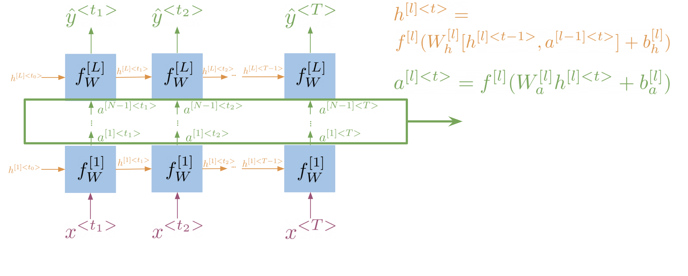

# Sequence Models

In this lecture, we will cover **sequence models**. Starting with the limitations of [N-gram language models](language_models.md), we will introduce recurrent neural networks along with some of their variants. We will also introduce the concept of the vanishing gradient problem, and explain how it can be addressed using long short-term memory networks.

## Limitations of N-Gram Language Models

Recall that [N-gram language models](language_models.md) are used to compute the probability of a sequence of words. For that, we need to compute the conditional probability of a word given the $N-1$ previous words. This approach has two main limitations:

- N-gram models consider only a fixed number of preceding words, i.e. $N-1$, to predict the next word, and thus, have **limited contextual information**. This limitation results in the model being unable to capture **long-range dependencies** or understand the context beyond the immediate history.
- To capture dependencies of words that are very distant from each other, we need to use a large $N$. This can be difficult to estimate without a large corpus. In practice, this can lead to **sparsity** issues, where many possible n-grams may not be observed in the training data.
- Even with a large corpus, such a model would require a lot of **memory** to store the counts of all possible $N$-grams.

So for large $N$, this becomes very impractical. A type of model that can help us with this is the recurrent neural network (RNN).

!!! example "long-range dependencies"

    Consider the following sentence:

    > Mary was supposed to study with me. I called her, but she did not <?>.

    Where the expected word is "answer".

    A traditional language model (let's say trigram) would probably predict a word like "have", since we can assume that the combination "did not have" is very frequent (or at least more frequent than the word "answer") in regular corpora.

    We would need a very large $N$ to capture the dependency between "did not" and "answer", as we would also need to consider the beginning of the sentence "I called her".

!!! example "Penta-gram"

    To predict the probability of a five-word sequence using a penta-gram model, we can use the following formula:

    $$P(w_1, w_2, w_3, w_4, w_5) = P(w_1) \cdot P(w_2 | w_1) \cdot P(w_3 | w_1, w_2) \cdot P(w_4 | w_1, w_2, w_3) \cdot P(w_5 | w_1, w_2, w_3, w_4)$$

    We can easily imagine that the larger the $N$, the more sparse the data will be, as large (N-1)-grams are unlikely to appear in the corpus. Thus, the more difficult it will be to estimate the probabilities for the N-grams.

    Note that the formula above shows the [sequence probability](./language_models.md#sequence-probabilities) (which makes use of the [Markov assumption](./language_models.md#markov-assumption)), and not the [N-gram probability](./language_models.md#n-gram-probability).

## Recurrent Neural Networks

RNNs **propagate information** from the beginning of a sequence through to the end. This allows them to capture long-range dependencies.

We can see this process illustrated in the following figure:


Here is a summary of the steps:

- Each of the boxes represent the **values** computed at each particular step.
- The **colors** represent the **information** that is propagated through the network.
- The **arrows** indicate how the information is propagated through the network.
- The information from every word in the sequence is multiplied by the **input weight matrix** $W_x$.
- To propagate information from one step to the next, we multiply the information from the previous step by the **hidden state weight matrix** $W_h$.
- The hidden state at each time step is computed as a **function** of the previous hidden state $h_{t-1}$ and the input at the current step $x_t$.

The hidden states are what allow the RNN to capture long-range dependencies. As we can see, in the last step, there is still information from the first step. This is what allows the RNN to capture long-range dependencies.

!!! info "Hidden State"

    We can think of the **hidden state** as a **memory** or internal representation that the network updates as it processes each element of a sequence.

    The hidden state acts as a way for the network to maintain information about **what it has seen so far** and use that information to make predictions or decisions about the current input.

!!! info

    The weights $W_x$ and $W_h$ are shared across all steps, that means we only need to learn them **once**, and then we can apply them to every step.

    This is why the RNN is called a **recurrent** neural network, because it performs the same task for every element of a sequence, with the output being dependent on the **previous computations**.

!!! info "Loss Function"

    For RNNs, typically the [cross entropy](https://en.wikipedia.org/wiki/Cross_entropy) loss function is used.

!!! example "Implementation Note"

    Tensorflows [`tf.scan`](https://www.tensorflow.org/api_docs/python/tf/scanz) function can be used to implement RNNs. It takes a function and applies it to all elements of a sequence. You can also pass an optional initializer, which is used to initialize the first element of the sequence.

    Here is a simple variant of the `scan` function, which shows how it basically works:

    ```python
    def scan(fn, elems, weights, h_0=None):
        h_t = h_0
        ys = []
        for e in elems:
            y, h_t = fn([e, h_t], weights)
            ys.append(y)
        return ys, h_t
    ```

    Note that in Python, you can pass a function as an argument to another function.

!!! note "Gated Recurrent Units"

    The [**Gated Recurrent Unit (GRU)**](https://en.wikipedia.org/wiki/Gated_recurrent_unit) is a variant of the RNN that is easier to train, and often performs better in practice.

    It is similar to the RNN, but it has two gates:

    - The **update gate** controls how much of the previous state is kept.
    - The **reset gate** controls how much of the previous state is forgotten.

!!! tip

    In general, we can say that sequence models like RNNs have the form of a **chain** of repeating modules of neural networks.

## Bi-directional RNNs

In a bi-directional RNN, information flows in **both directions**.

- The **forward RNN** propagates information from the beginning of the sequence to the end.
- The **backward RNN** propagates information from the end of the sequence to the beginning.

With this, a bi-directional RNN can capture information from both the past and the future context.

Note that the computations of the forward and backward RNNs are **independent of each other**, and thus, can be parallelized.


!!! example

    Given the sentence:

    > I was trying really hard to get a hold of <?>. Louise finally answered when I was about to give up.

    Since Louise doesn't appear until the beginning of the second sentence, a regular RNN would have to guess between "her", "him", or "them". However, a bi-directional RNN would be able to capture the context from the end of the sequence, and thus, would be able to predict "her" with a higher probability.

!!! info "Deep RNNs"

    Another variant of RNNs are deep RNNs. Similar to deep neural networks, deep RNNs are RNNs with **multiple hidden layers**. They can be used to capture more complex patterns. We can think of them as multiple RNNs stacked on top of each other.

    1. Get the hidden state for the current layer (propagate information through time). ➡️
    2. Use the hidden state of the current layer as input for the next layer (propagate information through layers). ⬆️

    

## Vanishing Gradient Problem

While RNNs are very powerful, they have a major limitation: the **vanishing gradient problem**.

Here is an illustration:


<!-- TODO EXAM -->
The problem can be summarized as follows:

- During the training of neural networks, the **backpropagation algorithm** is used to calculate gradients of the loss function with respect to the weights of the network.
- These gradients are then used to **update the weights** of the network.
- The vanishing gradient problem occurs when the gradients calculated by the backpropagation algorithm become **very small** as the algorithm progresses backward through the layers of the network.
- This means that the weights of the network are not updated significantly, and thus, the network is **not trained effectively**.

We can summarize the **advantages and disadvantages of RNNs** as follows:

- ✅ They can capture **long-range dependencies**
- ✅ They can be used to process sequences of **varying lengths**
- ✅ They use **less memory** than traditional N-gram language models
- ❌ They suffer from the vanishing or exploding **gradient problems**
- ❌ Struggle with **very long sequences**

!!! tip

    Think of the weights as factors that influence the **importance of information** at each step. If these factors are repeatedly small, the overall impact of the information from earlier steps diminishes exponentially as you go back in time.

    Here is an **analogy**:

    It's like **whispering a secret** in a long line of people, and each person passing it on speaks in a softer voice. By the time it reaches the end of the line, the original message is barely audible.

!!! info "Backpropagation"

    The backpropagation algorithm is used in the training of deep neural networks (i.e. networks with more than one hidden layer). It is used to **update the weights** of the network by **propagating the error backwards** through the network.

!!! info "Exploding Gradient Problem"

    The opposite of the vanishing gradient problem is the **exploding gradient problem**. This occurs when the gradients calculated by the backpropagation algorithm become very large as the algorithm progresses backward through the layers of the network.

    This can cause the weights of the network to be updated too much, and thus, the network is also **not trained effectively**.

!!! info "Further Reading"

    Here are some nice blog posts for further reading:

    - [Intro to Optimization in Deep Learning: Vanishing Gradients and Choosing the Right Activation Function](https://blog.paperspace.com/vanishing-gradients-activation-function/)
    - [Intro to optimization in deep learning: Gradient Descent](https://blog.paperspace.com/intro-to-optimization-in-deep-learning-gradient-descent/)

## Long Short-Term Memory Networks

**Long Short-Term Memory (LSTM)** networks are a type of RNN that are designed to address the vanishing gradient problem.

The following figure shows the **architecture** of an LSTM model[^1]:


LSTM allows your model to **remember and forget** certain inputs. It does this by using a combination of two states:

- **Cell state**, that can be thought of as a **memory cell**. It is the horizontal line running through the top of the diagram. It is like a conveyor belt and runs straight down the entire chain, with only some minor linear interactions.
- **Hidden state**, that is used to **propagate information through time**. It outputs $h_t$ and is the vertical line running through the right of the diagram.

The hidden state is used to control the flow of information in the LSTM. It consists of **three gates**. Gates are a way to optionally let information through. They are passed in the following order:

<!-- TODO EXAM -->
- **Forget gate**: decides what information should be thrown away or kept (left sigmoid gate)
- **Input gate**: decides which values from the input to update (middle sigmoid and tanh gates)
- **Output gate**: decides what information to pass over to the next hidden state (right sigmoid gate)

The gates allow the gradients to **flow unchanged**. This means, the risk of vanishing or exploding gradients is mitigated.

An LSTM model is a **chain** of repeating LSTM units.

!!! example

    Here is a little **analogy** that may help you to better understand the idea of LSTMs:

    Imagine you receive a **phone call** from a friend. ☎️ 👧

    At the time your phone rings, you might be thinking of any number of things **unrelated** to your friend. 🏃🍕🏖️

    > This is similar to the cell state at the beginning of the loop.

    When you answer the call, you put aside those unrelated thoughts while **retaining** anything you need to talk to your friend about. 👧

    > This is similar to what the forget gate does.

    As your conversation progresses, you'll be taking in all the **new information** from your friend while also thinking of **what else might be relevant** to talk about next. 🥳☕🏙️

    > This is similar to what the input gates does.

    Finally, you **decide** what to say next. 🍔

    > This is similar to what the output gate does.

    You will then continue to evolve the conversation in this way until you **hang up** at the end of the call, leaving you with a **new set of thoughts** and memories. ☎️👋

    > your cell states have been updated a few times since you began your conversation

!!! tip

    We can say that an LSTM is able to learn **which information** it should **remember** and which information it should **forget**.

!!! info

    LSTMs were introduced in the paper [Long Short-Term Memory](https://www.bioinf.jku.at/publications/older/2604.pdf) by _Hochreiter and Schmidhuber_ (1997).

!!! info "Further Reading"

    Here is a nice blog post that explains for better understanding the concepts of RNNs and LSTMs: [Understanding LSTM Networks](https://colah.github.io/posts/2015-08-Understanding-LSTMs/).

## Key Takeaways

- **N-gram language models** have **limited contextual information**, and thus, have difficulty capturing long-range dependencies.
- **Recurrent Neural Networks (RNNs)** are a type of neural network that can capture long-range dependencies.
- They achieve this by **propagating information** from the beginning of a sequence through to the end.
- There are some variants of RNNs, such as **bi-directional RNNs** and **deep RNNs**, that can be used to capture more complex patterns.
- Even though they can capture long range dependencies, RNNs suffer from the **vanishing gradient problem**. This occurs when the **gradients** calculated by the backpropagation algorithm become **very small**. As a result, the weights of the network are not updated significantly, and thus, the network is **not trained effectively**.
- **Long Short-Term Memory (LSTM)** networks are a type of RNN that are designed to address the vanishing gradient problem. They are able to learn which information it should remember and which information it should forget.

<!-- footnotes -->

[^1]: <https://colah.github.io/posts/2015-08-Understanding-LSTMs/>
