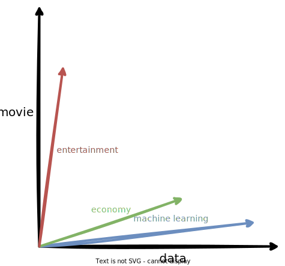
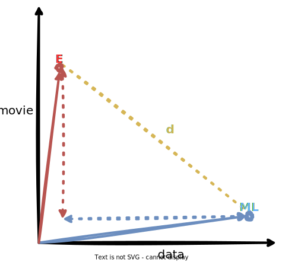
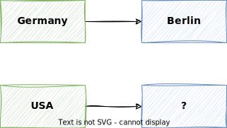
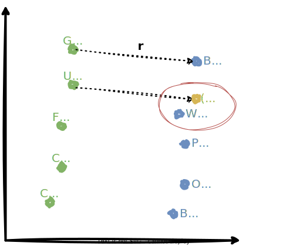

# Vector Space Models

Vector space models are a way of representing the meaning of words in a document. They are a fundamental concept in NLP, and are used in many applications such as document classification, information retrieval, and question answering.

## Introduction

Using vector space models, we can capture similarities, differences, dependencies or many other relationships between words.

!!! example

    The following sentence have very **similar words**, but they have **different meanings**:

    > Where are you **from**?

    > Where are you **going**?

    In contrast, the following sentences have very **different words**, but they have **similar meanings**:

    > What is your age?

    > How old are you?

    Vector space models can be used to capture such similarities and differences between words.

!!! example

    In the following sentence, the word **cereal** and the word **spoon** are related.

    > You eat **cereal** with a **spoon**.

    In the following sentence, the word **sell** depends on the word **buy**.

    > You **sell** something to someone who **buys** it.

Vector space models help us to capture such and many other relationships between words.

!!! quote "John Firth, 1957"

    **You shall know a word by the company it keeps.**

    This is one of the most fundamental concepts in NLP. When using vector space models, the way that representations are made is by identifying the context around each word in the text, which captures the relative meaning.

When learning these vectors, we usually make use of the neighboring words to extract meaning and information about the center word.

If we would cluster vectors together, we can observe that adjectives, nouns, verbs, etc. tend to be near to one another.

!!! question

    In vector space models, synonyms and antonyms are very close to one another. Why do you think this is the case?

<!--
Answer: this is because you can easily interchange them in a sentence, and they tend to have similar neighboring words!

Synonyms:
I bought a new automobile last week.
I bought a new car last week.

Antonyms:
She considered him her enemy
She considered him her friend
-->

## Co-Occurrence Matrix

The **co-occurrence matrix** is a matrix that counts the number of times that a word appears in the context of other words within a given window size $k$.

From the co-occurrence matrix, we can extract the word vectors.

The vector representation of a word is called a **word embedding**.

We can use those word embeddings to find relationships between words.

In the following, we will look at two different approaches to create word embeddings.


!!! info

    The terms **word vector** is often used interchangeably with **word embedding**.
    Both terms refer to a numerical representation of words in a continuous vector space.

## Word by Word Design

In the word by word design, the **co-occurrence matrix** counts the number of times that a word appears in the context of other words within a given window size $k$.

!!! example

    Suppose we have the following two sentences:

    > I like simple data

    > I prefer simple and raw data

    With a window size of $k=2$, the co-occurrence matrix would look as follows:

    |   | I | like | prefer | simple | and | raw | data |
    | - | - | ---- | ------ | ------ | --- | --- | ---- |
    | I | 0 | 1    | 1      | 2      | 1   | 1   | 1    |
    | like | 1 | 0    | 0      | 1      | 0   | 0   | 1    |
    | prefer | 1 | 0    | 0      | 1      | 0   | 0   | 1    |
    | simple | 2 | 1    | 1      | 0      | 1   | 1   | 2    |
    | and | 1 | 0    | 0      | 1      | 0   | 0   | 1    |
    | raw | 1 | 0    | 0      | 1      | 0   | 0   | 1    |
    | data | 1 | 1    | 1      | 2      | 1   | 1   | 0    |

    If we look more closely at the word **data**, we can see that it appears in the context of the word **simple** twice, and in the context of the word **and** once, given a window size of $k=2$.

    So the word **data** can be represented as the following vector:

    $$x_{data} = [1, 1, 1, 2, 1, 1, 0]$$

    Note that the vector is of size $n$, where $n$ is the number of unique words in the vocabulary.

## Word by Document Design

For a word by document design, the process is quite similar.

But instead of counting co-occurrences of words, we count the number of times that a word appears in documents of a specific category.

!!! example

    Let's assume our corpus contains documents of three categories:

    - entertainment
    - economy
    - machine learning

    For the words **data** and **movie**, we could assume the following counts per category:

    |   | entertainment | economy | machine learning |
    | - | ------------- | ------- | ---------------- |
    | data | 1000 | 4000 | 9000 |
    | movie | 7500 | 2000 | 500 |

    So the word **data** can be represented as the following vector:

    $$x_{data} = [1000, 4000, 9000]$$

    And the word **movie** can be represented as the following vector:

    $$x_{movie} = [7500, 2000, 500]$$

    Note that the vector is of size $n$, where $n$ is the number of categories.

We could visualize those vectors in a vector space as follows:



!!! note

    For the sake of drawing, instead of the word vectors, the figure shows the vectors of the categories.

    However, we should see similar results if we would draw the word vectors in a three-dimensional vector space.

## Eucledian Distance

The **Euclidean distance** between two vectors $\mathbf{x}$ and $\mathbf{y}$ in an n-dimensional space is defined as follows:

$$
\begin{align}
d &= \sqrt{(x_1 - y_1)^2 + (x_2 - y_2)^2 + \dots + (x_n - y_n)^2} \\
&= \sqrt{\sum_{i=1}^n (x_i - y_i)^2}
\end{align}
$$

It is the **straight line** between two points in an n-dimensional space, and derived from the Pythagorean theorem.

We can also interpret it as the **length of the vector** that connects the two points (aka the **norm** of the vector).

!!! quote "Pythagoraen Theorem"

    In a right triangle, the square of the hypotenuse is equal to the sum of the squares of the other two sides.

    $$
    c^2 = a^2 + b^2
    $$

Using the Euclidean distance, we can calculate **how close** two vectors are and thus, use it as a **similarity metric**.



!!! example

    If we continue with the example from above, we can calculate the Euclidean distance between the **machine learning** category vector $\mathbf{ml}$ and the **entertainment** category vector $\mathbf{e}$ as follows:

    Let the two vectors be:

    $$
    \begin{align}
    \mathbf{ml} &= [9000, 500] \\
    \mathbf{e} &= [1000, 7500]
    \end{align}
    $$

    Then the Euclidean distance is calculated as follows:

    $$
    \begin{align}
    d &= \sqrt{(x_1 - y_1)^2 + (x_2 - y_2)^2} \\
    &= \sqrt{(ml_1 - e_1)^2 + (ml_2 - e_2)^2} \\
    &= \sqrt{(9000 - 1000)^2 + (500 - 7500)^2} \\
    &= 8000
    \end{align}
    $$

As you can see from the formula, this generalizes to **any number of dimensions**.

!!! example

    Let's assume we have the following **co-oocurrence matrix**, and we want to calculate the Euclidean distance between the words **beer** and **pizza**.

    |   | data | beer | pizza |
    | - | ---- | ---- | ------ |
    | AI | 6 | 0    | 1      |
    | drinks | 0 | 4    | 6      |
    | food | 0 | 6    | 8      |

    Based on this co-occurrence matrix, we can represent the words **beer** and **pizza** as the following vectors:

    $$
    \begin{align}
    \mathbf{b} &= [0, 4, 6] \\
    \mathbf{p} &= [1, 6, 8]
    \end{align}
    $$

    Then the Euclidean distance is calculated as follows:

    $$
    \begin{align}
    d &= \sqrt{(x_1 - y_1)^2 + (x_2 - y_2)^2 + (x_3 - y_3)^2} \\
    &= \sqrt{(b_1 - p_1)^2 + (b_2 - p_2)^2 + (b_3 - p_3)^2} \\
    &= \sqrt{(0 - 1)^2 + (4 - 6)^2 + (6 - 8)^2} \\
    &= \sqrt{1 + 4 + 4} \\
    &= 3
    \end{align}
    $$

In Python, we can calculate the Euclidean distance using the `numpy.linalg.norm` function.

```python
import numpy as np

# Define two vectors
a = np.array([1, 2, 3])
b = np.array([4, 5, 6])

# Calculate the Euclidean distance
distance = np.linalg.norm(a - b)

print("Euclidean distance:", distance)
```

!!! note

    The [`numpy.linalg.norm`](https://numpy.org/doc/stable/reference/generated/numpy.linalg.norm.html) function calculates the norm of a vector or matrix.

    Since the **norm of a vector is its length**, the function can be used to calculate the Euclidean distance between two vectors.

## Cosine Similarity

The cosine similarity is another way of measuring the similarity between two vectors.

The **intuition** is that vectors pointing in the **similar direction** share a similar proportion of words, and thus, are more similar to each other.

Let's take a look at the following figure:


Normally, the **food** and **agriculture** categories would be considered more similar, because they share a similar proportion of words.

However, the Euclidean distance would suggest that the **agriculture** and **history** categories are more similar to each other than the **agriculture** and **food** categories, since $d_2 < d_1$.

This is because the **Euclidean distance** is biased towards longer vectors, or in our case, categories with more words.

To avoid that, we could also compare the angles, or the **cosine of the angles**, between the vectors to measure their similarity.

As the figure shows, the angle between the **agriculture** and **food** categories is smaller than the angle between the **agriculture** and **history** categories, and thus, would be a better measure of similarity in this case.

!!! info

    When corpora are different in size, the Euclidean distance is **biased towards longer vectors**. In such cases, it is better to use the **cosine similarity** as a measure of similarity.

!!! note

    Form the figure, we can see that:

    - vectors pointing in the **similar direction** means their word frequencies are **similar**, and
    - vectors pointing in **different directions** means the word frequencies are **dissimilar**.

Let's take a look at the math behind the cosine similarity.

The **norm** of a vector $\mathbf{x}$, or its length, is defined as the square root of the sum of the squared vector elements:

$$
\|\mathbf{x}\| = \sqrt{\sum_{i=1}^n x_i^2}
$$

The **dot product** of two vectors $\mathbf{x}$ and $\mathbf{y}$ is defined as the sum of the products of the corresponding vector elements:

$$
\mathbf{x} \cdot \mathbf{y} = \sum_{i=1}^n x_i \cdot y_i
$$

From trigonometry, we know that the **cosine of the angle** is defined as follows:

$$
\cos(\theta) = \frac{\text{adjacent}}{\text{hypotenuse}}
$$

In vector space,

- the **adjacent** is the **dot product** of the two vectors (the projection of one vector onto the other), and
- the **hypotenuse** is the **product of the norms** of the two vectors,

which leads us to the following formula:

$$
\cos(\theta) = \frac{\mathbf{x} \cdot \mathbf{y}}{\|\mathbf{x}\| \|\mathbf{y}\|}
$$

The following figure shows how we can use the cosine similarity to measure the similarity between two vectors.


- If the vectors are orthogonal, like the vectors $\mathbf{v}$ and $\mathbf{w}$, the cosine similarity is 0, since $\cos(90) = 0$.
- If the vectors point exactly in the same direction, like the vectors $\mathbf{x}$ and $\mathbf{y}$, the cosine similarity is 1, since $\cos(0) = 1$.

!!! note

    Since we are dealing with word counts, there won't be any negative values in the vectors, and our vectors will always point in the first quadrant.

!!! example

    Given the following diagram

    

    we can calculate the cosine similarity between the vectors for the categories **agriculture** $\mathbf{a}$ and **history** $\mathbf{h}$ as follows:

    Let the two vectors be:

    $$
    \begin{align}
    \mathbf{a} &= [10, 40] \\
    \mathbf{h} &= [30, 10]
    \end{align}
    $$

    Then the cosine similarity is calculated as follows:

    $$
    \begin{align}
    \cos(\theta) &= \frac{\mathbf{a} \cdot \mathbf{h}}{\|\mathbf{a}\| \|\mathbf{h}\|} \\
    &= \frac{\sum_{i=1}^n a_i h_i}{\sqrt{\sum_{i=1}^n a_i^2} \sqrt{\sum_{i=1}^n h_i^2}} \\
    &= \frac{(10 \times 30) + (40 \times 10)}{\sqrt{(10^2 + 40^2)} \sqrt{(30^2 + 10^2)}} \\
    &= 0.5368
    \end{align}
    $$

!!! example

    Let's assume we have the following **co-oocurrence matrix**, and we want to calculate the cosine similarity between the words **beer** and **pizza**.

    |   | data | beer | pizza |
    | - | ---- | ---- | ------ |
    | AI | 6 | 0    | 1      |
    | drinks | 0 | 4    | 6      |
    | food | 0 | 6    | 8      |

    Based on this co-occurrence matrix, we can represent the words **beer** and **pizza** as the following vectors:

    $$
    \begin{align}
    \mathbf{b} &= [0, 4, 6] \\
    \mathbf{p} &= [1, 6, 8]
    \end{align}
    $$

    Then the cosine similarity is calculated as follows:

    $$
    \begin{align}
    \cos(\theta) &= \frac{\mathbf{b} \cdot \mathbf{p}}{\|\mathbf{b}\| \|\mathbf{p}\|} \\
    &= \frac{\sum_{i=1}^n b_i p_i}{\sqrt{\sum_{i=1}^n b_i^2} \sqrt{\sum_{i=1}^n p_i^2}} \\
    &= \frac{(0 \times 1) + (4 \times 6) + (6 \times 8)}{\sqrt{(0^2 + 4^2 + 6^2)} \sqrt{(1^2 + 6^2 + 8^2)}} \\
    &= 0.9935
    \end{align}
    $$

Here is a NumPy implementation of the cosine similarity:

```python
import numpy as np

# Define two vectors
a = np.array([1, 2, 3])
b = np.array([4, 5, 6])

# Calculate the cosine similarity
similarity = np.dot(a, b) / (np.linalg.norm(a) * np.linalg.norm(b))

print("Cosine similarity:", similarity)
```

## Working with Word Vectors

We can use word vectors to find relationships between words.

Using simple vector arithmetics, we can already do some interesting things, like finding the capital of a country.



Knowing that the capital of Germany is Berlin, we can use this relationship to find the capital of the USA.

!!! question

    If you were given the pair **Australia** and **Sydney** instead of Germany and Berlin, where do you think we would end up in the vector space for the USA?

!!! example

    A similar analogy would be the following:

    prince 🤴 - male ♂️ + female ♀️ = princess 👸

Suppose we have the following vector space, that has vector representations for countries and their capitals.



We can express the relationship between a country and its capital by the **difference** between their vectors.

Using this relationship, we can find the capital of a country by **adding the difference vector** to the vector of the country.

Usually, we do not end up exactly at the capital, so we need to utilize **similarity metrics** to find the closest vector.

As we learned, we could use the Euclidean distance or the cosine similarity to achieve this.

In the end, we can leverage known relationships between words to find unknown relationships and make predictions.

!!! example

    Form the figure, we can see that

    $$
    \begin{align}
    \mathbf{v}_{\text{Germany}} = [5, 6]\\
    \mathbf{v}_{\text{Berlin}} = [10,5]
    \end{align}
    $$

    Given these vectors, we can derive that the relationship $\mathbf{r}$ between Germany and its capital Berlin can be expressed by the difference between the two vectors:

    $$
    \begin{align}
    \mathbf{r} &= \mathbf{v}_{\text{Germany}} - \mathbf{v}_{\text{Berlin}} \\
    &= [10, 5] - [5, 6] \\
    &= [5, -1]
    \end{align}
    $$

    So the relationship $\mathbf{r}$ between country and capital can be expressed by the vector $[5, -1]$.

    If we add this vector to the vector for the USA, we should end up close to the capital of the USA.

    $$
    \begin{align}
    \mathbf{v}_{\text{dest}} &= \mathbf{v}_{\text{USA}} + \mathbf{r} \\
    &= [5, 5] + [5, -1] \\
    &= [10, 4]
    \end{align}
    $$

    Now we can use the Euclidean distance or the cosine similarity to find the capital that is closest to the vector $\mathbf{v}_{\text{dest}}$.

    Looking at the figure, the capital that is closest to the vector $\mathbf{v}_{\text{dest}}$ is **Washington DC** with $\mathbf{v}_{\text{Washington DC}} = [9, 3]$.

Having words represented in a vector space allows us to capture relative meaning of words and find patterns in text. This is the **basis** for many advanced NLP tasks.

As you can imagine, similar words will have similar vectors, and thus, will be **close to each other in the vector space**.

!!! example

    Given the word **doctor**, if we look at the words that are close to it in the vector space, we can see that they are probably all related to the medical field. For example: **nurse**, **hospital**, **patient**, **medicine**, etc.

    We can also imagine that all countries will be close to each other, and all cities will be close to each other, or all animals will be close to each other, etc.

    Also we can expect that sub groups like **water animals**, **land animals**, etc. will be grouped together.

!!! info

    For a demo, please see the related notebook `vector_space_models.ipynb`.

## Transforming Word Vectors

We can make use of vector transformations to build a simple **translation system**.

!!! example

    Let's assume that in the english language, the word **cat** :gb:🐈 is represented by the vector

    $$
    \mathbf{v}_{\text{cat}} = [1, 3, 4]
    $$

    And in the french language, the word **chat** :fr:🐈 is represented by the vector

    $$
    \mathbf{v}_{\text{chat}} = [2, -4, -1]
    $$

    Then we want to find a transformation operation that transforms the english word vector $\mathbf{v}_{\text{cat}}$ :gb:🐈 into the french word vector $\mathbf{v}_{\text{chat}}$ :fr:🐈.

The basic idea is that one vector space can be transformed into another vector space using a **rotation matrix**.

!!! example

    If we have the english word vectors for **cat**, **dog**, and **bird**, and the french word vectors for **chat**, **chien**, and **oiseau**, we can find a rotation matrix that transforms the english word vectors into the french word vectors.


Mathematically, we want to minimize the distance between the dot product of the two matrices $\mathbf{X} \mathbf{R}$ and the matrix $\mathbf{Y}$.

$$
\mathbf{X} \mathbf{R} \approx \mathbf{Y}
$$

We can find the rotation matrix $\mathbf{R}$ by calculating a loss function that measures the difference between the dot product of the two matrices $\mathbf{X} \mathbf{R}$ and the matrix $\mathbf{Y}$.

1. Initialize the rotation matrix $\mathbf{R}$ with random values.
2. Calculate the dot product of the two matrices $\mathbf{X} \mathbf{R}$.
3. Calculate the loss function by comparing the dot product of the two matrices $\mathbf{X} \mathbf{R}$ and the matrix $\mathbf{Y}$.
4. Update the rotation matrix $\mathbf{R}$ using gradient descent.
5. Repeat steps 2-4 until the loss function is minimized.

Once we have the rotation matrix $\mathbf{R}$, we can use it to transform the word vectors from one language into another. We will end up somewhere in the vector space of the other language, and then apply a **similarity metric** to find candidates for the translation.

!!! example

    Let's assume we have the following three english word vectors:

    $$
    \begin{align}
    \mathbf{v}_{\text{cat}} &= [1, 3, 4] \\
    \mathbf{v}_{\text{dog}} &= [2, 2, 2] \\
    \mathbf{v}_{\text{bird}} &= [3, 1, 0]
    \end{align}
    $$

    And the following three equivalent french word vectors:

    $$
    \begin{align}
    \mathbf{v}_{\text{chat}} &= [2, -4, -1] \\
    \mathbf{v}_{\text{chien}} &= [2, -2, -2] \\
    \mathbf{v}_{\text{oiseau}} &= [2, -2, -1]
    \end{align}
    $$

    We can represent the english vectors as a matrix $\mathbf{X}$ and the french vectors as matrix $\mathbf{Y}$ as follows:

    $$
    \mathbf{X} =
    \begin{pmatrix}
      1 & 3 & 4 \\
      2 & 2 & 2 \\
      3 & 1 & 0
    \end{pmatrix}
    $$

    $$
    \mathbf{Y} =
    \begin{pmatrix}
      2 & -4 & -1 \\
      2 & -2 & -2 \\
      2 & -2 & -1
    \end{pmatrix}
    $$

    Now, we are lookng for a rotation matrix $\mathbf{R}$ that transforms the word vectors $\mathbf{v}_{\text{cat}}$, $\mathbf{v}_{\text{dog}}$, and $\mathbf{v}_{\text{bird}}$ into the word vectors $\mathbf{v}_{\text{chat}}$, $\mathbf{v}_{\text{chien}}$, and $\mathbf{v}_{\text{oiseau}}$ such that:

    $$
    \begin{align}
    \begin{pmatrix}
      1 & 3 & 4 \\
      2 & 2 & 2 \\
      3 & 1 & 0
    \end{pmatrix}
    \mathbf{R}
    &=
    \begin{pmatrix}
      2 & -4 & -1 \\
      2 & -2 & -2 \\
      2 & -2 & -1
    \end{pmatrix}
    \end{align}
    $$

Here is a NumPy implementation of such a transformation using `numpy.dot`:

```python
>>> import numpy as np
>>> X = np.array([[1, 3, 4], [2, 2, 2], [3, 1, 0], [4, 2, 1], [5, 1, 3]])
>>> R = np.array([[1, 0, 0], [0, 1, 0], [0, 0, 1]])
>>> np.dot(X, R)
array([[1, 3, 4],
       [2, 2, 2],
       [3, 1, 0],
       [4, 2, 1],
       [5, 1, 3]])
```

!!! question

    Why do we want to find a rotation matrix $\mathbf{R}$ that transforms the english word vectors into the french word vectors, instead of just using a dictionary to translate the words?

<!-- Answer: because translation is not always a key-value problem. If there is no direct translation, we can still find a relationship between the words. -->

## Key Takeaways

- Vector space models are a way of **representing the meaning of words** in a document. They are a fundamental concept in NLP, and are used in many applications such as document classification, information retrieval, and question answering.
- Using vector space models, we can capture similarities, differences, dependencies or many other **relationships** between words.
- With vector space models, we can capture the **relative meaning** of words by identifying the **context** around each word in the text.
- Using the **co-occurrence matrix**, we can extract the word vectors. The vector representation of a word is called a **word embedding**.
- In this lecture, we learned two different approaches to create word embeddings: the **word by word design** and the **word by document design**.
- When we have word vectors available, we can use a similarity metric like the **Euclidean distance** or the **cosine similarity** to measure the similarity between vectors.
- Using simple **vector arithmetics**, we can put word vectors into relation with each other and find interesting relationships between words.
- **Translation** can be done by finding a **rotation matrix** that transforms the word vectors from one language into another.
- Understanding the concept of vector space models is the **basis** for many advanced NLP tasks.
