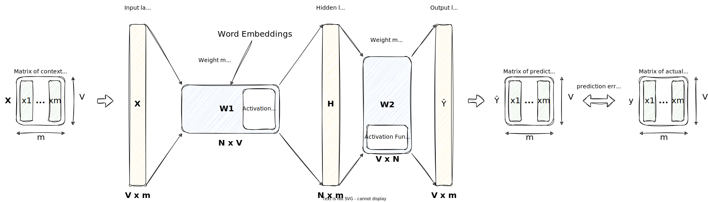

# Word Embeddings

In this lecture, we will learn about word embeddings, which are a way to represent words as vectors. We will learn about the CBOW model, which is a machine learning model that learns word embeddings from a corpus.

Deep learning models cannot process data formats like video, audio, and text in their raw form.
Thus, we use an embedding model to transform this raw data into a dense vector representation
that deep learning architectures can easily understand and process. Specifically, this figure illustrates the process of converting raw data into a three-dimensional numerical vector.

At its core, an embedding is a mapping from **discrete objects**, such as words, images, or even entire documents,
to points in a continuous vector space.
The primary purpose of embeddings is to convert **nonnumeric data** into a format that **neural networks can process**.[^1]

!!! info

    There are also embeddings for sentences, paragraphs, or whole documents.
    Sentence or paragraph embeddings are popular choices for **retrieval-augmented generation**.
    Retrieval augmented generation combines **generation** (like producing text) with **retrieval**
    (like searching an external knowledge base) to pull relevant information when generating text.

## Revisit One-Hot Encoding

In the lecture about feature extraction, we have seen that we can represent words as vectors using [one hot encoding](./feature_extraction.md#one-hot-encoding).

One-hot encoding is a very simple way to represent words as vectors, but it has some major **disadvantages**:

- ❌ the resulting vectors are very **high dimensional**, i.e. one dimension for each word in the vocabulary: $n_{\text{dim}} = |V|$
- ❌ it does not capture **meaning**, i.e. all words have the same distance to each other:

  

## Word Embeddings Overview

From the lecture about vector space models, we already know that similar words should be close to each other in the vector space.

But how can we achieve this? In this lecture we will learn about word embeddings, which are a way to represent words as vectors.

In the figure above, we have two dimensional word embeddings:

- the first dimension represents the word's sentiment in terms of positive or negative.
- the second dimensions indicates whether the word is more concrete or abstract.

In the real world, word embeddings are usually much higher dimensional, e.g. 100 or 300 dimensions.

Each dimension represents a different aspect of the word. We do not know what exactly each dimension represents, but we know that similar words are close to each other in the vector space.

Word embeddings have the following **advantages**:

- ✅ they are dense, i.e. they do not contain many zeros
- ✅ they are low dimensional, i.e. they do not require much memory
- ✅ they allow us to encode meaning
- ✅ they capture semantic and syntactic information
- ✅ they are computationally efficient

!!! note

    Note that in the [word by word design](./vector_space_models.md#word-by-word-design), we have as many features as we have words in our vocabulary. This is not very efficient, because we have to store a lot of zeros. With word embeddings, we can reduce the number of features to a much smaller number, e.g. 100 or 300, while at the same time capturing the meaning of the words (which is not possible with the word by word design).

    We could also say we are giving up precision for gaining meaning.

!!! tip

    Here is a list of popular word embeddings methods/models:

    - [FastText (Facebook, 2016)](https://arxiv.org/abs/1607.04606)
    - [GloVe (Stanford, 2014)](https://nlp.stanford.edu/pubs/glove.pdf)
    - [Word2Vec (Google, 2013)](https://arxiv.org/abs/1301.3781)

    More sophisticated models use **advanced deep learning network architectures** to learn word embeddings.
    In these advanced models, words have different embeddings depending on their context (e.g. plant as flower or factory or as a verb).
    Here are some popular examples:

    - [ELMo (Allen Institute, 2018)](https://arxiv.org/abs/1802.05365)
    - [BERT (Google, 2018)](https://arxiv.org/abs/1810.04805)
    - [GPT-2 (OpenAI, 2019)](https://d4mucfpksywv.cloudfront.net/better-language-models/language-models.pdf)

    There are also approaches to fine tune such models on your own corpus.

## Word Embeddings Process

Here is a high level overview of the word embeddings process:

The [corpus](./language_models.md#text-corpus) are words in their context of interest, e.g. wikipedia, news articles, etc. This can be generic or domain specific.

!!! info "Corpus"

    Suppose we want to generate word embeddings based on Shakespeare's plays, then the corpus would be all of Shakespeare's plays, but not Wikipedia or news articles.

After **preprocessing**, we should have the words represented as **vectors**. Typically, we use one-hot encoding for this.

Those one-hot encoded vectors are then fed into the word **embeddings method**. This is usually a machine learning model, that performs a **learning task** on the corpus, for example, predicting the next word in a sentence, or predicting the center word in a context window.

The dimension of the word embeddings is one of the **hyperparameters** of the model which needs to be determined. In practice, it typically ranges from a few hundred to a few thousand dimensions.

!!! tip

    Remember that it is the [context](./vector_space_models.md#introduction) that determines the meaning of a word.

!!! info "Self-supervised Learning"

    The learning task for word embeddings is self-supervised, i.e. the input data is unlabeled, but the data itself provides the necessary context (which would otherwise be the labels), because we are looking at the context of a word.

    A corpus is a _self-contained_ data set, i.e. it contains all the information necessary to learn the embeddings, that is, the training data and the labels.

!!! info "Dimensions of Word Embeddings"

    Using a higher number of dimensions allows us to capture more nuances of the meaning of the words, but it also requires more memory and computational resources.

    The smallest GPT-2 models (117M and 125M parameters)use an embedding size of 768 dimensions.
    The largest GPT-3 model (175B parameters) uses an embedding size of 12,288 dimensions.[^1]

## Continuous Bag of Words (CBOW)

For the CBOW model, the learning task is to **predict the center word** based on its context $C$.

The **rationale** of the CBOW model is, that if two words are surrounded by a similar sets of words when used in various sentences, then those two words tend to be **related in their meaning**.

!!! example

    Given the sentence:

    > The little ___ is barking 🐶

    Candidates for the center word are: dog, puppy, hound, terrier, etc., as they are all used frequently in the same context.

As a _by-product_ of this learning task, we will obtain the **word embeddings**.

The following visualization shows the CBOW model for a context size of $C=2$. This means, we take into account the two words before and after the center word. This would be equivalent to a window size of 5.

!!! info

    The context window size $C$ is another **hyperparameter** of the model.

!!! example

    Given the sentence:

    > I am happy because I am learning

    and a context window of size $C=2$, the input and output pairs would be:

    | Input (Context) | Output (Center Word) |
    | --------------- | -------------------- |
    | [I, am, because, I] | happy |
    | [am, happy, I, am] | because |
    | [happy, because, am, learning] | I |

!!! tip "Skip-Gram Model"

    The **Skip-Gram model** can be seen as the **opposite** of the CBOW model. It tries to predict the context words given the center word.

    More details can be found in the [original paper](https://arxiv.org/abs/1301.3781).

    Both CBOW and Skip-Gram are architectures of the [Word2Vec](https://arxiv.org/abs/1301.3781) model.

## Training Data for CBOW Model

To train the CBOW model, we need to generate training data.

For this, we need to transform the vectors of the context words into a single vector. This can be done by **averaging** the one-hot vectors of the context words. The resulting vector is the **context vector**, which is the input to the CBOW model.

Here is an overview of the process:

With this approach, we can generate training data for the CBOW model.

- The **input** is the context vector
- The **expected output** is the vector of the center word

!!! example

    Given the corpus:

    > I am happy because I am learning

    The vocabulary is:

    > $[\text{am}, \text{because}, \text{happy}, \text{I}, \text{learning}]$

    And the one-hot encoded vectors are:

    | Word | Vector |
    | ---- | ------ |
    | am | $[1, 0, 0, 0, 0]$ |
    | because | $[0, 1, 0, 0, 0]$ |
    | happy | $[0, 0, 1, 0, 0]$ |
    | I | $[0, 0, 0, 1, 0]$ |
    | learning | $[0, 0, 0, 0, 1]$ |

    To build a single vector for any given context words, we average the one-hot encoded vectors of the context words.

    For example, if the context words are [I, am, because, I], then the average vector would be:

    $$
    \frac{1}{4} \cdot \begin{pmatrix}\begin{bmatrix}0 \\ 0 \\ 0 \\ 1 \\ 0\end{bmatrix} + \begin{bmatrix}1 \\ 0 \\ 0 \\ 0 \\ 0\end{bmatrix} + \begin{bmatrix}0 \\ 1 \\ 0 \\ 0 \\ 0\end{bmatrix} + \begin{bmatrix}0 \\ 0 \\ 0 \\ 1 \\ 0\end{bmatrix}\end{pmatrix} = \frac{1}{4} \cdot \begin{pmatrix}\begin{bmatrix}1 \\ 1 \\ 0 \\ 2 \\ 0\end{bmatrix}\end{pmatrix} = \begin{pmatrix}\begin{bmatrix}0.25 \\ 0.25 \\ 0 \\ 0.5 \\ 0\end{bmatrix}\end{pmatrix}
    $$

    Doing this for a few more examples, we can generate the training data for the CBOW model:

    | Context words | Context vector | Center word | Center vector |
    | ------------- | -------------- | ----------- | ------------- |
    | $[\text{I}, \text{am}, \text{because}, \text{I}]$ | $[0.25, 0.25, 0, 0.5, 0]$ | $\text{happy}$ | $[0, 0, 1, 0, 0]$ |
    | $[\text{am}, \text{happy}, \text{I}, \text{am}]$ | $[0.5, 0, 0.25, 0.25, 0]$ | $\text{because}$ | $[0, 1, 0, 0, 0]$ |
    | $[\text{happy}, \text{because}, \text{am}, \text{learning}]$ | $[0.25, 0.25, 0.25, 0, 0.25]$ | $\text{I}$ | $[0, 0, 0, 1, 0]$ |

## Architecure of CBOW Model

The **architecture** of CBOW is a neural network model with a single hidden layer. The input layer corresponds to the context words, and the output layer corresponds to the target word.

!!! note "Shallow Dense Neural Network"

    From an architectural point of view, we speak of a **shallow dense neural network**, because it has only one hidden layer and all neurons are connected to each other.

    Note that the number of Neurons here is the first dimension of the matrix, i.e. the number of rows.

The **learning objective** is to minimize the prediction error between the predicted target word and the actual target word. The hidden layer weights of the neural network are adjusted to achieve this task.

!!! tip

    Right-click on the image and select "Open image in new tab" to see a larger version of the image, or use the zoom function of your browser.

Let's clarify the notation:

- $V$ is the vocabulary size
- $N$ is the number of dimensions of the word embeddings
- $m$ is the number of samples in the training data set

Now, let's look at the architecture in more detail:

- $\mathbf{X}$ is the input matrix of size $V \times m$. This is the matrix of the context vectors, where each _column_ is a context vector. This means the **input layer** has $V$ neurons, one for each word in the vocabulary.
- $\mathbf{H}$ is the **hidden layer** matrix of size $N \times m$. This means the **hidden layer** has $N$ neurons, which is the number of dimensions of the word embeddings.
- $\mathbf{\hat{Y}}$ is the output matrix of size $V \times m$. This is the matrix of the predicted center word vectors, where each _column_ is a word vector. This mean the **output layer** has $V$ neurons, one for each word in the vocabulary.
- $\mathbf{Y}$ represent the expected output matrix of size $V \times m$. This is the matrix of the actual center word vectors, where each _column_ is a word vector.

There are **two weight matrices**, one that connects the input layer to the hidden layer, and one that connects the hidden layer to the output layer.

- $\mathbf{W}_1$ is the weight matrix that connects the input layer to the hidden layer and is of size $N \times V$ (aka _weight matrix of the hidden layer_). This is the matrix of the **word embeddings**, where each _column_ represents the word embedding of a word in the vocabulary.

- $\mathbf{W}_2$ is the weight matrix for the output layer and is of size $V \times N$ (aka _weight matrix of the output layer_).

!!! info "Word Embeddings"

    The **weights of the hidden layer** $\mathbf{W}_1$, after training, serve as the **word embeddings**. Each word in the vocabulary is associated with a unique set of weights, and these weights serve as the vector representation or embedding for that word.

    In the case of CBOW, the **input layer** represents the context words, and the **weights** connecting this input layer to the hidden layer capture the **relationships** and **semantics** of the words in the context.

    The **hidden layer** acts as a transformative space where the input (context words) is transformed into the output (center word prediction), and the weights within this layer serve as the learned representations or embeddings for the words.

    The weights connecting the hidden layer to the output layer $\mathbf{W}_2$ are responsible for producing the final prediction based on the learned representations from the embeddings, and thus cannot be considered as the word embeddings.

To compute the next layer $\mathbf{Z}$, we multiply the weight matrix with the previous layer:

$$
\mathbf{Z}_{N \times m} = \mathbf{W}_{N \times V} \cdot \mathbf{X}_{V \times m}
$$

Since the number of columns in the weight matrix matches the number of rows in the input matrix, we can multiply the two matrices, and the resulting matrix $\mathbf{Z}$ will be of size $N \times m$.

!!! warning

    When looking at the diagram, you may think it may be the other way around, i.e. $\mathbf{Z} = \mathbf{X} \cdot \mathbf{W}$, but this is **not** the case.

!!! example

    Assume you have a vocabulary size of 8000 words, and want to learn 400-dimensional word embeddings.

    Then the sizes of the layers, i.e. the number of neurons, would be as follows:

    - Input layer: $V = 8000$
    - Hidden layer: $N = 400$
    - Output layer: $V = 8000$

!!! note

    In this lecture, we don't want to go into the details of the neural network architecture. However, it is important to know what the matrices represent.

!!! info "Activation Functions"

    You would also need to apply an [activation function](https://en.wikipedia.org/wiki/Activation_function) on $\mathbf{Z}$ but we will not cover this in this lecture. What is important is to understand how the dimensions of the matrices are related.

    The purpose of the activation function is to introduce non-linearity into the network, allowing it to learn from complex patterns and relationships in the data.

    Without activation functions (or with only linear activation functions), a neural network would behave like a linear model, regardless of its depth. This is because a composition of linear functions is still a linear function. Introducing non-linear activation functions enables the neural network to model and learn more complex mappings between inputs and outputs.

    Two popular activation functions are the [sigmoid function](https://en.wikipedia.org/wiki/Sigmoid_function) and the [ReLU function](https://en.wikipedia.org/wiki/Rectifier_(neural_networks)).

!!! note "Matrix Multiplication"

    Two matrices $\mathbf{A}$ and $\mathbf{B}$ can be multiplied if the number of columns of $\mathbf{A}$ is equal to the number of rows of $\mathbf{B}$.

    $$
    A_{m \times n} \cdot B_{n \times p} = C_{m \times p}
    $$

!!! info "Batch Processing"

    Usually when training a neural network, we use **batch processing**, i.e. we process multiple samples at once. This is more efficient than processing one sample at a time.

    The batch size is another **hyperparameter** of the model.

    As we can see from the matrix multiplication above, the weight matrices are independent of the batch size, i.e. they are the same for any batch size.

    Batch processing is also important for **parallelization**, i.e. we can process multiple batches in parallel on different processors.

!!! info "Loss Function"

    In CBOW, the **loss function** is typically the [cross entropy](https://en.wikipedia.org/wiki/Cross_entropy) loss function.

    The cross entropy loss function is a measure of how well the **predicted probability distribution** of the target word matches the **actual probability distribution** of the target word.

    The goal during training is to minimize this cross-entropy loss, and the **backpropagation** algorithm is used to adjust the model's parameters (weights) accordingly.

## Evaluation of Word Embeddings

When evaluating word embeddings, we can distinguish between intrinsic and extrinsic evaluation.

**Intrinsic evaluation** methods assess how well the word embeddings capture the semantic or syntactic relationships between the words.

We can evaluate the relationship between words using the following methods:

- Analogies
- Clustering
- Visualization

!!! example "Analogies"

    Semantic analogies:

    > "France" is to "Paris" as "Italy" is to <?>

    Syntactic analogies:

    > "seen" is to "saw" as "been" is to <?>

!!! warning "Ambiguous Words"

    Be careful with ambiguous words:

    > "wolf" is to "pack" as "bee" is to <?>

    Correct answers could be "hive", "colony", or "swarm".

In **external evaluation**, we use the word embeddings as input to a downstream task, e.g. sentiment analysis, NER, or parts-of-speech tagging, and evaluate the performance of the task with established metrics such as accuracy or F1-score.

The performance of the task is then used as a measure of the quality of the word embeddings.

External evaluation is more **practical**, because it allows us to evaluate the word embeddings in the context of a real-world application.

!!! example

    In NER, we want to identify the names of people, places, organizations, etc. in a text. Given the sentence:

    > "Marc is going to Paris to visit the Louvre."

    We can find the following named entities:

    > "Marc" (person), "Paris" (location), "Louvre" (organization)

!!! warning

    Note that with external evaluation methods, we evaluate both the word embeddings and the downstream task. This makes troubleshooting more difficult.

## Key Takeaways

- Word embeddings are a way to represent words as vectors.
- With word embeddings, each dimension represents a different **aspect** of the word. We do not know what exactly each dimension represents, but we know that similar words are close to each other in the vector space.
- To create word embeddings, we typically use a **machine learning model** that performs a **learning task** on a corpus.
- A famous example of a word embeddings model is the **CBOW** model. It learns to predict the center word based on its context words.
- The **rationale** of the CBOW model is, that if two words are surrounded by a similar sets of words when used in various sentences, then those two words tend to be **related in their meaning**.
- It's architecture is a **shallow dense neural network** with a single hidden layer. The word embeddings are essentially a by-product of the learning task, i.e. they are the **weights of the hidden layer** after training.
- We can evaluate the quality of word embeddings using **intrinsic** and **extrinsic** evaluation methods, where extrinsic evaluation is more practical, because it allows us to evaluate the word embeddings in the context of a real-world application.

<!-- footnotes -->
[^1]: Raschka, Sebastian. _Build a Large Language Model (From Scratch)_. Shelter Island, NY: Manning, 2024. <https://www.manning.com/books/build-a-large-language-model-from-scratch>.
