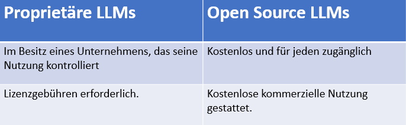
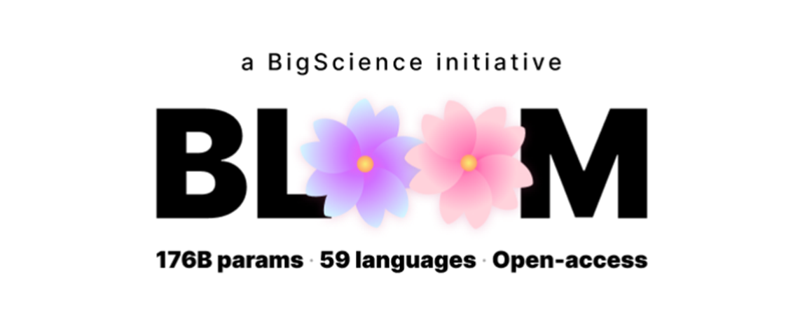
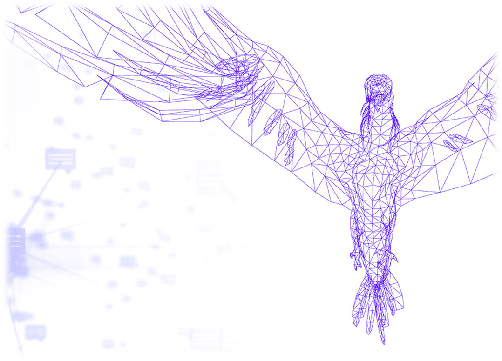
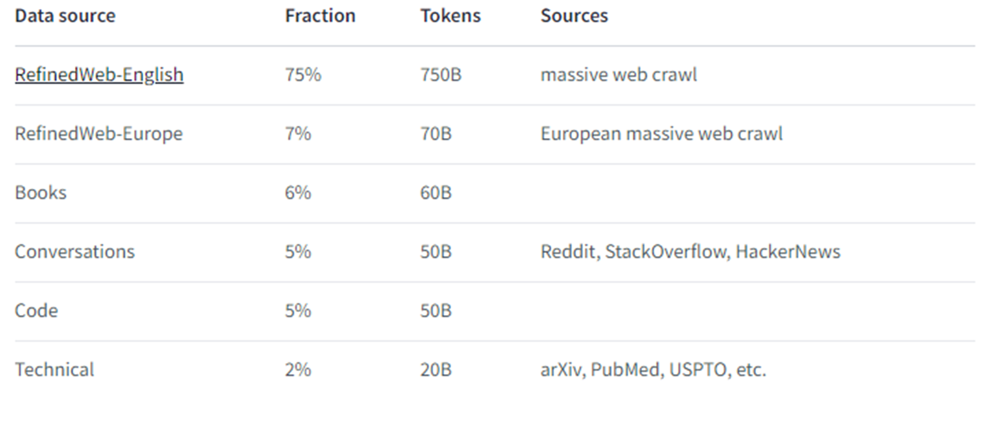
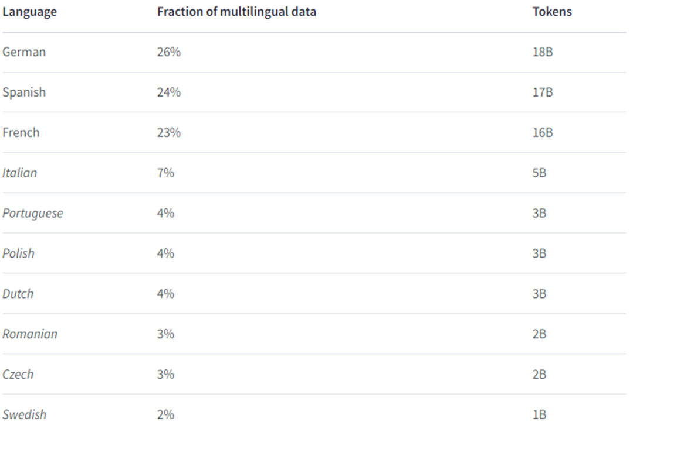
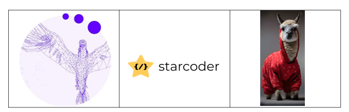
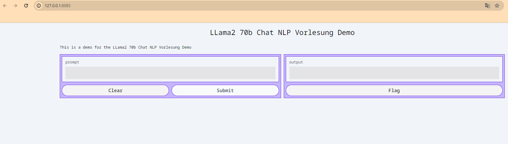

Open-Source LLMs

#### Ein Überblick über Open-Source-LLMs: Welche Open-Source-Alternativen gibt es zu OpenAIs GPT-3.5 und wie kann ich sie nutzen?

Autor: Karoly Robert Hegyi
Datum: 21.12.2023

Open Source Large Language Models (OSLLMs) sind mächtige, quelloffene KI-Modelle für natürliche Sprachverarbeitungsaufgaben. Im Gegensatz zu proprietären Modellen sind sie transparent, ermöglichen Zusammenarbeit und fördern Innovation in Anwendungen wie Übersetzung, Textgenerierung und Chatbots.

## Verfügbarkeit von Large language Models

Man unterscheidet zwischen:

  

Es existieren verschiedene Lizenzen für Open-Source-Software, wobei die Mehrheit dem Apache 2.0-Standard unterliegt.

!!! info Apache 2.0
Erlaubt Benutzern, die Software für jeden Zweck zu verwenden, sie zu verbreiten, zu modifizieren und modifizierte Versionen der Software unter den Bedingungen der Lizenz zu verbreiten, ohne sich um Lizenzgebühren zu kümmern.

## Vorteile von OS-LLMs

- Transparenz
- Fine-tunning
- Community

Open-Source-LLMs ermöglichen nicht nur kostenlose Nutzung, sondern überzeugen auch durch Transparenz, indem sie Einblick in Architektur, Funktionsweise und Trainingsdaten gewähren. Die Flexibilität wird durch das Fine-Tuning verstärkt, welches die Anpassung mit eigenen Daten erlaubt. Ein weiteres Plus ist die Community, die kontinuierliche Verbesserungen fördern und einen Raum für den Austausch von Ideen bieten.

## Anwendungsfälle

- Finanzwesen
- Mathematik
- Programmierung
- Argumentation
- Multilinguale Übersetzung

Diese Sprachmodelle können für verschiedene Anwendungsfälle trainiert werden, wobei die größeren Modelle auf eine ausgewogene Mischung dieser einzelnen Aspekte abzielen.

## 1) BLOOM

  

Unser erstes Large Language Model (LLM) war Bloom, das im Juli 2022 als wegweisendes Open-Source-Modell veröffentlicht wurde. Vor Bloom konnten nur wenige industrielle Labore aufgrund begrenzter Ressourcen und Rechte die vollen Potenziale großer Sprachmodelle ausschöpfen. Bloom durchbrach diesen Status quo als erstes mehrsprachiges LLM, das transparent trainiert wurde.

Mit einem Training in 59 Sprachen und beeindruckenden 176 Milliarden Parametern setzte Bloom einen Meilenstein für die Zugänglichkeit und Transparenz großer Sprachmodelle.

!!! note
Beachtlich ist jedoch, dass dieses Modell **180 GB Speicher** und **360 GB GPU-RAM** für den Betrieb benötigt.

  

---

## 2) Falcon Series

Nach Bloom wurden viele weitere LLMs veröffentlicht, darunter die Modelle der FALCON-Serie des Technology Innovation Institute in Abu Dhabi, etwa ein Jahr später.\
Die ersten beiden Modelle dieser Serie verfügen über **7B** und **40B** Parameter.
Zusätzlich sind diese Modelle unter der APACHE 2.0 Lizenz verfügbar, was auch eine kommerzielle Nutzung ermöglicht.

| FALCON 180B                                                                                                                                                                                                                                                                                                |                                   |
| ---------------------------------------------------------------------------------------------------------------------------------------------------------------------------------------------------------------------------------------------------------------------------------------------------------- | --------------------------------- |
| 🏆 Im September 2023 präsentierte das TII den großen Bruder der Falcon-Serie mit **180B** Parametern, der bei seiner Einführung die höchste Platzierung in den meisten Benchmarks erreichte. Der Schlüssel zum Erfolg lag in ihrem hochwertigen Datensatz, der ebenfalls Open Source veröffentlicht wurde. |  |

#### 2.1 ) Das Datensatz

  

Der neue Datensatz **RefinedWeb** stellt einen innovativen, umfassenden Web-Datensatz auf Basis von CommonCrawl dar. Falcon verbessert diese Daten durch Deduplizierung und strenge Filterung des Inhalts.
Neben RefinedWeb wurden auch Bücher, Konversationen, Code und technisch-wissenschaftliche Arbeiten verwendet.
Das Modell wurde hauptsächlich auf **Englisch** trainiert, jedoch wurden 7% des Datensatzes auf **europäische Sprachen** erweitert.

  

!!! info benötigte Ressourcen
⚠️ Die Bedeutung der Parameteranzahl wird deutlich, da das Training solcher Modelle kostspielig und ressourcenintensiv ist.
**7B Model**
_ Training: 384x A100 40GB GPUs x2 Wochen
_ Nutzung: min. 16 GB GPU-RAM

    **40B Model**
    * Training: 384x A100 40GB GPUs x2 Monate
    * Nutzung: min. 90 GB GPU-RAM

    **180B Model**
    Training: 4.069x A100 40GB GPUs (AWS)

  

---

## 3) LLaMa

Ein weiterer Erfolg unter den Open-Source LLM modelle sind die Llama-Modell von Meta

  

#### 3.1) LLaMA 1

Das erste LLama-Modell, veröffentlicht am 24.02.2023, erreicht eine vergleichbare Leistung wie das GPT-3-Modell von OpenAI.

Versionen:

- **7B**
- **13B**
- **33B**
- **65B**

!!! attention
Das Open-Source-Modell ist leider auf nicht-kommerzielle Nutzung beschränkt.

#### 3.2) Open LLaMA

  

Eine Gruppe von Studierenden an der UC Berkeley in Kalifornien reagierte darauf und gründete OpenLM Research. Zwei Monate später veröffentlichten sie das OpenLLama-Modell, das auf dem LLAMA-Modell von Meta basiert.

OpenLLama bietet Modelle in den Versionen mit **3B**, **7B** und **13B** Parametern an. Besonders interessant sind die leistungsstarken, jedoch "kleinen" V2-Modelle mit **3B** und **7B** Parametern. Diese kompakten, aber leistungsstarken Modelle wurden aus einem besonders spezialisierten Datensatz entwickelt.

Sie sind eine Kombination aus dem Refined-Web-Datensatz von Falcon, dem Starcoder-Datensatz und dem Redpajama-Datensatz, welcher eine Reproduktion des LLaMA-Datensatzes ist.

  

#### 3.2) LLaMA 2

Drei Monate nach OpenLLama veröffentlicht Meta das LLaMA 2 Modell, das dieses Mal tatsächlich Open Source ist (auch für kommerzielle Nutzung). Die Modelle von Meta sind beeindruckend, besonders das Modell mit 70 Milliarden Parametern.

Versionen:

- **7B**
- **13B**
- **70B**

#### LLama2 Fine-tunning

Genau, bisher habe ich euch erzählt, wie ein Large Language Model aufgebaut ist und wie groß diese Modelle eigentlich sind. Doch sie sind nur die Basis-Modelle.
Wie mache ich mein Modell zu einem Assistenten?
Wir möchten Fragen stellen und Antworten generieren. Dafür wird das Basis-Modell auf einen neuen Datensatz feinabgestimmt, der dem Modell zeigt, wie es auf Grundlage von Instruktionen Antworten generieren soll.

  

!!! info Instruct Datasets
Einige dieser Instruct Datensätze sind z.B. : 1) **Alpaca Dataset**
Self-instruct from davinci-003 API (52K samples)

    2) **Vicunna Dataset**
    (70K samples) user-shared conversations from ShareGPT.com

    3) **Open Orca**
    ca. 4 Mio. ChatGPT3.5 und ChatGPT 4 prompts und Antworten

## Key Takeaways

- Es gibt viele Open-Source-Modelle, die du für dein Produkt ausprobieren kannst.
- Diese Modelle sind sehr groß.
- Ein 3- oder 7-Milliarden-Parameter-Modell ist besonders wertvoll für die Open-Source-Community, da es auf einer Vielzahl von GPUs ausgeführt werden kann, einschließlich vieler GPUs für Verbraucher.
  - Llama 7B -> 28GB of GPU RAM to run locally
- Vlt. ein kleineres Modell für einen speziellen Anwendungsfall feintunen?
- Wichtig ist ein Qualitatives Datensatz sowohl für das Training als fürs Feintunen

  

---

# DEMO LLaMA 2 70B

---

## Methode 1 - Webanwendung

Über die Webanwendung https://www.llama2.ai/, die von Replicate gehostet wird, kann man mit dem Modell interagieren und die Parameter personalisieren.

## Methode 2 - Über API

1. Bei replicate.com mit github anmelden.
2. Auf deinem Name klicken -> API Tokens -> API Token kopieren.

  

  

3. VSCode oder andere IDE öffnen.

#### Install Replicate

    pip install replicate

#### Set Replicate API Token

    import os
    os.environ["REPLICATE_API_TOKEN"]= "r8_ePatc**********"

#### Run the LLaMA 2 Model

    import replicate

#### Create Output: Set Model, adjust parameters, change prompt ...

    output = replicate.run(
    "meta/llama-2-70b-chat:02e509c789964a7ea8736978a43525956ef40397be9033abf9fd2badfe68c9e3",
    input={
        "debug": False,
        "top_k": 50,
        "top_p": 1,
        "prompt": "Can you write a poem about open source machine learning? Let's make it in the style of E. E. Cummings.",
        "temperature": 0.5,
        "system_prompt": "You are a helpful, respectful and honest assistant. Always answer as helpfully as possible, while being safe. Your answers should not include any harmful, unethical, racist, sexist, toxic, dangerous, or illegal content. Please ensure that your responses are socially unbiased and positive in nature.\n\nIf a question does not make any sense, or is not factually coherent, explain why instead of answering something not correct. If you don't know the answer to a question, please don't share false information.",
        "max_new_tokens": 500,
        "min_new_tokens": -1
    }
    )

#### Create full ouput:

    full_output = ""

    for item in output:
        full_output += item

    print(full_output)

#### If you want create a small UI so you can interact with your model, you can use Gradio.

    !pip install gradio

#### Generate function:

    def generate(prompt):
        output = replicate.run(
            "meta/llama-2-70b-chat:02e509c789964a7ea8736978a43525956ef40397be9033abf9fd2badfe68c9e3",
            input={
                "debug": False,
                "top_k": 50,
                "top_p": 1,
                "prompt": prompt,
                "temperature": 0.5,
                "system_prompt": "You are a helpful, respectful and honest assistant. Always answer as helpfully as possible, while being safe. Your answers should not include any harmful, unethical, racist, sexist, toxic, dangerous, or illegal content. Please ensure that your responses are socially unbiased and positive in nature.\n\nIf a question does not make any sense, or is not factually coherent, explain why instead of answering something not correct. If you don't know the answer to a question, please don't share false information.",
                "max_new_tokens": 500,
                "min_new_tokens": -1
            }
        )
        full_output = ""

        for item in output:
            full_output += item
        return full_output

#### Launch gradio:

    import gradio as gr
    title = "LLama2 70b Chat NLP Vorlesung Demo"

    description = "This is a demo for the LLama2 70b Chat NLP Vorlesung Demo"

    gr.Interface(fn=generate,inputs=["text"],outputs=["text"], title=title, description=description, theme= 'finlaymacklon/boxy_violet').launch(server_port=8085,share=True)

#### Example Running on local URL: http://127.0.0.1:8085

  

