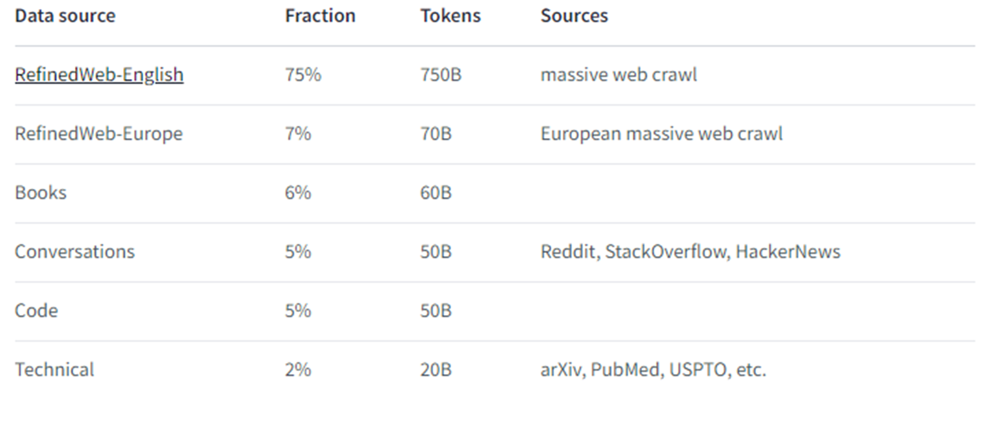
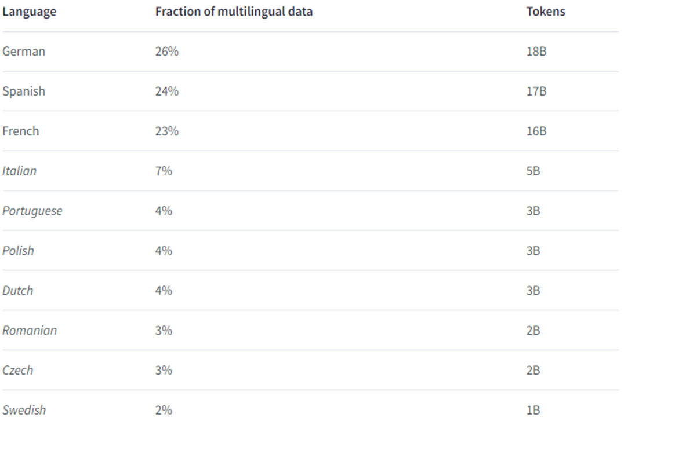
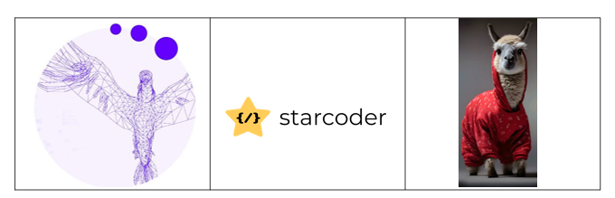
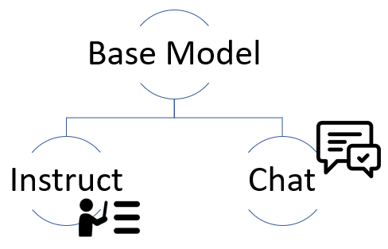
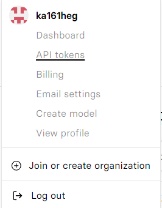
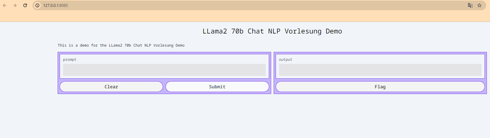

# Open-Source LLMs

This article gives an overview of Open Source LLMs: what Open Source alternatives exist to OpenAI's GPT-3.5 and how can we utilize them?

Autor: Karoly Robert Hegyi
Datum: 21.12.2023

Author: Karoly Robert Hegyi
Date: 21.12.2023

Open Source Large Language Models (OSLLMs) are powerful, open-source AI models for natural language processing tasks. Unlike proprietary models, they are transparent, facilitate collaboration, and foster innovation in applications such as translation, text generation, and chatbots.

## Availability of Large Language Models

They are distinguished into:

| Proprietary LLMs                         | Open Source LLMs                          |
| ---------------------------------------- | ----------------------------------------- |
| Owned by a company that controls its use | Free of charge and accessible to everyone |
| License fees required.                   | Free commercial use permitted.            |

Various licenses exist for open-source software, with the majority adhering to the Apache 2.0 standard.

!!! info "Apache 2.0"

    Allows users to use, distribute, modify, and distribute modified versions of the software for any purpose under the terms of the license, without worrying about license fees.

## Advantages of OS-LLMs

- Transparency
- Fine-tuning
- Community

Open-source LLMs not only enable free usage but also impress with transparency by providing insight into architecture, functionality, and training data. Flexibility is enhanced through fine-tuning, allowing customization with proprietary data. Another advantage is the community, fostering continuous improvements and providing a space for the exchange of ideas.

## Use Cases

- Finance
- Mathematics
- Programming
- Argumentation
- Multilingual translation

These language models can be trained for various use cases, with larger models aiming for a balanced mixture of these individual aspects.

## 1) BLOOM

  

Our first Large Language Model (LLM) was Bloom, released in July 2022 as a groundbreaking open-source model. Before Bloom, only a few industrial labs could harness the full potential of large language models due to limited resources and rights. Bloom broke this status quo as the first multilingual LLM trained transparently.

With training in 59 languages and an impressive 176 billion parameters, Bloom set a milestone for the accessibility and transparency of large language models.

!!! note
It is noteworthy, however, that this model requires **180 GB of storage** and **360 GB of GPU RAM** for operation.

  

---

## 2) Falcon Series

After Bloom, many more LLMs were released, including the models of the FALCON series from the Technology Innovation Institute in Abu Dhabi, approximately a year later.\
The first two models in this series have **7B** and **40B** parameters.
Additionally, these models are available under the APACHE 2.0 license, allowing for commercial use as well.

| FALCON 180B                                                                                                                                                                                                                                                                           |                                                                                                                                                                |
| ------------------------------------------------------------------------------------------------------------------------------------------------------------------------------------------------------------------------------------------------------------------------------------- | -------------------------------------------------------------------------------------------------------------------------------------------------------------- |
| 🏆 In September 2023, the TII unveiled the big brother of the Falcon series with **180B** parameters, which, upon its introduction, achieved the highest rankings in most benchmarks. The key to its success lay in its high-quality dataset, which was also released as open source. |  |

#### 2.1 ) The dataset

  

The new dataset **RefinedWeb** represents an innovative, comprehensive web dataset based on CommonCrawl. Falcon enhances this data through deduplication and rigorous content filtering.
In addition to RefinedWeb, books, conversations, code, and technical-scientific papers were also utilized.

The model was primarily trained in **English**, but 7% of the dataset was expanded to **European languages**.

  

!!! info Required Resources
⚠️ The significance of the parameter count becomes apparent as the training of such models is costly and resource-intensive.

    **7B Model**
    - Training: 384x A100 40GB GPUs for 2 weeks
    - Usage: minimum 16 GB GPU-RAM

    **40B Model**
    - Training: 384x A100 40GB GPUs for 2 months
    - Usage: minimum 90 GB GPU-RAM

    **180B Model**
    - Training: 4,069x A100 40GB GPUs (AWS)

  

---

## 3) LLaMa

Another success among open-source LLM models is the Llama model by Meta.

  

#### 3.1) LLaMA 1

The first Llama model, released on 24.02.2023, achieves performance comparable to OpenAI's GPT-3 model.

Versions:

- **7B**
- **13B**
- **33B**
- **65B**

!!! attention
Unfortunately, the open-source model is limited to non-commercial use.

#### 3.2) Open LLaMA

  

In response, a group of students at UC Berkeley in California founded OpenLM Research. Two months later, they released the OpenLLama model based on Meta's LLAMA model.

OpenLLama offers models in versions with **3B**, **7B**, and **13B** parameters. Particularly interesting are the powerful yet "small" V2 models with **3B** and **7B** parameters. These compact yet powerful models were developed from a specially curated dataset.

They are a combination of the Refined Web dataset from Falcon, the Starcoder dataset, and the Redpajama dataset, which is a reproduction of the LLaMA dataset.

  

#### 3.2) LLaMA 2

Three months after OpenLLama, Meta releases the LLaMA 2 model, which is open source this time (also for commercial use). Meta's models are impressive, especially the model with 70 billion parameters.

Versions:

- **7B**
- **13B**
- **70B**

#### LLaMA2 Fine-tuning

Yes, so far, I've told you about how a Large Language Model is structured and how large these models actually are. But they are just the base models.
How do I turn my model into an assistant?
We want to ask questions and generate answers. For this, the base model is fine-tuned on a new dataset that shows the model how to generate responses based on instructions.

  

!!! info Instruct Datasets
Some of these Instruct datasets include: 1) **Alpaca Dataset**
Self-instruct from davinci-003 API (52K samples) 2) **Vicunna Dataset**
(70K samples) user-shared conversations from ShareGPT.com 3) **Open Orca**
Approx. 4 million ChatGPT3.5 and ChatGPT 4 prompts and responses

## Key Takeaways

- There are many open-source models you can try for your product.
- These models are very large.
- A 3 or 7-billion-parameter model is particularly valuable for the open-source community as it can run on a variety of GPUs, including many consumer GPUs.
  - Llama 7B -> 28GB of GPU RAM to run locally
- Perhaps fine-tune a smaller model for a specific use case?
- A qualitative dataset is important for both training and fine-tuning.

  

---

# DEMO LLaMA 2 70B

---

## Method 1 - Web Application

Through the web application https://www.llama2.ai/, hosted by Replicate, you can interact with the model and personalize the parameters.

## Method 2 - Via API

1. Sign in to replicate.com with GitHub.
2. Click on your name -> API Tokens -> Copy API Token.

  

  

3. Open VSCode or another IDE.

#### Install Replicate

    pip install replicate

#### Set Replicate API Token

    import os
    os.environ["REPLICATE_API_TOKEN"]= "r8_ePatc**********"

#### Run the LLaMA 2 Model

    import replicate

#### Create Output: Set Model, adjust parameters, change prompt ...

    output = replicate.run(
    "meta/llama-2-70b-chat:02e509c789964a7ea8736978a43525956ef40397be9033abf9fd2badfe68c9e3",
    input={
        "debug": False,
        "top_k": 50,
        "top_p": 1,
        "prompt": "Can you write a poem about open source machine learning? Let's make it in the style of E. E. Cummings.",
        "temperature": 0.5,
        "system_prompt": "You are a helpful, respectful and honest assistant. Always answer as helpfully as possible, while being safe. Your answers should not include any harmful, unethical, racist, sexist, toxic, dangerous, or illegal content. Please ensure that your responses are socially unbiased and positive in nature.\n\nIf a question does not make any sense, or is not factually coherent, explain why instead of answering something not correct. If you don't know the answer to a question, please don't share false information.",
        "max_new_tokens": 500,
        "min_new_tokens": -1
    }
    )

#### Create full output:

    full_output = ""

    for item in output:
        full_output += item

    print(full_output)

#### If you want to create a small UI so you can interact with your model, you can use Gradio.

    !pip install gradio

#### Generate function:

    def generate(prompt):
        output = replicate.run(
            "meta/llama-2-70b-chat:02e509c789964a7ea8736978a43525956ef40397be9033abf9fd2badfe68c9e3",
            input={
                "debug": False,
                "top_k": 50,
                "top_p": 1,
                "prompt": prompt,
                "temperature": 0.5,
                "system_prompt": "You are a helpful, respectful and honest assistant. Always answer as helpfully as possible, while being safe. Your answers should not include any harmful, unethical, racist, sexist, toxic, dangerous, or illegal content. Please ensure that your responses are socially unbiased and positive in nature.\n\nIf a question does not make any sense, or is not factually coherent, explain why instead of answering something not correct. If you don't know the answer to a question, please don't share false information.",
                "max_new_tokens": 500,
                "min_new_tokens": -1
            }
        )
        full_output = ""

        for item in output:
            full_output += item
        return full_output

#### Launch Gradio:

    import gradio as gr
    title = "LLama2 70b Chat NLP Lecture Demo"

    description = "This is a demo for the LLama2 70b Chat NLP Lecture Demo"

    gr.Interface(fn=generate, inputs=["text"], outputs=["text"], title=title, description=description, theme= 'finlaymacklon/boxy_violet').launch(server_port=8085, share=True)

#### Example Running on local URL: http://127.0.0.1:8085

  

