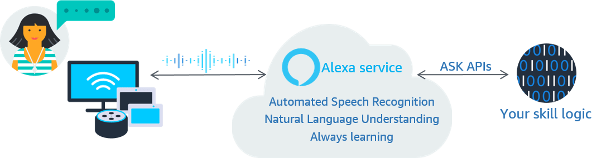

# Virtual Assistants

_Author: [Marco Mollo](mailto:ma161mol@htwg-konstanz.de)_

## TL;DR

Virtual assistants like Siri, Alexa, and Google Assistant rely on Natural Language Processing (NLP) for seamless interactions.

## Introduction

This articel will feature the underlying technology, how virtual assistants work, and how we as developers can use them.

## Underlying Technologies

1. Speech Recognition
2. NLP
3. Dialog Management
4. Machine Learning & AI
5. Cloud-Based Processing
6. Wake Word Detection
7. Integration with Services
8. Privacy and Data Security

### Speech Roecognition

Siri, Alexa and Google Assistant use Advanced automatic Speech Recognition technology to convert spoken language into text. To make this possible, ML models are trained on large data sets. The models are trained to recognize the patterns in the speech and convert them into text. The more data the model is trained on, the more accurate it becomes.

### NLP

As discussed in the lecture, the text is extracted and a context for the user queries is obtained from it.

- Alexa has new Alexa Large Language Model LLM since 20.09.23
- Siri uses CNN's and LSTM
- Google probably uses BERT but there is no further information available

### Dialog Management

All three use dialog management systems to maintain context and a conversation across multiple requests. So basically you can remember previous requests.

### Machine Learning & AI

ML and AI play an important role here because they improve the performance of voice assistants over time. They learn continuously from user interactions and adapt to user preferences.

### Cloud-Based Processing

Most of the work is done in the cloud. This gives the voice assistants access to extensive computer resources and databases, allowing them to respond quickly and accurately.

### Wake Word Detection

The wake word detection is the word that activates the voice assistant. For example, "Hey Siri" or "Alexa". The wake word detection is always active and listens for the wake word. When the wake word is detected, the voice assistant starts listening to the user's request.

### Integration with Services

The Virtual Assistants are linked to many online services so that they can transmit information, for example that they can provide information about the weather.

### Privacy and Data Security

User data sent to the cloud is anonymized and encrypted for protection.

## How Virtual Assistants Work

The following steps are performed when a user interacts with a voice assistant:

- The user says the wake word
- The voice assistant starts listening to the user's request
- The voice assistant converts the speech into text
- The text is sent to the cloud for processing
- The text is analyzed and a response is generated
- The response is sent back to the user

### Siri

### Alexa

### Google Assistant

## Developer Interaction

- You can integrate Siri with [SiriKit](https://developer.apple.com/documentation/sirikit/) for natural langaugae app interactions
- You can integrate Alexa with [Alexa Skills Kit](https://developer.amazon.com/en-US/alexa/alexa-skills-kit) for custom skills and interactions
- You can integrate Google Assistant with [Actions on Google](https://developers.google.com/assistant/console?hl=de) for extending Assistant capabilities

## Key Takeaways

- Virtual Assistants are a great example of how NLP can be used in real life
- As developers we can use the underlying technologies to create our own voice assistants
- The underlying technologies are very complex and require a lot of data to work properly
- It is easy to use with the developer tools provided by the companies

## References

- [Hey Siri Example](https://machinelearning.apple.com/research/hey-siri)
- [Alexa Example](https://developer.amazon.com/en-US/docs/alexa/ask-overviews/what-is-the-alexa-skills-kit.html)
- [Google Assistant Example](https://developer.android.com/guide/app-actions/overview)
- [SiriKit Developer Documentation](https://developer.apple.com/documentation/sirikit/)
- [Alexa Skills Kit Developer Documentation](https://developer.amazon.com/en-US/docs/alexa/ask-overviews/what-is-the-alexa-skills-kit.html)
- [Actions on Google Developer Documentation](https://developers.google.com/assistant/console?hl=de)
